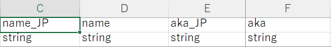

允许游戏自动从模组目录加载模组制作者的自定义资源，简化了模组制作者利用各种游戏功能的过程，无需额外步骤，并扩展了本地化支持。

非常适合引入新物品、角色、元素、或音频的模组，CWL免去使用DLL只为导入表格的麻烦。

## 使用CWL

- 源表（角色、物品、种族、对话等）
- 自定义冒险者
- 自定义商人
- 自定义能力（专长/法术/状态/能力等）
- 自定义信仰
- 自定义材质（自定义颜色）
- 对话/剧情
- 书籍文本
- 以上全部具有拓展本地化支持
- 自定义音频/BGM
- 大量修复和优化
    - 统一导入减少加载时间
    - 自动检测源表兼容性
    - 重抛源表解析异常并附加详细信息
    - 移除阻止加载的自定义元素/任务/卡片
- 功能丰富的API

CWL 由社区需求和反馈而添加新功能。

## 示例模组设置

CWL 要求Mod放置在**LangMod**文件夹下，而不是**Lang**；否则，游戏将把整个翻译树复制到您的模组文件夹中。在**LangMod**文件夹中，您可以通过使用语言代码命名子文件夹来添加任意数量的支持语言，例如：


当 CWL 导入资源时，它将优先从当前语言文件夹导入，有效解决了当前Elin xlsx的翻译问题，因为大部分工作表通常只包含JP和EN条目。

`JP` 文件夹可以省略，只要填入其他语言资源的`_JP`条目即可。 


`ZHTW` 将使用 `CN` 作为后备隐藏能源，而 `EN` 则是第二选择。CWL 将使用找到的第一个语言文件夹作为最后最后的选项。

## 自定义源表

您可以将 xlsx 文件简单地放置在每个语言文件夹中，而不必手动为每个 xlsx 工作表调用 **ModUtil.ImportExcel**。CWL 将根据与 SourceData 或 SourceLang 匹配的表名导入所有本地化的源。

请注意是 **表名**，而不是文件名！例如，这将相应地导入 **SourceThing**, **SourceChara**, **LangGeneral**。


支持的 `SourceData：`
```:no-line-numbers
Chara, CharaText, Tactics, Race, Job, Hobby
Thing, ThingV, Food, Recipe, SpawnList, Category, Collectible, KeyItem
Element, Calc, Stat, Check, Faction, Religion, Zone, ZoneAffix, Quest, Area, HomeResource, Research, Person
GlobalTile, Block, Floor, Obj, CellEffect, Material
```

支持的 `SourceLang：`
```:no-line-numbers
General, Game, List, Word, Note
```

您也可以将工作表拆分成多个 xlsx 文件以方便管理。xlsx 文件名无关紧要。

如果您想浏览游戏中物品/角色/各种源的 ID，请查看 Elin Sources：


## 使用示例

要查看一些 CWL 使用示例，请查看以下模组（以及更多）：

<LinkCard t="Mods Using CWL" u="https://steamcommunity.com/workshop/filedetails/discussion/3370512305/501685815345180661/" />

## 代码本地化

您可以将文本条目导出到一个`General`表，并让CWL将其导入到`LangGeneral`中，然后在运行时使用 **`"my_lang_str".lang()`** 进行代码本地化。


