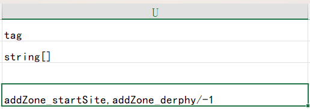

## 导入自定义角色

假设您已经在 Chara 表中定义了您的自定义角色。您可以参考现有的模组或 Elin Sources。
<LinkCard t="SourceChara" u="https://docs.google.com/spreadsheets/d/1CJqsXFF2FLlpPz710oCpNFYF4W_5yoVn" />

CWL 利用 tag 单元格来添加功能，您可以添加任意数量的标签。**请记住，标签之间用 `,`（逗号）分隔，中间不要有空格**。

## 自动生成/添加到区域

要让 CWL 将角色生成到某个区域，请使用标签 `addZone_*`，并用区域 **alias** 替换 `*`（星号），或者保留星号以生成到随机区域。

例如，要在起始原野中生成角色，请使用 `addZone_startSite`。要在特尔斐地下一层生成角色，请使用 `addZone_derphy/-1`。请查看 [SourceGame/Zone](https://docs.google.com/spreadsheets/d/16-LkHtVqjuN9U0rripjBn-nYwyqqSGg_/edit?gid=2115280503#gid=2115280503) 并参考 **alias** 列。

每一个 `addZone` 标签都会确保在该区域生成一个角色。例如，`addZone_lumiest,addZone_little_garden,addZone_specwing,addZone_*` 将会在所选的三个区域以及随机一个区域中生成一个角色（同时存在）。

::: warning 注意
从 CWL 1.20.11 开始，以前的标签 `addZone_类型` 已被上述普通标签 `addZone_alias` 取代，但仍然可以使用。  

:::

## 添加初始装备/物品

当 CWL 生成你的角色时，你还可以为该角色定义起始装备和物品，使用标签 `addEq_ItemID#Rarity` 和/或 `addThing_ItemID#Count`。

要为角色分配特定装备，使用标签 `addEq_ItemID#Rarity`，其中 `ItemID` 替换为物品的ID，`Rarity` 为以下之一：**随机（Random）、粗糙（Crude）、普通（Normal）、优质（Superior）、传奇（Legendary）、神话（Mythical）、神器（Artifact）**。如果省略 `#Rarity`，将使用默认稀有度 `#Random`。

例如，要将传奇的 `BS_Flydragonsword` 和随机的 `axe_machine` 设置为角色的主要武器：
**addZone_Palmia,addEq_BS_Flydragonsword#Legendary,addEq_axe_machine**

要为角色添加起始物品，使用标签 `addThing_ItemID#Count`。如果省略 `#Count`，将生成默认的 `1` 件物品。

例如，要为角色添加 `padoru_gift` x10 和 `援军卷轴` x5：
**addZone_Palmia,addThing_padoru_gift#10,addThing_1174#5**

## 创建冒险者

感谢 105gun。

如果您的角色 trait 设定为 **`Adventurer`** 或 **`AdventurerBacker`**，CWL 将登录该角色为冒险者，并将出现在冒险者排名列表中。

::: warning 注意
从 CWL 1.15.0 开始，以前的标签 `addAdvZone`/`addAdvEq`/`addAdvThing` 已被上述普通标签 `addZone`/`addEq`/`addThing` 取代，但仍然可以使用。  

:::

## 禁用随机移动

全局角色如果不在玩家的阵营中，会随机拜访其他城镇。您可以使用标签 `addFlag_StayHomeZone` 让他们留在起始区域。

该 flag 可以在剧情表中通过 `invoke*` 动作和 `mod_flag(StayHomeZone, 0)` 方法进行更改，`actor` 单元填写目标角色的 ID（或者 `tg` 指定剧情对象）。