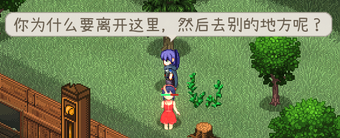

## 喊叫

在某些情况下, 角色会触发特定的对话并作为气泡显示在其头顶。

这些对话写在 **CharaText** 表格中, 而你的角色则在 **idText** 单元格中填入该对话的 ID 将其链接。

|单元格|calm|fov|aggro|dead|kill|
|-|-|-|-|-|-|
|触发|冷静|视线|激怒|亡语|击杀|

您还可以在每个条目中插入 [自定义音频](../Other%20其他/sound) 标签，使其成为有声音的喊叫，例如，`"你不能通过！！<sound=gandalf,0.8>"` 在触发此喊叫时，有80%的概率播放ID为 `gandalf` 的音频。

## 对话

想添加一些角色**来聊天吧**时的对话, 可以在 `LangMod/**/Dialog/` 文件夹中准备一个 `dialog.xlsx` 表格。

此表格的格式与游戏的对话表格 **Elin/Package/_Elona/Lang/_Dialog/dialog.xlsx** 相同, 但你只需 `unique` 表格和包含你角色 ID 的那一行。

此处 ID 和角色 ID 相同。

::: warning 格式
dialog.xlsx的文本数据从表格第5行开始，而非源表格式的第4行。
:::

## 剧情

剧情是通过多选项对话和附加动作构成的丰富交互系统。

剧情部分已移至单独的章节。

<LinkCard t="剧情系统" u="/100_Mod Documentation/Custom Whatever Loader/CN/Drama 剧情/0_basic.md" />
