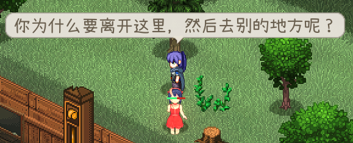

## 喊叫

在某些情况下，角色会触发特定的对话并显示在其头顶。



这些对话写在 **CharaText** 表格中，而你的角色则在 **idText** 单元格中填入该对话的 ID 将其链接。


|单元格|calm|fov|aggro|dead|kill|
|-|-|-|-|-|-|
|触发|冷静|视线|激怒|亡语|击杀|

## 对话

想添加一些和角色聊一聊的对话，可以在 `LangMod/**/Dialog/` 文件夹中准备一个 `dialog.xlsx` 表格。


这个表格的格式与游戏的对话表格 **Elin/Package/_Elona/Lang/_Dialog/dialog.xlsx** 相同，但你只需 `unique` 表格和包含你角色 ID 的那一行。


此处 ID 和角色 ID 相同。

## 剧情

剧情是你与角色的丰富对话，通常会有选项，分支，以及一些触发行动。


要为角色添加一个自定义剧情，使用标签 `addDrama_DramaSheetName`，CWL 将自动重定向该剧情。

你的自定义剧情表必须放在你的 `LangMod/**/Dialog/Drama/` 文件夹中，并且名称必须与标签匹配。例如，使用 `addDrama_MyCharaDrama` 对应 `Dialog/Drama/MyCharaDrama.xlsx`。

在制作自己的剧情时，你可以参考游戏中的剧情表，路径为 **Elin/Package/_Elona/Lang/_Dialog/Drama**，或者查看 Tiny Mita 的示例，它有一个模板剧情表：

<LinkCard t="CWL Example: Tiny Mita" u="https://steamcommunity.com/sharedfiles/filedetails/?id=3396774199" />


::: tip 热重载剧情
剧情表可以在游戏过程中编辑并保存，每次对话都会热重载。
:::

## 剧情拓展

::: warning 暂时版本
此文档部分是临时写就，具体API与用法随时可能会更改。
:::

苦于剧情表的游戏自带 `action` 无法达成你想要的效果？CWL 允许你在程序集中添加自定义剧情拓展方法并在剧情表中调用它。  

此功能需要 CWL 配置值 `Dialog.ExpandedActions` 为 `true`，默认已开启。

### 添加自定义拓展

首先，定义一个派生于 `DramaOutcome` 的类，这会让 CWL 添加这个类中所有符合剧情拓展格式的方法到剧情方法表中。 

其次，你的剧情拓展方法需要符合以下 CWL 格式: 静态 `static`，返回 `bool`，接受 `DramaManager dm, Dictionary<string, string> line, params string[] parameters` 三个参数。

```cs
internal class MyDramaExpansion : DramaOutcome
{
    internal static bool honk_honk(DramaManager dm, Dictionary<string, string> line, params string[] parameters)
    {
        return true;
    }
}
```

返回值用于决定是否在执行此 `action` 后跳转到填入的 `jump` 部分（如果有的话）。

### 调用方法

在剧情表中，你可以使用 CWL 特殊动作 `invoke*` 来调用你的方法:


### 传递参数

参数用英语逗号 `,` 隔开，写在拓展方法的括号中，与代码语法类似:

```
invoke* honk_honk(arg1, arg2)
```

在你的拓展方法代码中，参数会被传递为 `string[] parameters` ，你可以通过C# 8语法进行参数断言或者手动检查参数:

```cs
internal static bool honk_honk(DramaManager dm, Dictionary<string, string> line, params string[] parameters)
{
    // 参数断言: 必须传递两个参数
    if (parameters is not [{ } soundId, { } arg2]) {
        return false;
    }

    pc.PlaySound(soundId);
    // 使用arg2

    return true;
}
```

你也可以使用你喜欢的方式确保参数有效。常用的参数检查方式有且不限于:

```cs
[{ } arg1, { } arg2] // 必须传递2个参数
[{ } arg1, .. { } args] // 必须传递至少1个参数
```

如果你的方法不需要参数，那么无需做任何检查。

### 异常处理

在你的拓展方法代码中，任何不应该继续执行的错误（比如无效参数，无效ID等），你都可以直接抛出异常。例如，CWL 内部检查参数时，会使用如下异常:

```cs
if (parameters is not [{ } id, { } tag]) {
    throw new DramaActionArgumentException(parameters);
}
```

抛出异常后，方法返回值默认为 `false` 并会在游戏内提示剧情异常。

### CWL 拓展

CWL 自带了一小部分剧情拓展方法，你可以查看[它们的代码](https://github.com/gottyduke/Elin.Plugins/blob/master/CustomWhateverLoader/API/Drama/DramaExpansion.cs)。

值得一提的是 `build_ext` 和 `emit_call`，这两个拓展方法允许你直接调用部分外部程序集的静态方法，例如:


此功能需要 CWL 配置值 `Dialog.ExpandedActionsAllowExternal` 为 `true`，默认已开启。