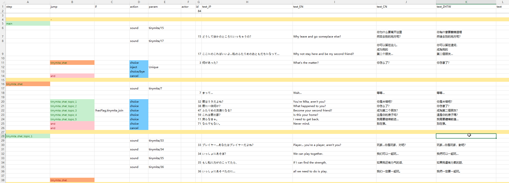

## 喊叫

在某些情况下, 角色会触发特定的对话并显示在其头顶。


这些对话写在 **CharaText** 表格中, 而你的角色则在 **idText** 单元格中填入该对话的 ID 将其链接。


|单元格|calm|fov|aggro|dead|kill|
|-|-|-|-|-|-|
|触发|冷静|视线|激怒|亡语|击杀|

## 对话

想添加一些和角色聊一聊的对话, 可以在 `LangMod/**/Dialog/` 文件夹中准备一个 `dialog.xlsx` 表格。


这个表格的格式与游戏的对话表格 **Elin/Package/_Elona/Lang/_Dialog/dialog.xlsx** 相同, 但你只需 `unique` 表格和包含你角色 ID 的那一行。


此处 ID 和角色 ID 相同。

## 剧情

剧情是通过多选项对话和附加动作构成的丰富交互系统。


要为角色定义自定义剧情, 请使用 `addDrama_剧情表名称` 标签, CWL将自动定向该剧情。

自定义剧情表必须放置在 `LangMod/**/Dialog/Drama/` 文件夹下, 且名称需与标签匹配。例如：使用 `addDrama_drama_example` 时需对应`Dialog/Drama/drama_example.xlsx`文件。

制作时可参考游戏内置剧情表 **Elin/Package/_Elona/Lang/_Dialog/Drama**, 或含有模板的Tiny Mita范例：
<LinkCard t="CWL范例：Tiny Mita" u="https://steamcommunity.com/sharedfiles/filedetails/?id=3396774199" />



::: tip 热重载
剧情表支持在游戏运行时编辑保存后热重载。
:::

### 基础结构

剧情表按从上至下顺序执行, 由多行剧情单元构成。每行剧情单元包含以下列(由首行定义)：

- `step`：标记后续行为剧情步骤起点, 直至遇到下一个step标记
- `jump`：执行该行时跳转的目标步骤
- `if`/`if2`：执行条件。若同时存在`if2`列, 则需同时满足两个条件
- `action`：执行的动作
- `param`：动作参数
- `actor`：当前说话角色 ID, 用于多人对话场景
- `id`：文本行唯一标识(仅文本行必需)
- `text`/`text_JP`/`text_EN`：实际对话内容。`text`列根据LangMod子文件夹自动切换语言版本

剧情通过步骤串联执行, 每个步骤包含若干行剧情单元, 可混合对话/动作/条件判断。

`main`是默认起始步骤, `end`是默认结束步骤。自定义步骤名请避免使用下划线`_`或`flag`前缀, 以免与内部步骤冲突。

### 剧情动作

文本行需要玩家输入(点击/按键)继续到下一行, 动作行(`choice`除外)连续执行且不可与文本共存(若共存则忽略文本)。

常用动作：

|动作|参数|说明|
|-|-|-|
|`inject`|`Unique`|插入"Let's Talk"及一些通用步骤|
|`choice`||为文本添加选项(需配合`text`和`jump`)|
|`choice/bye`||插入默认告别选项|
|`cancel`||设置右键/ESC键行为(需配合`jump`, 通常是`end`)|
|`setFlag`|flag, 值(可选)|设置flag值(默认1)|
|`reload`||重新加载剧情，以便应用当前剧情中所做的任何flag更改。需配合`jump`，通常是`main`|
|`enableTone`||启用对话语气转换|
|`addActor`||添加角色标识(`actor`列填写新ID时自动触发)|
|`invoke`|方法名|调用方法|
|`setBG`|图片名(可选)|设置背景图(支持Texture文件夹自定义png), 为空时则清除|
|`BGM`|BGM ID|切换背景音乐, 详见[Sound 音频/BGM](../Other%20其他/sound)|
|`stopBGM`||停止BGM|
|`lastBGM`||停止并恢复之前BGM|
|`sound`|音效ID|播放音效, 详见[Sound 音频/BGM](../Other%20其他/sound)|
|`wait`|时长|暂停执行(秒), 通常用于等待动画效果|
|`alphaIn`|持续时间|淡入效果(秒)|
|`alphaOut`|持续时间|淡出效果|
|`alphaInOut`|持续时间, 等待时间, 持续时间|先淡入, 等待, 再淡出|
|`fadeIn`|时长, `white`/`black`(可选)|渐显(白/黑)|
|`fadeOut`|时长, `white`/`black`(可选)|渐隐|
|`fadeInOut`|持续时间, 等待时间, 持续时间|先渐显, 等待, 再渐隐|
|`hideUI`|过渡时间|隐藏界面(结束剧情时恢复)|
|`hideDialog`||隐藏对话框(需配合`wait`使用)|
|`end`||直接结束剧情|
|`addKeyItem`|[关键物品ID](https://docs.google.com/spreadsheets/d/175DaEeB-8qU3N4iBTnaal1ZcP5SU6S_Z/edit?gid=836018107#gid=836018107)|给予玩家关键物品|
|`drop`|[物品ID](https://docs.google.com/spreadsheets/d/175DaEeB-8qU3N4iBTnaal1ZcP5SU6S_Z/edit?gid=1479265439#gid=1479265439)|在玩家位置生成物品|
|`addResource`|资源类型, 数量|添加家园资源, `food` `money` `knowledge` `influence` `fun` `safety` `nature` `education` `culture` `industry` `medicine` `worth` `karma` `reknown`|
|`shake`||屏幕震动|
|`slap`||扇剧情所有者角色|
|`destroyItem`|[物品ID](https://docs.google.com/spreadsheets/d/175DaEeB-8qU3N4iBTnaal1ZcP5SU6S_Z/edit?gid=1479265439#gid=1479265439)|从背包移除指定物品|
|`focus`||立即聚焦镜头到剧情所有者|
|`focusChara`|[角色ID](https://docs.google.com/spreadsheets/d/1CJqsXFF2FLlpPz710oCpNFYF4W_5yoVn/edit?gid=1622484657#gid=1622484657), 速度(可选)|移动镜头到**同地图角色**|
|`focusPC`|速度(可选)|聚焦玩家角色|
|`unfocus`||重置镜头|
|`destroy`|[角色ID](https://docs.google.com/spreadsheets/d/1CJqsXFF2FLlpPz710oCpNFYF4W_5yoVn/edit?gid=1622484657#gid=1622484657)|移除**同地图角色**|
|`save`||存档|
|`setHour`|小时数|设置游戏时间|

多参数使用逗号分隔(无空格)。

### 触发条件

通过`if`/`if2`列添加该行的条件判断：

|条件|参数|说明|
|-|-|-|
|`hasFlag`|flag|玩家拥有非零值flag|
|`!hasFlag`|flag|玩家无flag或值为零|
|`hasMelilithCurse`||玩家有Melilith诅咒|
|`merchant`||玩家在商人公会|
|`fighter`||玩家在战士公会|
|`thief`||玩家在盗贼公会|
|`mage`||玩家在法师公会|
|`hasItem`|[物品ID](https://docs.google.com/spreadsheets/d/175DaEeB-8qU3N4iBTnaal1ZcP5SU6S_Z/edit?gid=1479265439#gid=1479265439)|玩家持有指定物品|
|`isCompleted`|[任务ID](https://docs.google.com/spreadsheets/d/16-LkHtVqjuN9U0rripjBn-nYwyqqSGg_/edit?gid=785701697#gid=785701697)|玩家已完成指定任务|

条件格式为`条件, 参数`, 支持扩展表达式：
```
=, test_flag, 1
, counter, 20 
!, flag, 69
```

大多数情况下, 只需要在表格中使用 `if` 列。如果需要更复杂的条件, 可以插入一个新列, 并将首行值设置为 `if2`。

### 扩展功能

::: warning 临时版本
本节文档为临时版本, API可能随时变更。
:::

在使用剧本表内置的 `action` 时未能达到预期效果？需要更多条件检查？CWL 允许您在 DLL 中添加自定义扩展方法, 并在剧本表中调用它们。

CWL 附带了一小组内置的剧本扩展方法, 您可以在这里[查看代码](https://github.com/gottyduke/Elin.Plugins/blob/master/CustomWhateverLoader/API/Drama/Expansions)。

需开启 `Dialog.ExpandedActions` 配置。

在剧情表中, 你可以使用 CWL 特殊动作 `invoke*` 来调用拓展方法：


### 参数传递

使用逗号分隔参数：

|action|param|actor|
|-|-|-|
|`invoke*`|honk_honk(arg1, arg2)|`pc`|

大多数方法还会将 `actor` 单元格作为目标角色来执行该方法, 例如 `pc` 或 `tg`（剧情绑定角色）, 或任何有效的[角色ID](https://docs.google.com/spreadsheets/d/1CJqsXFF2FLlpPz710oCpNFYF4W_5yoVn/edit?gid=1622484657#gid=1622484657)。

若同一行中的 `jump` 格存在值, 则扩展方法的返回值将决定是否执行该 `jump` 指令。返回 `true` 时会执行跳转, 反之则不执行。

### 内置方法

|方法|参数|说明|跳转|
|-|-|-|-|
|`add_item`|[物品ID](https://docs.google.com/spreadsheets/d/175DaEeB-8qU3N4iBTnaal1ZcP5SU6S_Z/edit?gid=1479265439#gid=1479265439), [材质alias](https://docs.google.com/spreadsheets/d/13oxL_cQEqoTUlcWsjKZyNuAaITFGK56v/edit?gid=33087043#gid=33087043), 等级, 数量|为`actor`添加指定物品|总是|
|`join_party`||使`actor`加入队伍|总是|
|`join_faith`|[信仰ID](https://docs.google.com/spreadsheets/d/16-LkHtVqjuN9U0rripjBn-nYwyqqSGg_/edit?gid=729486062#gid=729486062)(可选)|使`actor`加入信仰, 为空时则退出当前信仰|成功时|
|`mod_affinity`|数值表达式|调整`actor`好感度, 比如`+5`, `*10`, `=69`|成功时|
|`mod_flag`|数值表达式|修改`actor`的flag值|总是|
|`apply_condition`|[状态alias](https://docs.google.com/spreadsheets/d/16-LkHtVqjuN9U0rripjBn-nYwyqqSGg_/edit?gid=921112246#gid=921112246), 强度|为`actor`施加状态|总是|
|`cure_condition`|[状态alias](https://docs.google.com/spreadsheets/d/16-LkHtVqjuN9U0rripjBn-nYwyqqSGg_/edit?gid=921112246#gid=921112246)|为`actor`治愈状态|成功时|
|`remove_condition`|[状态alias](https://docs.google.com/spreadsheets/d/16-LkHtVqjuN9U0rripjBn-nYwyqqSGg_/edit?gid=921112246#gid=921112246)|为`actor`移除状态|总是|
|`move_tile`|X, Y偏移|使`actor`进行相对坐标移动|总是|
|`move_zone`|[区域ID](https://docs.google.com/spreadsheets/d/16-LkHtVqjuN9U0rripjBn-nYwyqqSGg_/edit?gid=1819250752#gid=1819250752), 层数(可选)|传送`actor`到指定区域|总是|
|`play_anime`|[动画ID](https://gist.github.com/gottyduke/6e2847e37d205a5621bfd0615e5bd9e7#file-elin-animeid-md)|使`actor`执行动画|总是|
|`play_effect`|[特效ID](https://gist.github.com/gottyduke/6e2847e37d205a5621bfd0615e5bd9e7#file-elin-effects-md)|使`actor`播放特效|总是|
|`play_emote`|[表情ID](https://gist.github.com/gottyduke/6e2847e37d205a5621bfd0615e5bd9e7#file-elin-emo-md)|使`actor`显示表情|总是|
|`play_screen_effect`|[屏幕特效ID](https://gist.github.com/gottyduke/6e2847e37d205a5621bfd0615e5bd9e7#file-screeneffect-md)|播放屏幕特效|总是|
|`portrait_set`|立绘ID(可选)|设置`actor`对话立绘, 为空时重置|总是|

支持通过`build_ext`和`emit_call`调用外部程序集方法(需开启`Dialog.ExpandedActionsAllowExternal`)：


### 自定义条件

这些也是拓展方法(通过`invoke*`动作调用), 但是它们的值可以用于执行跳转。

|方法|参数|说明|跳转条件|
|-|-|-|-|
|`if_affinity`|数值表达式|检查`actor`好感度|满足时|
|`if_flag`|数值表达式|检查`actor`flag值|满足时|
|`if_condition`|[状态alias](https://docs.google.com/spreadsheets/d/16-LkHtVqjuN9U0rripjBn-nYwyqqSGg_/edit?gid=921112246#gid=921112246)|检查`actor`是否拥有状态|满足时|
|`if_tag`|标签|检查`actor`是否拥有标签|满足时|
|`if_location`|[区域ID](https://docs.google.com/spreadsheets/d/16-LkHtVqjuN9U0rripjBn-nYwyqqSGg_/edit?gid=1819250752#gid=1819250752), 层数(可选)|检查`actor`所在区域|满足时|

### 实现自定义方法

CWL 提供了[简单的 API](../API/Custom/drama), 允许您在自己的脚本 DLL 中添加扩展方法, 甚至无需引用 CWL 的程序集。