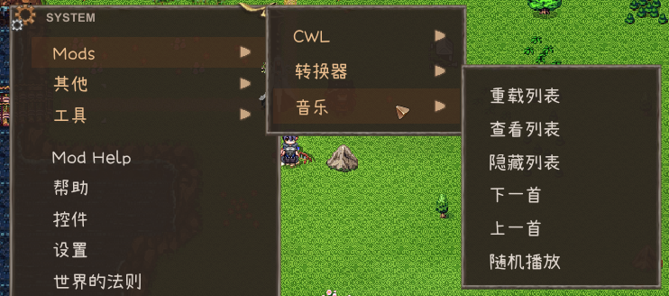
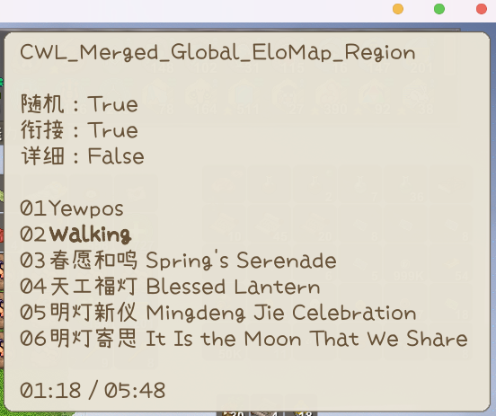

## 自定义音频

音频文件应为 **acc**、**mp3**、**ogg**、**wav** 格式之一，文件名作为音频ID。使用音频时会生成默认的同名元数据JSON，允许您编辑并在在下次游戏启动时应用音频文件元数据。

通过在元数据中设置`"type": "BGM"`，音频将作为 **BGMData** 而不是 **SoundData** 实例化。您还可以在元数据中自定义BGM的小节部分。

**Sound** 文件夹中的子目录将作为音频ID前缀。例如，**AI_PlayMusic** 将使用 **Instrument/sound_id**，因此如果您打算替换乐器音乐，应该将同名音频文件放在 **Instrument** 文件夹中。

**您可以使用相同的ID覆盖现有的游戏内音频**。例如，小鸡的叫声使用ID **Animal/Chicken/chicken**，那么您可以在 **Sound/Animal/Chicken/** 文件夹中准备一个名为 **chicken** 的音频文件来覆盖它。

通过 CWL 自动加载的音频会作为可用游戏资源，任何使用音频的地方都可以通过ID播放自定义音频。

例如：

```cs
pc.PlaySound("clown_horn"); // <- Card.PlaySound
SE.PlaySound("clown_horn");
```

## 自定义乐器音乐

由于 **[Custom Instrument Track](https://steamcommunity.com/sharedfiles/filedetails/?id=3374708172)** 这个模组目前未维护，以下是如何使用 CWL 手动替换乐器音轨的方法：

首先，在 **Sound/Instrument** 文件夹中准备一个音效文件，文件名请使用以下音频ID之一：

如果您要制作一个**新的**乐器，请使用该乐器的ID（Thing ID）作为音频ID。

::: details 游戏内乐器音频ID
|乐器 ID|音频 ID|CN|EN|JP|
<!--@include: ../../assets/instrument_id.md-->
:::

启动游戏一次，为新添加的音效生成一个元数据 **json** 文件，然后退出游戏，编辑该元数据 json 文件，将 **type** 设置为 **BGM**，并为乐器演奏添加一些 **parts**（片段）：

```json
"parts": [
    {
        "start": 0.0,
        "duration": 4.0
    },
    {
        "start": 4.0,
        "duration": 4.0
    },
    {
        "start": 8.0,
        "duration": 4.0
    },
    {
        "start": 12.0,
        "duration": 4.0
    },
    {
        "start": 16.0,
        "duration": 4.0
    }
]
```

每个 **part** 都有一个以秒为单位的起始时间（**start**）和持续时间（**duration**）。在乐器演奏期间，系统将随机选择这些片段进行播放。

## 自定义BGM/播放列表

::: tip 版本需求
此功能需求 CWL **`1.19.0`** 及以后版本。
:::

游戏自带100+首BGM，它们拥有一个数字ID和音频ID。
::: details BGM 列表
|BGM ID|音频 ID|BGM 名称|
<!--@include: ../../assets/bgm_items.md-->
:::

### 添加新BGM

自定义BGM放置在 **Sound/BGM** 子文件夹中，与自定义音效不同，您需要手动编辑元数据 JSON 中的 `id` 字段。确保先启动游戏一次，以便让 CWL 为您生成文件。

CWL 建议您使用 **ogg** 或者 **wav** 格式，因为Elin的Unity版本(2021.3.34f1)所使用的解码器很容易出现MP3解码错误。


`id` 是一个任意独特数字，设置为大于游戏最后使用的BGM ID（`117`），并足够独特以避免撞车。

**重要说明，** 这个 `id` 仅用于BGM。您的音效 ID 仍然是不含拓展名的文件名，例如 **`BGM/Happy Birthday`**

当您将现有的 `id` 分配给您的BGM时，它就会成为全局BGM替换。例如，将 `56` 分配给歌曲元数据 `Adventure-YOASOBI.json`，游戏中的BGM `056 orc01` 将会被 `Adventure-YOASOBI` 替换。这就是为什么您希望您的新BGM（非替换音乐）使用唯一的 `id`，否则下一个具有相同 `id` 的BGM将替换您的音乐。

> `056 orc01` 是标题菜单的BGM。

### 添加播放列表

您的播放列表文件放置在 **Sound/BGM/Playlist** 子文件夹，它们是格式简单的JSON文件。 
```json
{
    "shuffle": true,
    "list": [
        "megalovania"
    ],
    "remove": [
        "024 PSML514",
        "023 mysterious-forest"
    ]
}
```

`list` 中的音频ID（**不是BGM ID**）将合并到播放列表中，而 `remove` 将从播放列表中移除条目（如果存在）。您也可以使用现有的游戏音频ID。`shuffle` 设置该列表是否随机排列。

您也可以在 `list` 和 `remove` 列表中使用通配符，目前提供两种模式：
```json
"remove": [
	"**"
]
```
会在合并前清空所有曲目。

```json
"remove": [
	"<dir>/*"
]
```
会在合并前清空所有来自 **`Sound/BGM/<dir>/`** 文件夹的曲目。

### 播放列表类型

播放列表的JSON文件名应与以下之一匹配：

+ `"Global"`
+ 现有的播放列表名称
+ 区域类型名称
+ 区域ID

这里是游戏内已有的播放列表：
::: details 播放列表
<!--@include: ../../assets/playlists.md-->
:::

`Blank` 是所有没有明确指定播放列表的区域的默认播放列表。

查看区域类型名称及其播放列表：
<LinkCard t="SourceZone" u="https://docs.google.com/spreadsheets/d/16-LkHtVqjuN9U0rripjBn-nYwyqqSGg_/edit?gid=2144211469#gid=2144211469" />


### 全局列表

您可以准备一个名为 `Global.json` 的特殊播放列表，它会合并到所有播放列表中。

### 指定播放列表

例如，所有地城区域（`Zone_RandomDungeon`，`Zone_RandomDungeonFactory`，`Zone_Mine` 等）共享一个名为 `Dungeon` 的播放列表。如果您想添加/删除此播放列表中的歌曲，您应该在 **Sound/BGM/Playlist/** 文件夹中准备一个 `Dungeon.json`。


您在 `Dungeon.json` 中的更改将合并到游戏的 `Dungeon` 播放列表中，无论是添加还是删除歌曲。这将影响所有共享此播放列表的区域。

另一个常见用例是在您处于大地图时添加歌曲。大地图是区域类型 `Region`，它有一个播放列表 `EloMap`。

### 区域类型列表

除了播放列表合并，您还可以为每个区域类型指定区域覆盖。这些播放列表将使用区域类型名称，其内容将合并到区域的默认播放列表中（如果在表中未指定，则为 `Blank`）。

例如 `Zone_Vernis.json` 会为韦尔尼斯区域类型进行覆盖，而 `Zone_Forest` 则会对使用这个类型的 草原 和 森林 进行覆盖。

因此，您也可以通过 `Region.json` 而不是 `EloMap.json` 向大地图播放列表添加歌曲，因为它使用 `Region` 类型。

### 区域ID列表

有时候同一区域类型可能有多个不同区域，您可以单独使用区域ID进行覆盖，例如 `Zone_dungeon` 洞窟 和 `Zone_dungeon_ruin` 遗迹 都是 `Zone_RandomDungeon` 区域类型，您可以使用其ID进行单独指定。当使用区域ID时，您还可以在其后附加 `@N` 来指定特定 `N` 层，例如 特尔斐地下一层 为 `Zone_derphy@-1.json`。

### 合并顺序

多种播放列表可以同时存在，它们会依次按照全局列表，指定播放列表，区域类型列表，区域ID列表的顺序合并。重复的曲目会被移除。播放列表合并顺序也受Mod加载顺序影响。在 `remove` 列表中使用通配符时请在牢记播放列表的合并顺序也会影响你的最终曲目列表和顺序。

### 热加载/BGM 查看

您可以在游戏内加载存档后，使用 CWL 面板查看和控制当前播放列表：





当您在游戏运行时编辑播放列表 JSON 后，您可以热重载所有播放列表。尽管 CWL 有用于热重载新增音频的控制台命令，但由于可能出现索引问题，不建议使用。

### 最后一个示例

假设您想移除大地图探索的所有默认曲目，并添加您的新增曲目，使用 `Sound/BGM/Playlist/EloMap.json` 或 `Sound/BGM/Playlist/Region.json`:
```json
{
    "shuffle": true,
    "list": [
        "my new BGM sound id1",
        "my new BGM sound id2"
    ],
    "remove": [
        "**"
    ]
}
```