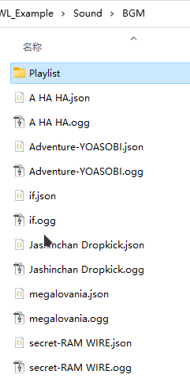

## 自定义音频

音频文件应为 **acc**、**mp3**、**ogg**、**wav** 格式之一，文件名作为音频ID。使用音频时会生成默认的同名元数据JSON，允许您编辑并在在下次游戏启动时应用音频文件元数据。

通过在元数据中设置`"type": "BGM"`，音频将作为 **BGMData** 而不是 **SoundData** 实例化。您还可以在元数据中自定义BGM的小节部分。

**Sound** 文件夹中的子目录将作为音频ID前缀。例如，**AI_PlayMusic** 将使用 **Instrument/sound_id**，因此如果您打算替换乐器音乐，应该将同名音频文件放在 **Instrument** 文件夹中。

**您可以使用相同的ID覆盖现有的游戏内音频**。例如，小鸡的叫声使用ID **Animal/Chicken/chicken**，那么您可以在 **Sound/Animal/Chicken/** 文件夹中准备一个名为 **chicken** 的音频文件来覆盖它。

通过 CWL 自动加载的音频会作为可用游戏资源，任何使用音频的地方都可以通过ID播放自定义音频。

例如：

```cs
pc.PlaySound("clown_horn"); // <- Card.PlaySound
SE.PlaySound("clown_horn");
```

## 自定义乐器音乐

由于 **[Custom Instrument Track](https://steamcommunity.com/sharedfiles/filedetails/?id=3374708172)** 这个模组目前未维护，以下是如何使用 CWL 手动替换乐器音轨的方法：

首先，在 **Sound/Instrument** 文件夹中准备一个音效文件，文件名请使用以下音频ID之一：

如果您要制作一个**新的**乐器，请使用该乐器的ID（Thing ID）作为音频ID。

::: details 游戏内乐器音频ID
|乐器 ID|音频 ID|CN|EN|JP|
|-|-|-|-|-|
|trumpet|trumpet_practice|喇叭|trumpet|トランペット|
|piano|piano_kanon|三角钢琴|grand piano|グランドピアノ|
|piano2|piano_neko|钢琴|piano|ピアノ|
|piano_killkill|piano_neko|杀杀钢琴|kill kill piano|キルキルピアノ|
|piano_gould|piano_gould|古尔德钢琴|Gould's piano|グールドのピアノノ|
|harpsichord|harpsichord_goldberg|大键琴|harpsichord|チェンバロ|
|guitar_ash|guitar_caccini|阿什的吉他|Ash's guitar|アッシュのギター|
|guitar_efrond|guitar_dusk|埃夫隆德的吉他|Efrond's guitar|エフロンドのギター|
|guitar|guitar_air|吉他|guitar|ギター|
|harp|harp_komori|竖琴|harp|ハープ|
|panty|violin_chaconne|内裤|panty|パンティー|
|lute|guitar_sad|鲁特琴|lute|リュート|
|shield_lute|guitar_sad|乌德琴|Al'ud|アル・ウード|
|recorder|recorder|竖笛|recorder|リコーダー|
|flute|flute|长笛|flute|フルート|
|taiko|taiko|太鼓|taiko|太鼓|
|mokugyo|mokugyo|木鱼|wooden gong|木魚|
|tambourine|tambourine|铃鼓|tambourine|タンバリン|
|mic|mic_rachmaninoff|麦克风|mic|マイク|
|cello|cello_prelude|大提琴|cello|チェロ|
|instrument_violin|violin_chaconne|小提琴|violin|ヴァイオリン|
|panty|violin_chaconne|小提琴|panty|パンティー|
|stradivarius|violin_furusato|斯特拉迪瓦里|stradivarius|ストラディバリウス|
:::

启动游戏一次，为新添加的音效生成一个元数据 **json** 文件，然后退出游戏，编辑该元数据 json 文件，将 **type** 设置为 **BGM**，并为乐器演奏添加一些 **parts**（片段）：

```json
"parts": [
    {
        "start": 0.0,
        "duration": 4.0
    },
    {
        "start": 4.0,
        "duration": 4.0
    },
    {
        "start": 8.0,
        "duration": 4.0
    },
    {
        "start": 12.0,
        "duration": 4.0
    },
    {
        "start": 16.0,
        "duration": 4.0
    }
]
```

每个 **part** 都有一个以秒为单位的起始时间（**start**）和持续时间（**duration**）。在乐器演奏期间，系统将随机选择这些片段进行播放。

## 自定义BGM/播放列表

::: tip 版本需求
此功能需求 CWL **`1.19.0`** 及以后版本。
:::

游戏自带100+首BGM，它们拥有一个数字ID和音频ID。
::: details BGM 列表
|BGM ID|音频 ID|BGM 名称|
|-|-|-|
|1|001 no bgm|No BGM|
|2|002 pop01|Pop01|
|3|003 PSML516|PSML516|
|4|004 hoshinokiseki|Hoshi No Kiseki|
|5|005 elomap1|Tyris 1|
|6|006 elomap2|Tyris 2|
|7|007 elomap3|Tyris 3|
|8|008 town2 magic|Town 2|
|9|009 fun village|Fun Village|
|10|010 bouken no junbi|Bouken No Junbi|
|11|011 bukikoubou|Buki Kobo|
|12|012 kiminoita natsu|Kiminoita Natsu|
|13|013 ruins|Ruins|
|14|014 village1|Village|
|15|015 Atlantean_Twilight256|Atlantean Twilight|
|16|016 intro2|Intro 2|
|17|017 cobalt|Cobalt|
|18|018 mitologia|Mitologia|
|19|019 morning breeze|Morning Breeze|
|20|020 morning breeze(sunny day)|Morning Breeze(Sunny Day)|
|21|021 PSML047|PSML047|
|22|022 Pyramid-naibu|Pyramid|
|23|023 mysterious-forest|Mysterious Forest|
|24|024 PSML514|PSML514|
|25|025 nodokana mura|Nodokana Mura|
|26|026 kokyo|Kokyo|
|27|027 fun game|Mayonakano Omochabako|
|28|028 kagayaku tsuki|Kagayaku Tsuki|
|29|029 MapBGM|Map BGM|
|30|030 a moment in the morning|A Moment In The Morning|
|31|031 SBGMv2_05|SBGM 5|
|32|032 daybreak|Daybreak|
|33|033 hoshi to tsuki|Hoshi To Tsuki No Oka|
|34|034 ep2|Epilogue 2|
|35|035 nibiiro no sora|Nibiiro No Sora|
|36|036 oita kataribe|Oita Kataribe|
|37|037 kaerimichi piano|Kaerimichi(Piano)|
|38|038 mori|Mori|
|39|039 raina|Raina|
|40|040 laid back guitars|Laid Back Guitars|
|41|041 earlgrey|Earlgrey Guitar|
|42|042 mayonakano-park|Mayonakano Park|
|43|043 Along-the-riverside-road|Along the riverside road|
|44|044 heya_guitar 1|Heya Guitar|
|45|045 Sancho_Panza 1|Sancho Panza|
|46|046 dwarf|Dwarf|
|47|047 nonbiri dwarf|Nonbiri Dwarf|
|48|048 nazoooki shinden|Nazoooki Shinden|
|49|049 kamigamiga nemuru basho|Kamigamiga Nemuru Basho|
|50|050 title|Title|
|51|051 yuki|Yuki|
|52|052 dark theme|Fear 2|
|53|053 hoard|Hoard|
|54|054 The House of Leaves|The House of Leaves|
|55|055 BGM_0 sirube-2|Sirube|
|56|056 orc01|Orc01|
|57|057 Village|Mearas Village 2|
|58|058 PSML060|PSML060|
|59|059 tyris4|Tyris 4|
|60|060 mayoimichi|Mayoimichi|
|61|061 hyousetsu|Hyousetsu|
|62|062 workshop|Mearas Workshop|
|63|063 shop|Shop|
|64|064 Town|Mearas Town|
|65|065 soaring|Soaring|
|66|066 soraochi|Soraochiruhi|
|67|067 Wizartorium|Wizartorium|
|68|068 gray|Gray|
|69|069 escape|Escape|
|70|070 arifureta shiawase|Arifureta Shiawase|
|71|071 Taikutsu|Taikutsu|
|72|072 Netherworld_Shanty|Netherworld Shanty|
|73|073 tabinohajime|Tabino Hajime|
|74|074 gag|Gag|
|75|075 happy|Mearas Happy|
|76|076 village|Mearas Village 3|
|77|077 dragon and toast|Dragon and Toast|
|78|078 legend of one|Legend of One|
|79|079 koudou|Koudou|
|80|080 big mojo|Big Mojo|
|81|081 exotics|Exotics|
|82|082 magic city|Mearas Magic City|
|83|083 gothic|Gothic|
|84|084 field|Field|
|85|085 PSML0515|PSML515|
|86|086 anosora|Anosorano Mukouni|
|87|087 memory|Memory|
|88|088 memory 2|Memory 2|
|89|089 semi yuugata|Semi. Yuugata.|
|90|090 hirusagari|Hirusagari Kibun|
|91|091 nichiyo|Nichiyo No Gogo|
|92|092 itazura|Itazura Kids|
|93|093 cat life|Cat Life|
|94|094 ensolarado|Ensolarado|
|95|095 BGM3 11|BGM3-11|
|96|096 BGM3 7var|BGM3-7 Var|
|97|097 BGM3 11var 1|BGM3-11 Var|
|98|098 Pixel Myth|Pixel Myth|
|99|099 Tsukitowatashi|Tsukito Watashi|
|100|100 Tsukino Kobune|Tsukino Kobune|
|101|101 flashback|Flashback|
|102|102 punipuni|Punipunichuiho|
|103|103 sabaku|Sabakuwo Iku|
|104|104 butou|Butoukai|
|105|105 anime OP|Elin OP|
|106|106 anime ED|Elin ED|
|107|107 BGM3-1 1|BGM3-1|
|108|108 wafu|Wafu|
|109|109 Into Legend|And Thus Into Legend|
|110|110 defender|Defender|
|111|111 snow forest|Snow Forest|
|112|112 hirahira|Hirahira|
|113|113 luna|Luna|
|114|114 orc05|Orchestra 5|
|115|115 xmas|Holy Night|
|116|116 xmas 2|Jingle Bell|
|117|117 atonement|Shokuzai No Mori|
:::

### 添加新BGM

自定义BGM放置在 **Sound/BGM** 子文件夹中，与自定义音效不同，您需要手动编辑元数据 JSON 中的 `id` 字段。确保先启动游戏一次，以便让 CWL 为您生成文件。

CWL 建议您使用 **ogg** 或者 **wav** 格式，因为Elin的Unity版本(2021.3.34f1)所使用的解码器很容易出现MP3解码错误。



`id` 是一个任意独特数字，设置为大于游戏最后使用的BGM ID（`117`），并足够独特以避免撞车。

**重要说明，** 这个 `id` 仅用于BGM。您的音效 ID 仍然是不含拓展名的文件名，例如 **`BGM/Happy Birthday`**

当您将现有的 `id` 分配给您的BGM时，它就会成为全局BGM替换。例如，将 `56` 分配给歌曲元数据 `Adventure-YOASOBI.json`，游戏中的BGM `056 orc01` 将会被 `Adventure-YOASOBI` 替换。这就是为什么您希望您的新BGM（非替换音乐）使用唯一的 `id`，否则下一个具有相同 `id` 的BGM将替换您的音乐。

> `056 orc01` 是标题菜单的BGM。

### 添加播放列表

您的播放列表文件放置在 **Sound/BGM/Playlist** 子文件夹，它们是格式简单的JSON文件。 
```json
{
    "shuffle": true,
    "list": [
        "megalovania"
    ],
    "remove": [
        "024 PSML514",
        "023 mysterious-forest"
    ]
}
```

`list` 中的音频ID（**不是BGM ID**）将合并到播放列表中，而 `remove` 将从播放列表中移除条目（如果存在）。您也可以使用现有的游戏音频ID。`shuffle` 设置该列表是否随机排列。

您也可以在 `list` 和 `remove` 列表中使用通配符，目前提供两种模式：
```json
"remove": [
	"**"
]
```
会在合并前清空所有曲目。

```json
"remove": [
	"<dir>/*"
]
```
会在合并前清空所有来自 **`Sound/BGM/<dir>/`** 文件夹的曲目。

### 播放列表类型

播放列表的JSON文件名应与以下之一匹配：

+ `"Global"`
+ 现有的播放列表名称
+ 区域类型名称
+ 区域ID

这里是游戏内已有的播放列表：
::: details 播放列表
+ Battle               [1]
	+ 054 The House of Leaves
+ Blank                [4]
	+ 041 earlgrey
	+ 090 hirusagari
	+ 044 heya_guitar 1
	+ 043 Along-the-riverside-road
+ Day                  [1]
	+ 004 hoshinokiseki        
+ Dungeon              [4]
	+ 024 PSML514                             
	+ 022 Pyramid-naibu     
	+ 023 mysterious-forest   
	+ 048 nazoooki shinden        
+ Dungeon2             [6]
	+ 072 Netherworld_Shanty       
	+ 077 dragon and toast                   
	+ 078 legend of one                        
	+ 079 koudou                            
	+ 080 big mojo                          
	+ 081 exotics     
+ Dungeon_Boss         [1]
	+ 098 Pixel Myth  
+ EloMap               [3]
	+ 006 elomap2      
	+ 007 elomap3      
	+ 059 tyris4      
+ Festival_Noyel       [1]
	+ 051 yuki  
+ Festival_Olvina      [1]
	+ 051 yuki 
+ Festival_Yowyn       [1]
	+ 093 cat life      
+ Field                [1]
	+ 015 Atlantean_Twilight256 
+ Hoard                [1]
	+ 053 hoard                               
+ Lot                  [1]
	+ 061 hyousetsu                           
+ Night                [2]
	+ 005 elomap1                             
	+ 004 hoshinokiseki                       
+ Underground          [2]
	+ 046 dwarf                                
	+ 047 nonbiri dwarf                        
:::

`Blank` 是所有没有明确指定播放列表的区域的默认播放列表。

查看区域类型名称及其播放列表：
<LinkCard t="SourceZone" u="https://docs.google.com/spreadsheets/d/16-LkHtVqjuN9U0rripjBn-nYwyqqSGg_/edit?gid=2144211469#gid=2144211469" />


### 全局列表

您可以准备一个名为 `Global.json` 的特殊播放列表，它会合并到所有播放列表中。

### 指定播放列表

例如，所有地城区域（`Zone_RandomDungeon`，`Zone_RandomDungeonFactory`，`Zone_Mine` 等）共享一个名为 `Dungeon` 的播放列表。如果您想添加/删除此播放列表中的歌曲，您应该在 **Sound/BGM/Playlist/** 文件夹中准备一个 `Dungeon.json`。


您在 `Dungeon.json` 中的更改将合并到游戏的 `Dungeon` 播放列表中，无论是添加还是删除歌曲。这将影响所有共享此播放列表的区域。

另一个常见用例是在您处于大地图时添加歌曲。大地图是区域类型 `Region`，它有一个播放列表 `EloMap`。

### 区域类型列表

除了播放列表合并，您还可以为每个区域类型指定区域覆盖。这些播放列表将使用区域类型名称，其内容将合并到区域的默认播放列表中（如果在表中未指定，则为 `Blank`）。

例如 `Zone_Vernis.json` 会为韦尔尼斯区域类型进行覆盖，而 `Zone_Forest` 则会对使用这个类型的 草原 和 森林 进行覆盖。

因此，您也可以通过 `Region.json` 而不是 `EloMap.json` 向大地图播放列表添加歌曲，因为它使用 `Region` 类型。

### 区域ID列表

有时候同一区域类型可能有多个不同区域，您可以单独使用区域ID进行覆盖，例如 `Zone_dungeon` 洞窟 和 `Zone_dungeon_ruin` 遗迹 都是 `Zone_RandomDungeon` 区域类型，您可以使用其ID进行单独指定。当使用区域ID时，您还可以在其后附加 `@N` 来指定特定 `N` 层，例如 特尔斐地下一层 为 `Zone_derphy@-1.json`。

### 合并顺序

多种播放列表可以同时存在，它们会依次按照全局列表，指定播放列表，区域类型列表，区域ID列表的顺序合并。重复的曲目会被移除。播放列表合并顺序也受Mod加载顺序影响。在 `remove` 列表中使用通配符时请在牢记播放列表的合并顺序也会影响你的最终曲目列表和顺序。

### 热加载/BGM 查看

您可以在游戏内加载存档后，使用 CWL 面板查看和控制当前播放列表：


当您在游戏运行时编辑播放列表 JSON 后，您可以热重载所有播放列表。尽管 CWL 有用于热重载新增音频的控制台命令，但由于可能出现索引问题，不建议使用。

### 最后一个示例

假设您想移除大地图探索的所有默认曲目，并添加您的新增曲目，使用 `Sound/BGM/Playlist/EloMap.json` 或 `Sound/BGM/Playlist/Region.json`:
```json
{
    "shuffle": true,
    "list": [
        "my new BGM sound id1",
        "my new BGM sound id2"
    ],
    "remove": [
        "**"
    ]
}
```