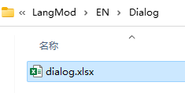
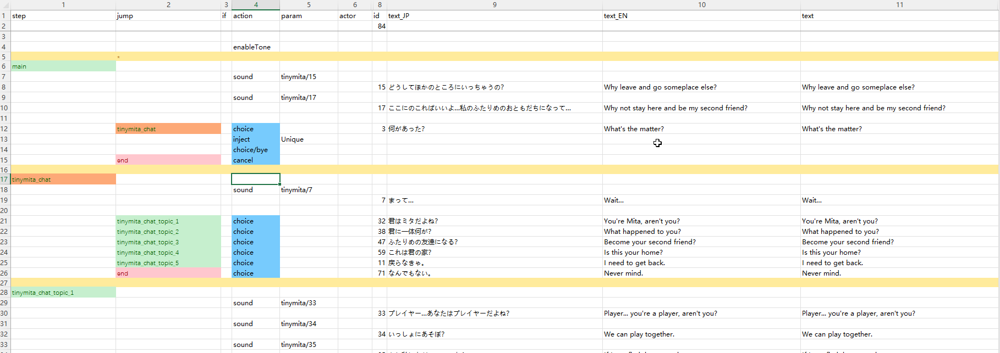

## 导入自定义角色

假设您已经在 Chara 表中定义了您的自定义角色。您可以参考现有的模组或 Elin Sources。
<LinkCard t="SourceChara" u="https://docs.google.com/spreadsheets/d/1CJqsXFF2FLlpPz710oCpNFYF4W_5yoVn" />

CWL 利用 tag 单元格来添加功能，您可以添加任意数量的标签。**请记住，标签之间用 `,`（逗号）分隔，中间不要有空格**。

## 自动生成/添加到区域

要让 CWL 将角色生成到某个区域，请使用标签 `addZone_*`，并用区域 **类型名称** 替换 `*`（星号），或者保留星号以生成到随机区域。

例如，要在小小花园中生成角色，请使用 `addZone_LittleGarden`。请查看 [SourceGame/Zone](https://docs.google.com/spreadsheets/d/16-LkHtVqjuN9U0rripjBn-nYwyqqSGg_) 并参考 type 列以获取正确的区域名称。

如果您的游戏中已经存在该角色，则 CWL 将跳过。

## 添加初始装备/物品

当CWL生成你的角色时，你还可以为该角色定义起始装备和物品，使用标签 `addEq_ItemID#Rarity` 和/或 `addThing_ItemID#Count`。

要为角色分配特定装备，使用标签 `addEq_ItemID#Rarity`，其中 `ItemID` 替换为物品的ID，`Rarity` 为以下之一：**随机（Random）、粗糙（Crude）、普通（Normal）、优质（Superior）、传奇（Legendary）、神话（Mythical）、神器（Artifact）**。如果省略 `#Rarity`，将使用默认稀有度 `#Random`。

例如，要将传奇的 `BS_Flydragonsword` 和随机的 `axe_machine` 设置为角色的主要武器：
```:no-line-numbers
addZone_Palmia,addEq_BS_Flydragonsword#Legendary,addEq_axe_machine
```

要为角色添加起始物品，使用标签 `addThing_ItemID#Count`。如果省略 `#Count`，将生成默认的 `1` 件物品。

例如，要为角色添加 `padoru_gift` x10 和 `援军卷轴` x5：
```:no-line-numbers
addAdvZone_Palmia,addThing_padoru_gift#10,addThing_1174#5
```

## 创建冒险者

感谢 105gun。

如果您的角色 trait 设定为 **`Adventurer`** 或 **`AdventurerBacker`**，CWL 将导入该角色为冒险者，并将出现在冒险者排名列表中。

::: warning 注意
从 CWL 1.15.0 开始，以前的标签 `addAdvZone`/`addAdvEq`/`addAdvThing` 已被上述普通标签取代，但仍然可以使用。  

:::

## 自定义商人库存

如果您的角色 trait 设定为 **`Merchant`**，您可以使用标签 `addStock` 和一份库存文件定义自定义商人的库存。


库存文件是一个简单的 JSON 文件，放置在您的 `LangMod/**/Data/` 文件夹中，名称为 `stock_merchantID.json`，例如，您有一个自定义角色，ID 为 `example_merchant`，您应该在 `LangMod/EN/Data/`、`LangMod/CN/Data/` 等语言子文件夹中有一个文件 `stock_example_merchant.json`。
```json
{
  "Owner": "example_merchant",
  "Items": [
    {
      "Id": "example_item",
      "Material": "",
      "Num": 1,
      "Restock": true,
      "Type": "Item"
    },
    {
      "Id": "example_item_limited",
      "Material": "granite",
      "Num": 1,
      "Restock": false,
      "Type": "Item"
    },
    {
      "Id": "example_item_craftable",
      "Material": "",
      "Num": 1,
      "Restock": false,
      "Type": "Recipe"
    }
  ]
}
```

`Owner` 值与商人角色 ID 相同，`Items` 是库存中物品的数组。

`Id` 是物品的 ID。`Material` 是您希望其作为的材料，留空以使用在物品行中定义的默认材料。`Num` 是堆叠中物品的数量。`Restock` 定义它是否为限时物品，当设置为 `false` 时，只能购买一次。`Type` 可以是 `Item`、`Recipe` 或 `Spell`。

如果您不使用代码编辑器，您应该使用 [JSONLint](https://jsonlint.com/) 来验证您的 JSON。

## 自定义对话

有时候你想让角色在特定时间插话或喊叫，只需要在 `LangMod/**/Dialog/` 文件夹中准备一个 `dialog.xlsx` 表格。



这个表格的格式与游戏的对话表格 **Elin/Package/_Elona/Lang/_Dialog/dialog.xlsx** 相同，但你只需 `unique` 表格和包含你角色 ID 的那一行。

## 自定义剧情

剧情是你与角色的对话，通常会有选项。

要为角色添加一个自定义剧情，使用标签 `addDrama_DramaSheetName`，CWL 将自动重定向该剧情。

你的自定义剧情表必须放在你的 `LangMod/**/Dialog/Drama/` 文件夹中，并且名称必须与标签匹配。例如，使用 `addDrama_MyCharaDrama` 对应 `Dialog/Drama/MyCharaDrama.xlsx`。

在制作自己的剧情时，你可以参考游戏中的剧情表，路径为 **Elin/Package/_Elona/Lang/_Dialog/Drama**，或者查看 Tiny Mita 的示例，它有一个模板剧情表：

<LinkCard t="CWL Example: Tiny Mita" u="https://steamcommunity.com/sharedfiles/filedetails/?id=3396774199" />



::: tip 热加载剧情
剧情表可以在游戏过程中编辑并热重载。
:::

## 自定义传记

为了为你的角色增添更多风味，你可以使用标签 `addBio_CharaId` 来指定自定义传记。传记文件是一份 JSON 文件，存放在你的 `LangMod/**/Data/` 文件夹中，名称为 `bio_CharaId.json`，例如，如果你有一个自定义角色，其 ID 为 `example_chara`，那么你应该在 `LangMod/EN/Data/`、`LangMod/CN/Data/` 等其他语言子文件夹中有一个文件 `bio_example_chara.json`。
```json
{
    "Birthday": 11,
    "Birthmonth": 4,
    "Birthyear": 514,
    "Birthplace": "地球",
    "Birthplace_JP": "地球",
    "Birthlocation": "咩咩村",
    "Birthlocation_JP": "咩咩村",
    "Mom": "最棒的母亲",
    "Mom_JP": "最棒的母亲",
    "Dad": "最棒的爹地",
    "Dad_JP": "最棒的爹地",
    "Background": "在这普通的一天\n我穿着普通的鞋\n很普通地走在这普通的街\n掏出普通的耳机\n找点普通的感觉\n来一首我最爱的普通音乐\n普通的disco我们普通的摇",
    "Background_JP": "在这普通的一天\n我穿着普通的鞋\n很普通地走在这普通的街\n掏出普通的耳机\n找点普通的感觉\n来一首我最爱的普通音乐\n普通的disco我们普通的摇"
}
```

带有 `_JP` 的条目用于日语本地化，这样就不用单独准备一份 `LangMod/JP/` 资源了。