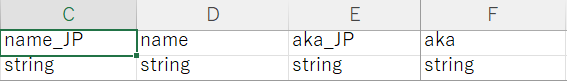

Allows the game to automatically load modders' custom resources from the mod directory, simplifying the process for modders to utilize various game functionalities without any additional steps, and with extended localization support.

Ideal for mods that introduce new items, characters, or audio elements, the CWL eliminates the need for creating script DLLs to import Excel sheets.

## Using CWL

- Source Sheets (Character, Items, Races, Talks, etc)
- Custom Adventurer
- Custom Merchant
- Custom Element (Feat, Ability, Spell)
- Custom Religion
- Custom Material (New color)
- Dialog/Drama
- Book Text
- Localization Support 
- Sound/BGM
- Lots of Fixes & Optimizations
    - Unified import process to reduce load time
    - Auto detect incompatible sheet
    - Rethrow excel parsing exceptions with more details
    - Safely load game with invalid modded elements/cards/quests
- Comprehensive API

CWL is made with community effort and feedback, new features are added upon request.

## Example Mod Setup

CWL requires mod resources to be placed under the **LangMod** folder, you can add as many supported languages as you want by naming the subfolders with the language code, for example:


When CWL imports the resources, it will import from the current language folder first, effectively addressing the translation issue with the current Elin xlsx implementation, which generally only has JP and EN entries.

`JP` folder can be omitted, as long as the `_JP` entries in other lang folders are filled in. 


`ZHTW` will use `CN` as fallback, while `EN` being the last fallback. CWL will use whatever is found as the last resort.

## Shared Data

Some data files do not require localization, so you only need to prepare one copy of that data file and place it in any language subfolder. For example, custom merchant stock files and custom religion offering multiplier files only need to be added once.

## Custom Sources

Modders can now simply place the xlsx files within each language folder. CWL will import all the localized sources according to the sheet name that matches a SourceData or SourceLang.

Note that it's the **sheet name**, not the file name! For example, this will import **SourceThing**, **SourceChara**, **LangGeneral** accordingly.


Supported `SourceData` are: 
```:no-line-numbers
Chara, CharaText, Tactics, Race, Job, Hobby
Thing, ThingV, Food, Recipe, SpawnList, Category, Collectible, KeyItem
Element, Calc, Stat, Check, Faction, Religion, Zone, ZoneAffix, Quest, Area, HomeResource, Research, Person
GlobalTile, Block, Floor, Obj, CellEffect, Material
```

Supported `SourceLang` are: 
```:no-line-numbers
General, Game, List, Word, Note
```

You may also split the sheets into multiple xlsx files for organizing. The xlsx file name doesn't matter.

If you want to browse the IDs for in game things/charas/various sources, checkout Elin Sources:


## Usage Examples

To see some CWL usage examples, checkout the following mods (and more on steam workshop):

<LinkCard t="Mods Using CWL" u="https://steamcommunity.com/workshop/filedetails/discussion/3370512305/501685815345180661/" />

## Code Localization

You may export the string entries to a `General` sheet and let CWL import it to `LangGeneral`, then you can use **`"my_lang_id".lang()`** to localize in code at runtime.


