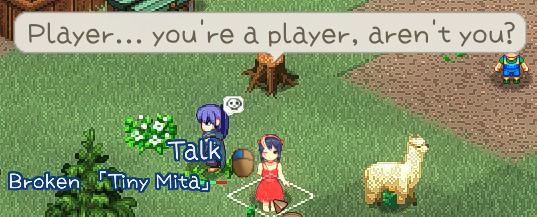
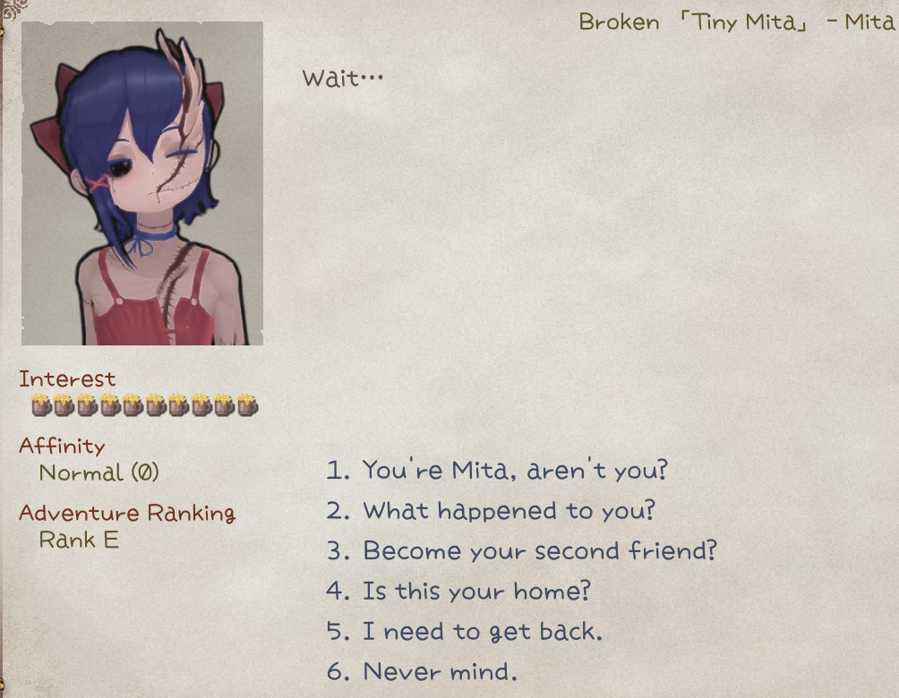
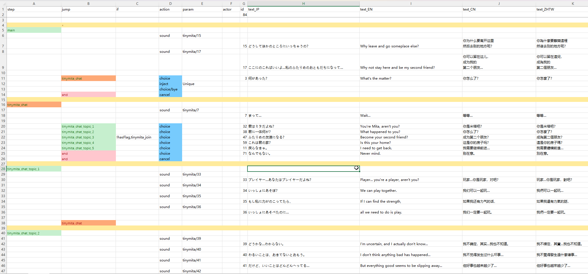

## Barks

Sometimes you want the character to banter/bark at certain conditions. The barks pop up above character's head in a speech bubble.



These barks are written in **CharaText** sheet, and your Chara sheet uses **idText** cell to link their IDs together.


|Cell|calm|fov|aggro|dead|kill|
|-|-|-|-|-|-|
|Condition|Random default|On sight|In combat|Death rattle|Kill confirmed|

You can also insert [custom sound](../Other/sound) tags in each entry to make it an audible bark, e.g.  `"You shall not pass!!<sound=gandalf,0.8>"` will have a 80% chance to play sound with ID `gandalf` when this bark triggers.

## Dialog

To add some chatty texts to the character for the `**Let's Talk**` option, you'll need to have a `dialog.xlsx` sheet in your `LangMod/**/Dialog/` folder.


The sheet format is the same as game's dialog sheet at **Elin/Package/_Elona/Lang/_Dialog/dialog.xlsx**, but you only need the `unique` sheet and the row with your character's ID.

## Drama

A drama is the rich dialog that usually has options and additional actions. 



To define a custom drama for the character, use tag `addDrama_DramaSheetName` and CWL will reroute the drama automatically.

Your custom drama sheet must be placed in your `LangMod/**/Dialog/Drama/` folder, and the name must match the tag. For example, use `addDrama_MyCharaDrama` with `Dialog/Drama/MyCharaDrama.xlsx`.

**<span class="text-amber-300">Important</span>**: you only need to provide **1** copy of the drama sheet, it can be placed in any of language sub folders. CWL supports in-file localization for multiple languages within the same sheet.

You should reference the game drama sheets at **Elin/Package/_Elona/Lang/_Dialog/Drama** while making your own, or the Tiny Mita example which has a template drama sheet:
<LinkCard t="CWL Example: Tiny Mita" u="https://steamcommunity.com/sharedfiles/filedetails/?id=3396774199" />



::: tip Hot Reload
Drama sheet can be edited and hot reloaded during game play.
:::

### Drama Basic

A drama sheet is executed from top to bottom, and composed of drama lines. A drama line has the following cells(defined as 1st row):

- `step`: when filled in, it marks all the subsequent lines as a drama step, until another line with `step` appears.
- `jump`: the `step` to jump to when this line executes.
- `if` / `if2`: the condition to check before executing this line. If `if2` column is also present, then both `if` and `if2` need to be satisfied.
- `action`: the action to execute.
- `param`: the parameters for the action.
- `actor`: The current line speaker. Only fill this when you want to introduce multiple character conversation. Defaults to `tg`. Append `?` to show as `???`.
- `id`: unique id for this line, this is only and mandatory for `text` lines.
- `text_XX` / `text_JP` / `text_EN` / `text`: the actual dialog content in this line. `text_XX` is for other languages where `XX` is the lang code, such as `text_CN`, `text_RU`. `text` column will be used as the last fallback for language code that's missing.

The flow of the drama is connected by drama steps, each drama step contains one or many drama lines, line can be pure dialog, action, and/or conditional at the same time.

`main` is the default drama step that gets executed first, `end` is the default step that exits the drama.

When writing your own drama sheet, avoid using step names starting with underscore `_` or `flag`, there are a lot of internally generated steps with such naming and we don't want any collision.

### Drama Actions

Text lines are the most common lines, they only have `text` and `id` cell filled in and optionally `if` condition. They require an input to advance to the next line, such as clicking or pressing key. 

Action lines(except `choice`) do not require input and will keep executing. If both `action` and `text` are provided, `text` will be ignored.

Common actions:

|action|param|description|
|-|-|-|
|`inject`|`Unique`|Insert "Let's Talk" and a lot of useful steps|
|`choice`||Add a choice to the last text line. Requires `text` and `jump`|
|`choice/bye`||Insert a default bye choice|
|`cancel`||Set right click / escape key behavior. Requires `jump`, usually set to `end`|
|`setFlag`|flag name,value(optional)|Set a flag with value or default 1 if not provided|
|`reload`||Reload the drama so any flag changes made in the current drama can be applied. Requires `jump`, usually set to `main`. Don't confuse this with hot reload during development - for that you only need to save the changes and it will be reloaded next time you start the drama|
|`enableTone`||Enable tone transformation for the drama|
|`addActor`||Add a drama actor to use later, `text` can be used to set a name override. This is done automatically when you fill in new id in `actor` cell. Requires [character id](https://docs.google.com/spreadsheets/d/1CJqsXFF2FLlpPz710oCpNFYF4W_5yoVn/edit?gid=1622484657#gid=1622484657) in `actor`|
|`invoke`|method name|Call a method. All of them are hardcoded for specific use. Check CWL Expansion below|
|`setBG`|image name(optional)|Set an image as background or use empty to clear it. CWL allows you to supply your own png image in **Texture** folder|
|`BGM`|BGM id|Switch the BGM to specific one by id. Check the [CWL Sound & BGM page](../Other/sound) for custom BGM|
|`stopBGM`||Stop the BGM and do not continue|
|`lastBGM`||Stop the BGM and continue the last one played|
|`sound`|sound id|Play a sound by id. Check the [CWL Sound & BGM page](../Other/sound) for custom sounds|
|`wait`|duration|Pause the execution in this line for seconds, good to use when you want the animation or stuff to finish|
|`alphaIn` `alphaOut`|duration|Alpha transition(transparency) in seconds|
|`alphaInOut`|duration,wait time|`alphaIn` first, wait in seconds, then `alphaOut`|
|`fadeIn` `fadeOut`|duration,`white`/`black`(optional)|Fade transition in seconds|
|`fadeInOut`|duration,wait time,`white`/`black`(optional)|`fadeIn` first, wait in seconds, then `fadeOut`|
|`hideUI`|transition|Hide the HUD elements with a transition in seconds. Restored when exiting drama|
|`hideDialog`||Hide the drama dialog so you can do cutscenes, however text lines force show dialogs, so you need to combine this with `wait`|
|`end`||Explicitly end the drama. Same as `jump` to drama step `end`|
|`addKeyItem`|[keyitem id](https://docs.google.com/spreadsheets/d/175DaEeB-8qU3N4iBTnaal1ZcP5SU6S_Z/edit?gid=836018107#gid=836018107)|Add keyitem with id to the player|
|`drop`|[item id](https://docs.google.com/spreadsheets/d/175DaEeB-8qU3N4iBTnaal1ZcP5SU6S_Z/edit?gid=1479265439#gid=1479265439)|Drop an item as reward at player's position|
|`addResource`|[resource name](https://gist.github.com/gottyduke/6e2847e37d205a5621bfd0615e5bd9e7#file-homeresource-md),count|Add home resource by count|
|`shake`||Shake the screen|
|`slap`||Slap the drama owner character|
|`destroyItem`|[item id](https://docs.google.com/spreadsheets/d/175DaEeB-8qU3N4iBTnaal1ZcP5SU6S_Z/edit?gid=1479265439#gid=1479265439)|Find and destroy the item with id from player's inventory|
|`focus`||Immediately move and focus camera to the drama owner character|
|`focusChara`|[character id](https://docs.google.com/spreadsheets/d/1CJqsXFF2FLlpPz710oCpNFYF4W_5yoVn/edit?gid=1622484657#gid=1622484657),speed(optional)|Move and focus camera to the character with id **on the same map**|
|`focusPC`|speed(optional)|Move and focus camera to the player|
|`unfocus`||Reset and unfocus camera|
|`destroy`|[character id](https://docs.google.com/spreadsheets/d/1CJqsXFF2FLlpPz710oCpNFYF4W_5yoVn/edit?gid=1622484657#gid=1622484657)|Destroy a character with id **on the same map**|
|`save`||Save game|
|`setHour`|hour|Set the game time in hours|

When providing multiple parameters, they are **separated by `,` (comma) with no spaces in between**.

### Drama Condition

You can attach condition checks to any line by filling in `if` and/or `if2` cells.

|condition|param|description|
|-|-|-|
|`hasFlag`|flag name|Player has flag set and value is not 0|
|`!hasFlag`|flag name|Player doesn`t has flag set or value is 0|
|`hasMelilithCurse`||Player has Melilith curse|
|`merchant`||Player is at Merchant Guild|
|`fighter`||Player is at Fighter Guild|
|`thief`||Player is at Thief Guild|
|`mage`||Player is at Mage Guild|
|`hasItem`|[item id](https://docs.google.com/spreadsheets/d/175DaEeB-8qU3N4iBTnaal1ZcP5SU6S_Z/edit?gid=1479265439#gid=1479265439)|Player has item with id in inventory|
|`isCompleted`|[quest id](https://docs.google.com/spreadsheets/d/16-LkHtVqjuN9U0rripjBn-nYwyqqSGg_/edit?gid=785701697#gid=785701697)|Player has completed quest with id|

The format for a condition is `condition,param`. Since `hasFlag` is used most often, it can be simplified with value check too:
```
=,example_flag,1
>,example_counter,20
!,exmaple_not_equal_flag,69
```

Most of the time you only need `if` column in your sheet. If you think you need more complex condition and feel necessary, you can insert a new column and set the first row (column header) as `if2`.

::: warning Static Evaluation
The `if` column is evaluated **only once on drama load**, that means you cannot dynamically enable/disable lines. Use `reload` or CWL's `invoke*` condition.
:::

## Drama Expansion

Struggling with the built-in `action` of the drama sheet not achieving the desired effect? Need more condition checks? CWL allows you to add custom drama expansion methods in the DLL and call them in the drama sheet.

<LinkCard t="CWL Drama Expansion" u="https://elin-modding-resources.github.io/Elin.Docs/articles/100_Mod%20Documentation/Custom%20Whatever%20Loader/EN/Character/4_drama"/>

## Mod Help Integration

Sometimes you may want to provide a bit of hint for players, so they can better experience your awesome drama story. By making mods with CWL, you already gain access to Mod Help, check it out to deliver custom made help pages!

<LinkCard t="Mod Help" u="https://elin-modding-resources.github.io/Elin.Docs/articles/100_Mod%20Documentation/Mod%20Help/0_mod_help" />