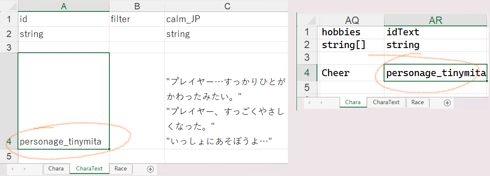
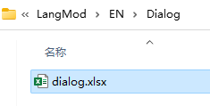

## Barks (Popup)

Sometimes you want the character to banter/bark at certain conditions. The barks pop up above character's head in a speech bubble.

These barks are written in **CharaText** sheet, and your Chara sheet uses **idText** cell to link their IDs together.

|Cell|calm|fov|aggro|dead|kill|
|-|-|-|-|-|-|
|Condition|Random default|On sight|In combat|Death rattle|Kill confirmed|

You can also insert [custom sound](../Other/sound) tags in each entry to make it an audible bark, e.g.  `"You shall not pass!!<sound=gandalf,0.8>"` will have a 80% chance to play sound with ID `gandalf` when this bark triggers.

## Dialog

To add some chatty texts to the character for the `**Let's Talk**` option, you'll need to have a `dialog.xlsx` sheet in your `LangMod/**/Dialog/` folder.

The sheet format is the same as game's dialog sheet at **Elin/Package/_Elona/Lang/_Dialog/dialog.xlsx**, but you only need the `unique` sheet and the row with your character's ID.

::: warning Format
Dialog data starts at 5th row.
:::

## Drama

A drama is the rich dialog that usually has options and additional actions. 

Drama guides are moved to a new section:

<LinkCard t="Drama System" u="/100_Mod Documentation/Custom Whatever Loader/EN/Drama/0_basic.md" />
