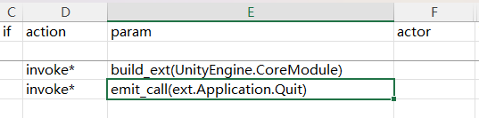

## Barks

Sometimes you want the character to banter/bark at certain conditions. They barks pop up above character's head.


These barks are written in **CharaText** sheet, and your Chara sheet uses **idText** to link their IDs together.


|Cell|calm|fov|aggro|dead|kill|
|-|-|-|-|-|-|
|Condition|Random default|On sight|In combat|Death rattle|Kill confirmed|

## Dialog

To add some chatty chat texts to the character for the `Let's Talk` option, you'll need to have a `dialog.xlsx` sheet in your `LangMod/**/Dialog/` folder.


The sheet format is the same as game's dialog sheet at **Elin/Package/_Elona/Lang/_Dialog/dialog.xlsx**, but you only need the `unique` sheet and the row with your character's ID.

## Drama

A drama is the rich dialog that usually has options and additional actions. 


To define a custom drama for the character, use tag `addDrama_DramaSheetName` and CWL will reroute the drama automatically.

Your custom drama sheet must be placed in your `LangMod/**/Dialog/Drama/` folder, and the name must match the tag. For example, use `addDrama_MyCharaDrama` with `Dialog/Drama/MyCharaDrama.xlsx`.

You should reference the game drama sheets at **Elin/Package/_Elona/Lang/_Dialog/Drama** while making your own , or the Tiny Mita example which has a template drama sheet:
<LinkCard t="CWL Example: Tiny Mita" u="https://steamcommunity.com/sharedfiles/filedetails/?id=3396774199" />


::: tip Hot Reload
Drama sheet can be edited and hot reloaded during game play.
:::

### Drama Basic

A drama sheet is executed from top to bottom, and composed of drama lines. A drama line has the following cells(defined as 1st row):

- `step`: when filled in, it marks all the subsequent lines as a drama step, until another line with `step` appears.
- `jump`: the `step` to jump to when this line executes.
- `if` / `if2`: the condition to check before executing this line. If `if2` column is also present, then both `if` and `if2` need to be satisfied.
- `action`: the action to execute.
- `param`: the parameters for the action.
- `actor`: The current line speaker. Only fill this when you want to introduce multiple character conversation.
- `id`: unique id for this line, this is only and mandatory for `text` lines.
- `text` / `text_JP` / `text_EN`: the actual dialog content in this line. `text_JP` and `text_EN` is self explanatory, `text` is for other languages(**CWL switches sheet by the LandMod/ subfolder**, so you should fill in the localized texts in the `text` cell).

The basic flow of the drama execution connected by drama steps, each drama step contains one or many drama lines, line can be pure dialog, action, and/or conditional at the same time.

`main` is the default drama step that gets executed first, `end` is the default step that exits the drama.

When writing your own drama sheet, avoid using step names starting with underscore `_` or `flag`, there are a lot of internally generated steps with such naming and we don't want any collision.

### Drama Actions

Text lines require an input to advance to the next line in game, such as clicking or pressing key. 

Action lines(except `choice`) do not require input and cannot be used with `text` on the same line, if both are filled in, `text` will be ignored.

Common actions:

|action|param|description|
|-|-|-|
|`inject`|`Unique`|Insert "Let's Talk" and a lot of useful steps|
|`choice`||Add a choice to the last text line. Requires `text` and `jump`|
|`choice/bye`||Insert a default bye choice|
|`cancel`||Set right click / escape key behavior. Requires `jump`, usually set to `end`|
|`setFlag`|flag name,value(optional)|Set a flag with value or default 1 if not provided|
|`enableTone`||Enable tone transformation for the dialog|
|`addActor`||Add a drama actor to use later, `text` can be used to set a name override. This is done automatically when you fill in new id in `actor` cell. Requires [character id](https://docs.google.com/spreadsheets/d/1CJqsXFF2FLlpPz710oCpNFYF4W_5yoVn/edit?gid=1622484657#gid=1622484657) in `actor`|
|`invoke`|method name|Call a method. All of them are hardcoded for specific use. Check CWL Expansion below|
|`setBG`|image name(optional)|Set an image as background or use empty to clear it. CWL allows you to supply your own png image in **Texture** folder|
|`BGM`|BGM id|Switch the BGM to specific one by id. Check the [CWL Sound & BGM page](../Other/sound) for custom BGM|
|`stopBGM`||Stop the BGM and do not continue|
|`lastBGM`||Stop the BGM and continue the last one played|
|`sound`|sound id|Play a sound by id. Check the [CWL Sound & BGM page](../Other/sound) for custom sounds|
|`wait`|duration|Pause the execution in this line for seconds, good to use when you want the animation or stuff to finish|
|`alphaIn` `alphaOut`|duration|Alpha transition(transparency) in seconds|
|`alphaInOut`|duration,wait time|`alphaIn` first, wait in seconds, then `alphaOut`|
|`fadeIn` `fadeOut`|duration,`white`/`black`(optional)|Fade transition in seconds|
|`fadeInOut`|duration,wait time,`white`/`black`(optional)|`fadeIn` first, wait in seconds, then `fadeOut`|
|`hideUI`|transition|Hide the HUD elements with a transition in seconds. Restored when exiting drama|
|`hideDialog`||Hide the drama dialog so you can do cutscenes, however text lines force show dialogs, so you need to combine this with `wait`|
|`end`||Explicitly end the drama. Same as `jump` to drama step `end`|
|`addKeyItem`|[key item id](https://docs.google.com/spreadsheets/d/175DaEeB-8qU3N4iBTnaal1ZcP5SU6S_Z/edit?gid=836018107#gid=836018107)|Add key item by id to the player|
|`drop`|[item id](https://docs.google.com/spreadsheets/d/175DaEeB-8qU3N4iBTnaal1ZcP5SU6S_Z/edit?gid=1479265439#gid=1479265439)|Drop an item as reward at player's position|
|`addResource`|resource name,count|Add home resource by count. `food` `money` `knowledge` `influence` `fun` `safety` `nature` `education` `culture` `industry` `medicine` `worth` `karma` `reknown`|
|`shake`||Shake the screen|
|`slap`||Slap the drama owner character|
|`destroyItem`|[item id](https://docs.google.com/spreadsheets/d/175DaEeB-8qU3N4iBTnaal1ZcP5SU6S_Z/edit?gid=1479265439#gid=1479265439)|Find and destroy the item with id from player's inventory|
|`focus`||Immediately move and focus camera to the drama owner character|
|`focusChara`|[character id](https://docs.google.com/spreadsheets/d/1CJqsXFF2FLlpPz710oCpNFYF4W_5yoVn/edit?gid=1622484657#gid=1622484657),speed(optional)|Move and focus camera to the character with id **on the same map**|
|`focusPC`|speed(optional)|Move and focus camera to the player|
|`unfocus`||Reset and unfocus camera|
|`destroy`|[character id](https://docs.google.com/spreadsheets/d/1CJqsXFF2FLlpPz710oCpNFYF4W_5yoVn/edit?gid=1622484657#gid=1622484657)|Destroy a character with id **on the same map**|
|`save`||Save game|
|`setHour`|hour|Set the game time in hours|

When providing multiple parameters, they are separated by commas `,` **and no space in between**.

### Drama Condition

You can attach condition checks to any line by filling in `if` and/or `if2` cells.

|condition|param|description|
|-|-|-|
|`hasFlag`|flag name|Player has flag set and value is not 0|
|`!hasFlag`|flag name|Player doesn`t has flag set or value is 0|
|`hasMelilithCurse`||Player has Melilith curse|
|`merchant`||Player is at Merchant Guild|
|`fighter`||Player is at Fighter Guild|
|`thief`||Player is at Thief Guild|
|`mage`||Player is at Mage Guild|
|`hasItem`|[item id](https://docs.google.com/spreadsheets/d/175DaEeB-8qU3N4iBTnaal1ZcP5SU6S_Z/edit?gid=1479265439#gid=1479265439)|Player has item with id in inventory|
|`isCompleted`|[quest id](https://docs.google.com/spreadsheets/d/16-LkHtVqjuN9U0rripjBn-nYwyqqSGg_/edit?gid=785701697#gid=785701697)|Player completed quest with id|

The format for a condition is `condition,param`. Since `hasFlag` is used most often, it can be simplified with value check too:
```
hasFlag,example_flag
=>
=,example_flag,1
>,example_counter,20
!,exmaple_not_equal_flag,69
```

Most of the time you only need `if` column in your sheet. If you think you need more complex condition and feel necessary, you can insert a new column and set the first row (column header) as `if2`.

### Drama Expansion

::: warning Temporary Version
This part of documentation is a partially written stub, and API usages may change at any time.
:::

Struggling with the built-in `action` of the drama sheet not achieving the desired effect? Need more condition checks? CWL allows you to add custom drama extension methods in the DLL and call them in the drama sheet.

CWL comes with a small set of built-in drama expansion methods, which you can [checkout code here](https://github.com/gottyduke/Elin.Plugins/blob/master/CustomWhateverLoader/API/Drama/Expansions).

This feature requires the CWL configuration value `Dialog.ExpandedActions` to be set to `true`, which is enabled by default.

In the drama sheet, you can use the CWL special action `invoke*` to call expansion method:


### Parameter Passing

Parameters are separated by commas `,` and written within the parentheses of the expansion method, similar to code syntax:

|action|param|
|-|-|
|`invoke*`|honk_honk(arg1, arg2)|

Most of the methods also take `actor` cell as the target character to execute the method on, such as `pc` or `tg`(the drama owner character), or any valid [character id](https://docs.google.com/spreadsheets/d/1CJqsXFF2FLlpPz710oCpNFYF4W_5yoVn/edit?gid=1622484657#gid=1622484657).

If the `jump` in the same line has any value, then the return value of the expansion method will be used to determine if the `jump` will be executed. Returns `true` will execute the `jump`, otherwise not.

### CWL Methods

|method|param|description|jump|
|-|-|-|-|
|`add_item`|[item id](https://docs.google.com/spreadsheets/d/175DaEeB-8qU3N4iBTnaal1ZcP5SU6S_Z/edit?gid=1479265439#gid=1479265439),[material alias](https://docs.google.com/spreadsheets/d/13oxL_cQEqoTUlcWsjKZyNuAaITFGK56v/edit?gid=33087043#gid=33087043),lv,count|Add the item with given material, lv and count to the `actor`|always|
|`join_party`||Make the `actor` join player party|always|
|`join_faith`|[religion id(optional)](https://docs.google.com/spreadsheets/d/16-LkHtVqjuN9U0rripjBn-nYwyqqSGg_/edit?gid=729486062#gid=729486062)|Make the actor join the specific religion or leave current religion if none provided|if success|
|`mod_affinity`|value expression|Modify the `actor` affinity with expression, such as `+5`, `-10`|if success|
|`mod_flag`|value expression|Modify the flag value from `actor` with expression, such as `+1`, `=1`, `0`. This supports non player character|always|
|`apply_condition`|[condition alias](https://docs.google.com/spreadsheets/d/16-LkHtVqjuN9U0rripjBn-nYwyqqSGg_/edit?gid=921112246#gid=921112246),power|Apply a condition with given power (default 100) to the `actor`|always|
|`cure_condition`|[condition alias](https://docs.google.com/spreadsheets/d/16-LkHtVqjuN9U0rripjBn-nYwyqqSGg_/edit?gid=921112246#gid=921112246)|Cure the condition on `actor`|if cured|
|`remove_condition`|[condition alias](https://docs.google.com/spreadsheets/d/16-LkHtVqjuN9U0rripjBn-nYwyqqSGg_/edit?gid=921112246#gid=921112246)|Remove the condition on `actor`|always|
|`move_tile`|x,y|Move `actor` with **relative** tile offset, such as `1,1` or `2,-1`|always|
|`move_zone`|[zone id](https://docs.google.com/spreadsheets/d/16-LkHtVqjuN9U0rripjBn-nYwyqqSGg_/edit?gid=1819250752#gid=1819250752),level(optional)|Move `actor` to a specific zone with id, and specific level(default 0)|always|
|`play_anime`|[anime id](https://gist.github.com/gottyduke/6e2847e37d205a5621bfd0615e5bd9e7#file-elin-animeid-md)|Play animation on `actor`|always|
|`play_effect`|[effect id](https://gist.github.com/gottyduke/6e2847e37d205a5621bfd0615e5bd9e7#file-elin-effects-md)|Play effect on `actor`|always|
|`play_emote`|[emote id](https://gist.github.com/gottyduke/6e2847e37d205a5621bfd0615e5bd9e7#file-elin-emo-md)|Play emote on `actor`|always|
|`play_screen_effect`|[screen effect id](https://gist.github.com/gottyduke/6e2847e37d205a5621bfd0615e5bd9e7#file-screeneffect-md)|Play screen effect once|always|
|`portrait_set`|portrait id(optional)|Set `actor` portrait in dialog to the specific one or reset using empty, such as `UN_charaId2`|always|

Notably, `build_ext` and `emit_call` are two expansion methods that allow you to directly invoke certain static methods from external assemblies, for example:



This feature requires the CWL configuration value `Dialog.ExpandedActionsAllowExternal` to be set to `true`, which is enabled by default.

### CWL Conditions

These are still expansion methods that uses `invoke*` action same as above, but their return value is important.

|method|param|description|jump|
|-|-|-|-|
|`if_affinity`|value expression|Check `actor` affinity with expression, such as `<5`, `>=90`, `!=0`|if satisfies|
|`if_flag`|value expression|Check `actor` flag value with expression or set it, such as `=5`, `1`, `!=0`|if satisfies|
|`if_condition`|condition alias|Check if `actor` has active condition with alias|if active|
|`if_tag`|tag|Check if `actor` has certain tag defined in Chara row|if defined|
|`if_location`|[zone id](https://docs.google.com/spreadsheets/d/16-LkHtVqjuN9U0rripjBn-nYwyqqSGg_/edit?gid=1819250752#gid=1819250752),level(optional)|Check if `actor` is in certain zone and optionally check level|if present|

### Implementing Custom Method

CWL offers [easy API to add expansion methods](../API/Custom/drama) in your own script DLL, without even needing to reference CWL's script assembly.
