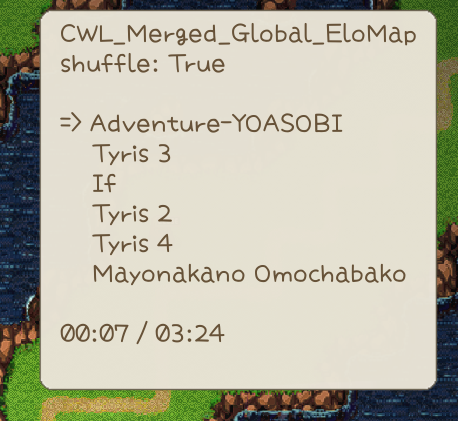

## Custom Sound

Sound files should be in one of **acc**, **mp3**, **ogg**, **wav** formats, with the filename serving as the sound ID. A default metadata JSON is generated upon loading, allowing you to edit and apply sound file metadata on the next game launch.

By setting **"type"**: **"BGM"** in the metadata, the sound file will be instantiated as **BGMData** instead of **SoundData**. You can also customize the BGM parts in the metadata.

Subdirectories in the **Sound** folder will serve as ID prefixes. For example, **AI_PlayMusic** will use **Instrument/sound_id**, so you should place the sound file in the `Instrument` folder if you plan to replace instrument sounds.

**You can override existing in-game sounds using the same ID**. For example, chicken uses sound id **Animal/Chicken/chicken**, if you want to replace this sound, you should put your sound file named **chicken** with one of the supported formats, in **Sound/Animal/Chicken/** folder.

Sounds loaded by CWL will be available to use anywhere in the game via sound id.


```cs
pc.PlaySound("clown_horn"); // <- Card.PlaySound
SE.PlaySound("clown_horn");
```

## Custom BGM & Playlist

::: tip Version Notice
Custom BGM & Playlist feature is added in CWL **`1.19.0`**.
:::

Game comes with 100+ BGMs, they are defined by a numeric id and sound file id. You may check them out here:
::: details BGM Items
|bgm id|sound id|bgm name|
|-|-|-|
|1|001 no bgm|No BGM|
|2|002 pop01|Pop01|
|3|003 PSML516|PSML516|
|4|004 hoshinokiseki|Hoshi No Kiseki|
|5|005 elomap1|Tyris 1|
|6|006 elomap2|Tyris 2|
|7|007 elomap3|Tyris 3|
|8|008 town2 magic|Town 2|
|9|009 fun village|Fun Village|
|10|010 bouken no junbi|Bouken No Junbi|
|11|011 bukikoubou|Buki Kobo|
|12|012 kiminoita natsu|Kiminoita Natsu|
|13|013 ruins|Ruins|
|14|014 village1|Village|
|15|015 Atlantean_Twilight256|Atlantean Twilight|
|16|016 intro2|Intro 2|
|17|017 cobalt|Cobalt|
|18|018 mitologia|Mitologia|
|19|019 morning breeze|Morning Breeze|
|20|020 morning breeze(sunny day)|Morning Breeze(Sunny Day)|
|21|021 PSML047|PSML047|
|22|022 Pyramid-naibu|Pyramid|
|23|023 mysterious-forest|Mysterious Forest|
|24|024 PSML514|PSML514|
|25|025 nodokana mura|Nodokana Mura|
|26|026 kokyo|Kokyo|
|27|027 fun game|Mayonakano Omochabako|
|28|028 kagayaku tsuki|Kagayaku Tsuki|
|29|029 MapBGM|Map BGM|
|30|030 a moment in the morning|A Moment In The Morning|
|31|031 SBGMv2_05|SBGM 5|
|32|032 daybreak|Daybreak|
|33|033 hoshi to tsuki|Hoshi To Tsuki No Oka|
|34|034 ep2|Epilogue 2|
|35|035 nibiiro no sora|Nibiiro No Sora|
|36|036 oita kataribe|Oita Kataribe|
|37|037 kaerimichi piano|Kaerimichi(Piano)|
|38|038 mori|Mori|
|39|039 raina|Raina|
|40|040 laid back guitars|Laid Back Guitars|
|41|041 earlgrey|Earlgrey Guitar|
|42|042 mayonakano-park|Mayonakano Park|
|43|043 Along-the-riverside-road|Along the riverside road|
|44|044 heya_guitar 1|Heya Guitar|
|45|045 Sancho_Panza 1|Sancho Panza|
|46|046 dwarf|Dwarf|
|47|047 nonbiri dwarf|Nonbiri Dwarf|
|48|048 nazoooki shinden|Nazoooki Shinden|
|49|049 kamigamiga nemuru basho|Kamigamiga Nemuru Basho|
|50|050 title|Title|
|51|051 yuki|Yuki|
|52|052 dark theme|Fear 2|
|53|053 hoard|Hoard|
|54|054 The House of Leaves|The House of Leaves|
|55|055 BGM_0 sirube-2|Sirube|
|56|056 orc01|Orc01|
|57|057 Village|Mearas Village 2|
|58|058 PSML060|PSML060|
|59|059 tyris4|Tyris 4|
|60|060 mayoimichi|Mayoimichi|
|61|061 hyousetsu|Hyousetsu|
|62|062 workshop|Mearas Workshop|
|63|063 shop|Shop|
|64|064 Town|Mearas Town|
|65|065 soaring|Soaring|
|66|066 soraochi|Soraochiruhi|
|67|067 Wizartorium|Wizartorium|
|68|068 gray|Gray|
|69|069 escape|Escape|
|70|070 arifureta shiawase|Arifureta Shiawase|
|71|071 Taikutsu|Taikutsu|
|72|072 Netherworld_Shanty|Netherworld Shanty|
|73|073 tabinohajime|Tabino Hajime|
|74|074 gag|Gag|
|75|075 happy|Mearas Happy|
|76|076 village|Mearas Village 3|
|77|077 dragon and toast|Dragon and Toast|
|78|078 legend of one|Legend of One|
|79|079 koudou|Koudou|
|80|080 big mojo|Big Mojo|
|81|081 exotics|Exotics|
|82|082 magic city|Mearas Magic City|
|83|083 gothic|Gothic|
|84|084 field|Field|
|85|085 PSML0515|PSML515|
|86|086 anosora|Anosorano Mukouni|
|87|087 memory|Memory|
|88|088 memory 2|Memory 2|
|89|089 semi yuugata|Semi. Yuugata.|
|90|090 hirusagari|Hirusagari Kibun|
|91|091 nichiyo|Nichiyo No Gogo|
|92|092 itazura|Itazura Kids|
|93|093 cat life|Cat Life|
|94|094 ensolarado|Ensolarado|
|95|095 BGM3 11|BGM3-11|
|96|096 BGM3 7var|BGM3-7 Var|
|97|097 BGM3 11var 1|BGM3-11 Var|
|98|098 Pixel Myth|Pixel Myth|
|99|099 Tsukitowatashi|Tsukito Watashi|
|100|100 Tsukino Kobune|Tsukino Kobune|
|101|101 flashback|Flashback|
|102|102 punipuni|Punipunichuiho|
|103|103 sabaku|Sabakuwo Iku|
|104|104 butou|Butoukai|
|105|105 anime OP|Elin OP|
|106|106 anime ED|Elin ED|
|107|107 BGM3-1 1|BGM3-1|
|108|108 wafu|Wafu|
|109|109 Into Legend|And Thus Into Legend|
|110|110 defender|Defender|
|111|111 snow forest|Snow Forest|
|112|112 hirahira|Hirahira|
|113|113 luna|Luna|
|114|114 orc05|Orchestra 5|
|115|115 xmas|Holy Night|
|116|116 xmas 2|Jingle Bell|
|117|117 atonement|Shokuzai No Mori|
:::

### Add New BGM

Custom BGMs are placed in the **Sound/BGM** sub folder, unlike custom sounds, you need to manually edit the `id` field in the metadata JSON. Be sure to launch game once to let CWL generate the files for you first.

CWL suggests using **wav** or **ogg** formats, this is because the Unity codec with Elin's game version (2021.3.34f1) might encounter problems decoding mp3 files.


The `id` is an arbitrary number, set it to larger than what game uses at last (`117`) and make it less likely to collide with other BGM's id. 

**Important to note,** this `id` is purely for the BGM. Your sound id is still the file name without extension.

When you assign an existing id to your BGM, then it becomes a global BGM replacement. E.g. Assigning id `56` to the song metadata `Adventure-YOASOBI.json`, will replace in game BGM `056 orc01` with sound `Adventure-YOASOBI`. This is why you want your new BGM (non-replacement ones) to use a unique id, otherwise the next BGM with the same id will replace yours.

> `056 orc01` is the title menu BGM.

### Add Playlist

Your playlists are placed in the **Sound/BGM/Playlist** folder, and they are simple JSON files. It contains 2 lists and a single bool value `shuffle`.
```json
{
    "shuffle": true,
    "list": [
        "megalovania"
    ],
    "remove": [
        "024 PSML514",
        "023 mysterious-forest"
    ]
}
```

The sound id (**not BGM id**) in `list` will be merged into the playlist, and `remove` will remove the entries (if present) from the playlist. You can also use existing game sound ids.

The playlist JSON file name should match one of the following:

+ An existing playlist name, excluding `Blank`
+ A zone type name
+ `"Global"`


Here are some of the game playlists:
::: details Playlists
+ Battle               [1]
	+ 054 The House of Leaves
+ Blank                [4]
	+ 041 earlgrey
	+ 090 hirusagari
	+ 044 heya_guitar 1
	+ 043 Along-the-riverside-road
+ Day                  [1]
	+ 004 hoshinokiseki        
+ Dungeon              [4]
	+ 024 PSML514                             
	+ 022 Pyramid-naibu     
	+ 023 mysterious-forest   
	+ 048 nazoooki shinden        
+ Dungeon2             [6]
	+ 072 Netherworld_Shanty       
	+ 077 dragon and toast                   
	+ 078 legend of one                        
	+ 079 koudou                            
	+ 080 big mojo                          
	+ 081 exotics     
+ Dungeon_Boss         [1]
	+ 098 Pixel Myth  
+ EloMap               [3]
	+ 006 elomap2      
	+ 007 elomap3      
	+ 059 tyris4      
+ Festival_Noyel       [1]
	+ 051 yuki  
+ Festival_Olvina      [1]
	+ 051 yuki 
+ Festival_Yowyn       [1]
	+ 093 cat life      
+ Field                [1]
	+ 015 Atlantean_Twilight256 
+ Hoard                [1]
	+ 053 hoard                               
+ Lot                  [1]
	+ 061 hyousetsu                           
+ Night                [2]
	+ 005 elomap1                             
	+ 004 hoshinokiseki                       
+ Underground          [2]
	+ 046 dwarf                                
	+ 047 nonbiri dwarf                        
:::

`Blank` is the default playlist for all zones that don't have an explicit playlist defined. 

To view the zone type names and their playlists (if any):
<LinkCard t="SourceZone" u="https://docs.google.com/spreadsheets/d/16-LkHtVqjuN9U0rripjBn-nYwyqqSGg_/edit?gid=2144211469#gid=2144211469" />


### Playlist Merge

For example. All nefia zones (`Zone_RandomDungeon`, `Zone_RandomDungeonFactory`, `Zone_Mine`...etc) share a playlist called `Dungeon`. If you want to add/remove songs into this playlist, you should have `Dungeon.json` in your **Sound/BGM/Playlist/** folder.


Your changes in `Dungeon.json` will be merged into game's `Dungeon` playlist, be it adding or removing songs. This will affect all zones that share this playlist.

Another common use case is to add songs when you are in overworld map. The overworld map is a zone type `Region` and it has a playlist `EloMap`. 

### Zone Override

In addition to the playlist merge, you can also specifiy zone overrides for each zone type. These playlists will be using the zone type name, and its contents will be merged on top of the zone's default playlist (`Blank` if none specified in the sheet).

So, you could add songs to the overworld map playlist via `Region.json` instead of `EloMap.json` too.

### Global Override

A special playlist named `Global` can be provided to be merged into all playlists.

The three types of playlists will be applied in the order of `Global`, Playlist Merge, Zone Override. They are also affected by the your mod load order.

### Hot Reload/BGM View

CWL provides a set of helper commands in game so you can develop your playlist easier. After loading in, open up console and use `cwl.bgm.view` to view current playlist and items.



You may also use `cwl.bgm.next`, `cwl.bgm.last`, `cwl.bgm.shuffle` to test your playlist. After you are satisfied with your work, use `cwl.bgm.hide` to kill the popup.

When you edit your playlist JSONs while game is running, you can also hot reload all playlists with `cwl.bgm.rebuild`. Although CWL has commands for hot reloading new sounds, it's not recommended for BGM editing because of the possible indexing problem.

### Last Example

To remove all songs in overworld exploration playlist and add your new songs, define these in `Sound/BGM/Playlist/EloMap.json` or `Sound/BGM/Playlist/Region.json`:
```json
{
    "shuffle": true,
    "list": [
        "my new BGM sound id1",
        "my new BGM sound id2"
    ],
    "remove": [
        "006 elomap2",
        "007 elomap3",
        "059 tyris4"
    ]
}
```