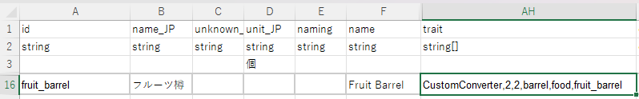

## Make Custom Converters

Game has a few container types that serve as converters, such as **brewery barrel**, **aging shelf**, and **drying rack**. Instead of decaying, they convert their contents into products. 

However, they are all hardcoded. You can turn your Thing into a custom converter by using CWL trait `CustomConverter` and a conversion rule file.

E.g. this row is copied from `brewery` in SourceThing:



The `trait` cell has 5 parameters, `CustomConverter`, `width`, `height`, `inventory style`, `inventory ID`, `conversion rule ID`. When you leave the 5th parameter `conversion rule ID` blank, the Thing ID will be used instead.

## Define Conversion Rules

The conversion rule is a simple JSON file located in your `LangMod/**/Data/` folder, named `converter_ID.json`.
```json
{
    "DecaySpeed": 500,
    "IdMsg": "driedFood",
    "Conversions": {
        "origin:fruit": [
            {
                "Id": "dried_fruit",
                "Num": 1,
                "PriceAdd": "base * 0.25"
            }
        ],
        "grape": [
            {
                "Id": "raisin",
                "Num": 5,
                "PriceAdd": "base * 0.06"
            }
        ],
        "tomato": [
            {
                "Id": "dried_fruit",
                "Num": 1,
                "PriceAdd": "0"
            }
        ]
    }
}
```

`DecaySpeed` is the conversion speed, `500` is the default value for game's **brewery barrel**, **aging shelf**, and **drying rack**. 

`IdMsg` is the `LangGame` ID that is displayed when conversion completes, you can find the relevant entry in `LangGame` sheet, or defining your own phrases in `Game` sheet.

<LinkCard t="Lang/Game" u="https://docs.google.com/spreadsheets/d/1cje2GHiKwjBd_YLYWqWlddm2YLsYnRiB/edit?gid=1110671768#gid=1110671768" />

`Conversions` is a set of conversion rules, each entry should match the initial item's ID, or using `origin:originID` to include all variations with the same `_origin`. You can also overwrite specific item from previously included entries, such as `grape` from `origin:fruit`.

Each conversion entry has an array of products, each product includes the same fields from [`StockItem`](../Character/2_merchant.md), default fields can be omitted. The `PriceAdd` field is an expression to calculate the extra price added to the product, and `base` is the price of the initial item.

## Test Conversion Rules 

You can edit your conversion rules when game is running. After saving your changes, use console command `cwl.converter.reload` to reload all conversion rules.