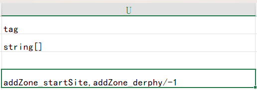

## カスタムキャラクターのインポート

<LinkCard t="トウミィの MOD 作成講座" u="https://note.com/seacolor/n/n4118acf824fa?sub_rt=share_pw" i="https://cdn.discordapp.com/avatars/414045627400454144/b5f7f32a00b8653bd28ac58f9b85a2b8.webp" />

Charaテーブルでカスタムキャラクターを定義したと仮定します。既存のモジュールやElin Sourcesを参考にしてください。
<LinkCard t="SourceChara" u="https://elin-modding-resources.github.io/Elin.Docs/articles/10_Source%20Sheets/puddles_chara_note" />

CWLはタグセルを使用して機能を追加します。任意の数のタグを追加できます。タグは `,`（カンマ）で区切り、間にスペースを入れないように注意してください。

## 変更をテストする

セーブデータをロードし、キャラクターのデータを確認した後、ゲームを実行しながら **Excelシート**に変更を加えることができます。変更を保存した後、以下のコンソールコマンドを使用してください：

```
cwl.remove_all charaId
cwl.data.load_sources true
```

`charaId` をあなたのキャラクターの **ID** に置き換えてください。ソースを再読み込みした後、同じセーブデータを再度ロードして、新しく適用された変更を確認できます。

## 自動生成/エリアへの追加

CWLでキャラクターを特定のエリアに生成させるには、`addZone_*`タグを使用します。`*`（アスタリスク）をゾーンの**id**に置き換えるか、アスタリスクを残すとランダムなエリアに生成されます。
 
- startSite（野原）に生成する場合 → `addZone_startSite`  
- ダルフィ地下1階に生成する場合 → `addZone_derphy/-1`  
[SourceGame/Zone](https://docs.google.com/spreadsheets/d/16-LkHtVqjuN9U0rripjBn-nYwyqqSGg_/edit?gid=1819250752#gid=1819250752)の**id**列を参照してください。

各`addZone`タグは、そのエリアに必ず1体のキャラクターを生成します。  
例：  
```
addZone_lumiest,addZone_little_garden,addZone_specwing,addZone_*
```

→ 選択した3エリア＋ランダム1エリアにそれぞれ1体ずつ生成（合計4体）

::: warning 注意
CWL 1.20.11 から、以前のタグ `addZone_Type` は上記の一般的なタグ `addZone_id` に置き換えられましたが、引き続き使用可能です。

:::

## 初期装備/アイテムの追加

CWLがキャラクターを生成する際、初期装備とアイテムも定義できます。タグ `addEq_ItemID#Rarity` または/および `addThing_ItemID#Count` を使用してください。

特定の装備をキャラクターに割り当てるには、タグ `addEq_ItemID#Rarity` を使用し、`ItemID`をアイテムのIDに置き換え、Rarityは次のいずれかを指定してください：ランダム（Random）、粗悪（Crude）、普通（Normal）、優良（Superior）、伝説（Legendary）、神話（Mythical）、神器（Artifact）。`#Rarity`を省略した場合、デフォルトのレアリティ`#Random`が使用されます。

例えば、伝説の`BS_Flydragonsword`とランダムの`axe_machine`をキャラクターのメイン武器に設定する場合：
**addZone_Palmia,addEq_BS_Flydragonsword#Legendary,addEq_axe_machine**

キャラクターに初期アイテムを追加するには、タグ `addThing_ItemID#Count` を使用します。`#Count`を省略した場合、デフォルトで1つのアイテムが生成されます。

例えば、キャラクターに`padoru_gift`を10個、`援軍巻軸`を5つ追加する場合：
**addZone_Palmia,addThing_padoru_gift#10,addThing_1174#5**

## 冒険者の作成

105gunに感謝します。

キャラクターの trait が`AdventurerBacker`に設定されている場合、CWLはそのキャラクターを冒険者としてインポートし、冒険者ランキングリストに表示されます。

## ランダム移動を無効にする

グローバルキャラクターがプレイヤーの陣営にいない場合、他の町をランダムに訪れます。`addFlag_StayHomeZone` タグを使用すると、彼らを初期エリアに留まらせることができます。

このフラグは、ストーリーテーブルで `invoke*` アクションと `mod_flag(StayHomeZone, 0)` メソッドを使用して変更できます。`actor` セクションには対象キャラクターの ID（または `tg` でストーリーオブジェクトを指定）を記入します。

## 人間の対話の使用

種族（Race）テーブルに `human` または `humanSpeak` タグを追加するだけでなく、キャラクター（Chara）テーブルにも `humanSpeak` タグを使用することで、キャラクターの会話で括弧を使わずに表現できます。

## 性別設定の上書き

`bio` 列で `m` または `f` の代わりに `n` を使用すると、キャラクターの性別を `???` に設定できます。

CWLはさらに、背景情報の編集を含む包括的な[伝記の上書き](./3_bio)機能も提供しています。

:::警告  
CWLでは以前、`bio`列で`?`という性別を使って`???`を表していましたが、Elinは23.214 Nightlyバージョン以降、新たに`n`という性別を追加し、同じ機能を実現しています。
:::

## カスタム商人の在庫定義

こちらで定義されたカスタム商人の在庫データを使用してください：[Custom Merchant](./2_merchant)。

## 会話・ストーリーの追加

ここでは、三種類の会話を追加できます：[Dialog & Drama](./1_talks)。