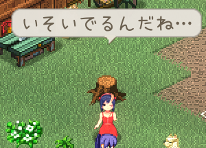

## バーク（叫び）

特定の状況で、キャラクターが頭上に表示する専用の会話をトリガーします。

これらの会話は **CharaText** テーブルに記述され、キャラクターは **idText** セルに対応する会話IDを入力してリンクさせます。

|セル|calm|fov|aggro|dead|kill|
|------------|-------|-------|-------|-------|-------|
|トリガー|冷静時|視界内|敵対時|死亡時|撃破時|

各エントリに [カスタム音声](../Other/sound) タグを挿入することもでき、音声付きの叫びにすることができます。例えば、`「通過できない！！<sound=gandalf,0.8>」` とすると、この叫びがトリガーされた際に、80%の確率でIDが `gandalf` のオーディオが再生されます。

## 会話

キャラクターと話すための会話を追加するには、`LangMod/**/Dialog/` フォルダ内に `dialog.xlsx` ファイルを準備します。

このテーブルの形式はゲーム内の **Elin/Package/_Elona/Lang/_Dialog/dialog.xlsx** と同じですが、`unique` テーブルとキャラクターIDに対応する行のみが必要です。

ここでのIDはキャラクターIDと同一です。

::: warning フォーマット
データはテーブルの5行目から開始します。
:::

## シナリオ

シナリオは、複数選択肢の会話と追加アクションで構成される高度なインタラクションシステムです。

ストーリーセクションは別の章に移動しました。

<LinkCard t="ドラマ基礎" u="/100_Mod Documentation/Custom Whatever Loader/JP/Drama/0_basic.md" />