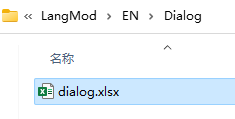

## バーク（叫び）

特定の状況で、キャラクターが頭上に表示する専用の会話をトリガーします。


これらの会話は **CharaText** テーブルに記述され、キャラクターは **idText** セルに対応する会話IDを入力してリンクさせます。


|セル|calm|fov|aggro|dead|kill|
|------------|-------|-------|-------|-------|-------|
|トリガー|冷静時|視界内|敵対時|死亡時|撃破時|

## 会話

キャラクターと話すための会話を追加するには、`LangMod/**/Dialog/` フォルダ内に `dialog.xlsx` ファイルを準備します。



このテーブルの形式はゲーム内の **Elin/Package/_Elona/Lang/_Dialog/dialog.xlsx** と同じですが、`unique` テーブルとキャラクターIDに対応する行のみが必要です。


ここでのIDはキャラクターIDと同一です。

## シナリオ

シナリオは、複数選択肢の会話と追加アクションで構成される高度なインタラクションシステムです。


カスタムシナリオを定義するには、`addDrama_シナリオテーブル名` タグを使用します。CWLは自動的に該当シナリオを参照します。

カスタムシナリオテーブルは `LangMod/**/Dialog/Drama/` フォルダに配置し、ファイル名はタグと一致させる必要があります。例：`addDrama_drama_example` には `Dialog/Drama/drama_example.xlsx` を対応させます。

作成時はゲーム内蔵のシナリオテーブル **Elin/Package/_Elona/Lang/_Dialog/Drama** や、テンプレートを含む「Tiny Mita」サンプルを参考にしてください：
<LinkCard t="CWLサンプル：Tiny Mita" u="https://steamcommunity.com/sharedfiles/filedetails/?id=3396774199" />


::: tip ホットリロード
シナリオテーブルはゲーム実行中に編集・保存後、ホットリロードが可能です。
:::

### 基本構造

シナリオテーブルは上から順に実行され、複数の「シナリオユニット」行で構成されます。各ユニットは以下の列を持ちます（ヘッダー行で定義）：

- `step`：次の`step`が現れるまでの実行範囲の起点
- `jump`：実行時にジャンプするターゲットステップ
- `if`/`if2`：実行条件。`if2`列が存在する場合は両条件を満たす必要あり
- `action`：実行するアクション
- `param`：アクションのパラメータ
- `actor`：発言キャラクターID（複数キャラ会話用）
- `id`：テキスト行の一意識別子（テキスト行のみ必須）
- `text`/`text_JP`/`text_EN`：実際の会話内容。`text`列はLangModのサブフォルダに応じて言語切り替え

シナリオはステップで実行され、各ステップ内で会話/アクション/条件分岐を組み合わせられます。

`main` がデフォルト開始ステップ、`end` が終了ステップです。カスタムステップ名はアンダースコア `_` や `flag` プレフィックスを避けてください。

### シナリオアクション

テキスト行はプレイヤーの入力（クリック/キー操作）で次へ進み、アクション行（`choice`除く）は連続実行され、テキストと共存できません。

主なアクション：

|アクション|パラメータ|説明|
|----|-----|------|
|`inject`|`Unique`|「話す」オプションと汎用ステップを挿入|
|`choice`||テキストに選択肢を追加（`text`と`jump`と併用）|
|`choice/bye`||デフォルトの別れオプションを追加|
|`cancel`||右クリック/ESCキーの動作を設定（通常は`end`に`jump`）|
|`setFlag`|flag, 値（省略可）|flagを設定（デフォルト値1）|
|`reload`||ストーリーを再読み込みし、現在のストーリーで行ったフラグの変更を適用します。通常は`jump`と組み合わせて使用し、通常は`main`です。**これはホットリロードを指しているわけではなく、開発時のホットリロードはファイルの変更を保存し、再度ダイアログを開くだけで済みます**|
|`enableTone`||会話のトーン切り替えを有効化|
|`addActor`||キャラクター識別子を追加（`actor`列に新ID入力時自動発動）|
|`invoke`|メソッド名|メソッドを呼び出し|
|`setBG`|画像名（省略可）|背景画像を設定（Textureフォルダのカスタムpng対応）、空で解除|
|`BGM`|BGM ID|BGMを変更（詳細は[Sound オーディオ/BGM](../Other/sound)参照）|
|`stopBGM`||BGM停止|
|`lastBGM`||BGM停止し、以前のBGMを復元|
|`sound`|効果音ID|効果音再生|
|`wait`|秒数|実行を一時停止（アニメーション待機用）|
|`alphaIn`|秒数|フェードイン効果|
|`alphaOut`|秒数|フェードアウト効果|
|`alphaInOut`|秒数, 待機, 秒数|フェードイン→待機→フェードアウト|
|`fadeIn`|秒数, `white`/`black`|画面を白/黒で徐々に表示|
|`fadeOut`|秒数, `white`/`black`|画面を白/黒で徐々に非表示|
|`fadeInOut`|秒数, 待機, 秒数|フェードイン→待機→フェードアウト|
|`hideUI`|遷移時間|UIを非表示（シナリオ終了時復元）|
|`hideDialog`||ダイアログを非表示（`wait`と併用）|
|`end`||シナリオを終了|
|`addKeyItem`|[キーアイテムID](https://docs.google.com/spreadsheets/d/175DaEeB-8qU3N4iBTnaal1ZcP5SU6S_Z/edit?gid=836018107#gid=836018107)|キーアイテムを付与|
|`drop`|[アイテムID](https://docs.google.com/spreadsheets/d/175DaEeB-8qU3N4iBTnaal1ZcP5SU6S_Z/edit?gid=1479265439#gid=1479265439)|プレイヤー位置にアイテム生成|
|`addResource`|資源タイプ, 数量|ホーム資源追加（`food` `money`等）|
|`shake`||画面振動|
|`slap`||シナリオ所有者を平手打ち|
|`destroyItem`|[アイテムID](https://docs.google.com/spreadsheets/d/175DaEeB-8qU3N4iBTnaal1ZcP5SU6S_Z/edit?gid=1479265439#gid=1479265439)|指定アイテムを削除|
|`focus`||カメラをシナリオ所有者に即時フォーカス|
|`focusChara`|[キャラID](https://docs.google.com/spreadsheets/d/1CJqsXFF2FLlpPz710oCpNFYF4W_5yoVn/edit?gid=1622484657#gid=1622484657), 速度|同マップ内キャラにカメラ移動|
|`focusPC`|速度（省略可）|プレイヤーにフォーカス|
|`unfocus`||カメラリセット|
|`destroy`|[キャラID](https://docs.google.com/spreadsheets/d/1CJqsXFF2FLlpPz710oCpNFYF4W_5yoVn/edit?gid=1622484657#gid=1622484657)|同マップ内キャラを削除|
|`save`||セーブ|
|`setHour`|時間数|ゲーム内時間を設定|

複数パラメータはカンマ区切り（スペースなし）。

### トリガー条件

`if`/`if2`列で条件を追加：

|条件|パラメータ|説明|
|-----|-----|----------|
|`hasFlag`|flag|プレイヤーが非ゼロ値のflagを所持|
|`!hasFlag`|flag|プレイヤーがflag未所持または値ゼロ|
|`hasMelilithCurse`||プレイヤーがメリリスの呪い所持|
|`merchant`||プレイヤーが商人ギルド所属|
|`fighter`||戦士ギルド所属|
|`thief`||盗賊ギルド所属|
|`mage`||魔術師ギルド所属|
|`hasItem`|[アイテムID](https://docs.google.com/spreadsheets/d/175DaEeB-8qU3N4iBTnaal1ZcP5SU6S_Z/edit?gid=1479265439#gid=1479265439)|指定アイテム所持|
|`isCompleted`|[クエストID](https://docs.google.com/spreadsheets/d/16-LkHtVqjuN9U0rripjBn-nYwyqqSGg_/edit?gid=785701697#gid=785701697)|クエスト完了済み|

条件フォーマットは `条件, パラメータ`。拡張式も可能：

```
=,test_flag,1
>,flag,5
,counter,20
!,flag,69
```

基本的に `if` 列のみ使用。複雑な条件は `if2` 列を追加。

### 拡張機能

::: warning 暫定版
このセクションのAPIは変更される可能性があります。
:::

シナリオテーブルの標準アクションで不足する場合、DLLにカスタムメソッドを追加し、`invoke*` アクションで呼び出せます。

CWLの組み込み拡張メソッドは[こちら](https://github.com/gottyduke/Elin.Plugins/blob/master/CustomWhateverLoader/API/Drama/Expansions)で確認可能。`Dialog.ExpandedActions` 設定を有効化してください。


### パラメータ渡し

カンマ区切りで指定：

|action|param|actor|
|-|-|-|
|`invoke*`|honk_honk(arg1, arg2)|`pc`|

`actor` 列はターゲットキャラ（`pc` `tg` または任意の[キャラID](https://docs.google.com/spreadsheets/d/1CJqsXFF2FLlpPz710oCpNFYF4W_5yoVn/edit?gid=1622484657#gid=1622484657)）を示します。

`jump` 列が存在する場合、拡張メソッドの戻り値が `true` ならジャンプを実行します。

### 組み込みメソッド

|メソッド|パラメータ|説明|ジャンプ条件|
|-|-|-|--|
|`add_item`|[アイテムID](https://docs.google.com/spreadsheets/d/175DaEeB-8qU3N4iBTnaal1ZcP5SU6S_Z/edit?gid=1479265439#gid=1479265439), [材質alias](https://docs.google.com/spreadsheets/d/13oxL_cQEqoTUlcWsjKZyNuAaITFGK56v/edit?gid=33087043#gid=33087043), レベル, 数量|`actor`にアイテム追加|常時|
|`join_party`||`actor`をパーティーに加入|常時|
|`join_faith`|[信仰ID](https://docs.google.com/spreadsheets/d/16-LkHtVqjuN9U0rripjBn-nYwyqqSGg_/edit?gid=729486062#gid=729486062)（省略可）|信仰に加入/脱退|成功時|
|`mod_affinity`|数値式（例: `+5`）|`actor`の好感度を調整|成功時|
|`mod_flag`|数値式|`actor`のflag値を変更|常時|
|`apply_condition`|[状態alias](https://docs.google.com/spreadsheets/d/16-LkHtVqjuN9U0rripjBn-nYwyqqSGg_/edit?gid=921112246#gid=921112246), 強度|状態を付与|常時|
|`cure_condition`|[状態alias](https://docs.google.com/spreadsheets/d/16-LkHtVqjuN9U0rripjBn-nYwyqqSGg_/edit?gid=921112246#gid=921112246)|状態を治療|成功時|
|`remove_condition`|[状態alias](https://docs.google.com/spreadsheets/d/16-LkHtVqjuN9U0rripjBn-nYwyqqSGg_/edit?gid=921112246#gid=921112246)|状態を解除|常時|
|`move_tile`|X, Yオフセット|`actor`を相対座標移動|常時|
|`move_zone`|[エリアID](https://docs.google.com/spreadsheets/d/16-LkHtVqjuN9U0rripjBn-nYwyqqSGg_/edit?gid=1819250752#gid=1819250752), 階層（省略可）|`actor`を転送|常時|
|`play_anime`|[アニメID](https://gist.github.com/gottyduke/6e2847e37d205a5621bfd0615e5bd9e7#file-elin-animeid-md)|アニメーション実行|常時|
|`play_effect`|[エフェクトID](https://gist.github.com/gottyduke/6e2847e37d205a5621bfd0615e5bd9e7#file-elin-effects-md)|エフェクト再生|常時|
|`play_emote`|[表情ID](https://gist.github.com/gottyduke/6e2847e37d205a5621bfd0615e5bd9e7#file-elin-emo-md)|表情を表示|常時|
|`play_screen_effect`|[スクリーンエフェクトID](https://gist.github.com/gottyduke/6e2847e37d205a5621bfd0615e5bd9e7#file-screeneffect-md)|スクリーンエフェクトを再生|常に|
|`portrait_set`|立ち絵ID（省略可）|会話用立ち絵を設定/リセット|常時|

外部アセンブリメソッドの呼び出しには `build_ext` と `emit_call` を使用可能（`Dialog.ExpandedActionsAllowExternal` 要有効化）：


### カスタム条件

これらも拡張メソッド（`invoke*`アクションを通じて呼び出す）ですが、これらの値はジャンプを実行するために使用できます。

|メソッド|パラメータ|説明|ジャンプ条件|
|-|-|-|-|
|`if_affinity`|数値式|`actor`の好感度をチェック|満たされた場合|
|`if_condition`|[状態alias](https://docs.google.com/spreadsheets/d/16-LkHtVqjuN9U0rripjBn-nYwyqqSGg_/edit?gid=921112246#gid=921112246)|`actor`が状態を持っているかチェック|満たされた場合|
|`if_faith`|[信仰ID](https://docs.google.com/spreadsheets/d/16-LkHtVqjuN9U0rripjBn-nYwyqqSGg_/edit?gid=729486062#gid=729486062), レベル（省略可）|`actor`が特定の信仰に加入しており、特定のレベル（デフォルトは0レベル）以上であるかを確認|満たす場合|
|`if_flag`|数値式|`actor`のフラグ値をチェック|満たされた場合|
|`if_location`|[エリアID](https://docs.google.com/spreadsheets/d/16-LkHtVqjuN9U0rripjBn-nYwyqqSGg_/edit?gid=1819250752#gid=1819250752), 階層数（省略可）|`actor`のいるエリアをチェック|満たされた場合|
|`if_tag`|tag|`actor`がタグを持っているかチェック|満たされた場合|

### カスタムメソッド実装

CWLは[シンプルなAPI](../API/Custom/drama)を提供し、独自のスクリプトDLLに拡張メソッドを追加できます。