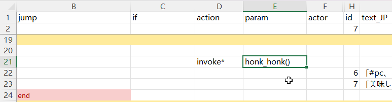
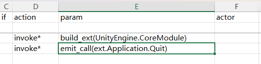

::: tip 暫定版
このセクションのAPIは変更される可能性があります。
:::

CWLには, 内蔵された一連のスクリプト拡張メソッドが付属しています。ここで[コードを確認](https://github.com/gottyduke/Elin.Plugins/blob/master/CustomWhateverLoader/API/Drama/Expansions)できます。

`Dialog.ExpandedActions` 設定を有効にする必要があります。デフォルトで有効になっています。

ストーリーテーブルでは, CWLの特別なアクション `invoke*` / `i*` を使用して拡張メソッドを呼び出すことができます：

### パラメータ渡し

カンマ区切りで指定：

|action|param|actor|
|-|-|-|
|`invoke*`/`i*`|honk_honk(arg1, arg2)|`pc`|

`actor` 列はターゲットキャラ(`pc` `tg` または任意の[キャラid](https://docs.google.com/spreadsheets/d/1CJqsXFF2FLlpPz710oCpNFYF4W_5yoVn/edit?gid=1622484657#gid=1622484657))を示します。

`jump` 列が存在する場合, 拡張メソッドの戻り値が `true` ならジャンプを実行します。

**数値式**: `+5`, `*10`, `=69`, `!=114` などは, 判定または代入に使用される表現です。

## アクション

|メソッド|パラメータ|説明|ジャンプ条件|
|-|-|-|-|
|`add_item`|[アイテムid](https://docs.google.com/spreadsheets/d/175DaEeB-8qU3N4iBTnaal1ZcP5SU6S_Z/edit?gid=1479265439#gid=1479265439), [素材エイリアス(省略可)](https://docs.google.com/spreadsheets/d/13oxL_cQEqoTUlcWsjKZyNuAaITFGK56v/edit?gid=33087043#gid=33087043)(省略可), レベル(省略可), 数量(省略可)|`actor`に指定されたアイテムを追加します。デフォルトはランダムな素材, 自動レベル, 数量は `1`|常時|
|`equip_item`|[アイテムid](https://docs.google.com/spreadsheets/d/175DaEeB-8qU3N4iBTnaal1ZcP5SU6S_Z/edit?gid=1479265439#gid=1479265439), [材質エイリアス](https://docs.google.com/spreadsheets/d/13oxL_cQEqoTUlcWsjKZyNuAaITFGK56v/edit?gid=33087043#gid=33087043)(省略可), レベル(省略可)|`actor`に指定された物品を装備させる。デフォルトはランダムな材質、レベルは自動|常時|
|`join_party`||`actor`をパーティに参加させます|常時|
|`join_faith`|[信仰id](https://docs.google.com/spreadsheets/d/16-LkHtVqjuN9U0rripjBn-nYwyqqSGg_/edit?gid=729486062#gid=729486062)(省略可)|`actor`を信仰に参加させます。空の場合は現在の信仰から退出します|成功時|
|`apply_condition`|[状態alias](https://docs.google.com/spreadsheets/d/16-LkHtVqjuN9U0rripjBn-nYwyqqSGg_/edit?gid=921112246#gid=921112246), 強度|`actor`に状態を適用します|常時|
|`cure_condition`|[状態alias](https://docs.google.com/spreadsheets/d/16-LkHtVqjuN9U0rripjBn-nYwyqqSGg_/edit?gid=921112246#gid=921112246)|`actor`の状態を治癒します|成功時|
|`remove_condition`|[状態alias](https://docs.google.com/spreadsheets/d/16-LkHtVqjuN9U0rripjBn-nYwyqqSGg_/edit?gid=921112246#gid=921112246)|`actor`から状態を削除します|常時|
|`build_ext`|アセンブリ名|指定されたアセンブリ内のメソッドを可能な限りストーリー拡張テーブルに追加する|成功時|
|`emit_call`|ext.メソッド名|外部の静的メソッドを呼び出す|常時|

`build_ext` と `emit_call` を通じて外部アセンブリメソッドを呼び出すには,  `Dialog.ExpandedActionsAllowExternal` 設定を有効にする必要があります。デフォルトでは有効になっています。

## 演劇パフォーマンス

|メソッド|パラメータ|説明|ジャンプ条件|
|-|-|-|-|
|`move_next_to`|[キャラid](https://docs.google.com/spreadsheets/d/1CJqsXFF2FLlpPz710oCpNFYF4W_5yoVn/edit?gid=1622484657#gid=1622484657)|`actor`を**同じマップのキャラクター**の隣に移動させる|常時|
|`move_tile`|X, Yオフセット|`actor`を**相対座標**で移動させる。例えば `1,1`|常時|
|`move_to`|x, y|`actor`を**絶対座標**に移動させる。例えば `1,1`|常時|
|`move_zone`|[ゾーンid](https://docs.google.com/spreadsheets/d/16-LkHtVqjuN9U0rripjBn-nYwyqqSGg_/edit?gid=1819250752#gid=1819250752)，階層(省略可)|`actor`を指定されたゾーンに転送する。デフォルトは `0` 階層|常時|
|`play_anime`|[アニメーションid](https://gist.github.com/gottyduke/6e2847e37d205a5621bfd0615e5bd9e7#file-elin-animeid-md)|`actor`にアニメーションを実行させる|常時|
|`play_effect`|[エフェクトid](https://gist.github.com/gottyduke/6e2847e37d205a5621bfd0615e5bd9e7#file-elin-effects-md)|`actor`にエフェクトを再生させる|常時|
|`play_emote`|[感情id](https://gist.github.com/gottyduke/6e2847e37d205a5621bfd0615e5bd9e7#file-elin-emo-md)|`actor`に感情を表示させる|常時|
|`play_screen_effect`|[画面エフェクトid](https://gist.github.com/gottyduke/6e2847e37d205a5621bfd0615e5bd9e7#file-screeneffect-md)|画面エフェクトを再生する|常時|
|`pop_text`|テキスト|`actor`に叫びのテキスト(吹き出し)を発声させる|常時|
|`portrait_set`|立ち絵id(省略可)|`actor`の対話立ち絵を設定します。空の場合はリセットされます。**Portrait**フォルダーのカスタム立ち絵をサポートしています。例えば、`UN_myChara_happy.png`は`happy`または`UN_myChara_happy`として使用できます。|常時|
|`show_book`|書籍id, カテゴリー(`Book` または `Scroll`)|本を開く。**LangMod/_*_*/Text**フォルダーをサポートする。例えば `Text/Book/ok.txt` ならば `(ok, Book)` を使用|成功時|

## 値を変更する

|メソッド|パラメータ|説明|ジャンプ条件|
|-|-|-|--|
|`console_command`|コンソールコマンド 引数1 引数2...|コンソールコマンドを実行する|常時|
|`mod_affinity`|数値式(例: `+5`)|`actor`の好感度を調整|成功時|
|`mod_currency`|通貨の種類, 数値式|指定された通貨を`actor`に変更します。`money` `money2` `plat` `medal` `influence` `casino_coin` `ecopo`|常時|
|`mod_element`|[元素alias](https://docs.google.com/spreadsheets/d/16-LkHtVqjuN9U0rripjBn-nYwyqqSGg_/edit?gid=1766305727#gid=1766305727), 強度(省略可)|`actor`の指定された要素(特性/抵抗/スキルなど)を変更し, デフォルトの強度は`1`であり, 異なるタイプの要素には異なる強度が使用される|常時|
|`mod_element_exp`|[元素alias](https://docs.google.com/spreadsheets/d/16-LkHtVqjuN9U0rripjBn-nYwyqqSGg_/edit?gid=1766305727#gid=1766305727), 数値式|`actor`の指定された要素の経験値を変更する|成功時|
|`mod_fame`|数値式|プレイヤーの名声を変更します|常時|
|`mod_flag`|flag, 数値式|`actor`のflag値を変更|常時|
|`mod_keyitem`|[キーアイテムid](https://docs.google.com/spreadsheets/d/175DaEeB-8qU3N4iBTnaal1ZcP5SU6S_Z/edit?gid=836018107#gid=836018107), 値式(省略可)|プレイヤーの重要アイテムの値を変更します。デフォルトは `=1`|成功時|

### 条件

これらも拡張メソッド(`invoke*` アクションを通じて呼び出される)ですが, それらの戻り値は `jump` ジャンプの判定に使用できます。

|メソッド|パラメータ|説明|ジャンプ条件|
|-|-|-|-|
|`if_affinity`|数値式|`actor`の好感度をチェック|条件が満たされた時|
|`if_condition`|[状態alias](https://docs.google.com/spreadsheets/d/16-LkHtVqjuN9U0rripjBn-nYwyqqSGg_/edit?gid=921112246#gid=921112246)|`actor`が状態を持っているかチェック|条件が満たされた時|
|`if_currency`|通貨の種類, 数値式|`actor`が該当する通貨を所有しているか確認します。`money` `money2` `plat` `medal` `influence` `casino_coin` `ecopo`|条件が満たされた時|
|`if_element`|[元素alias](https://docs.google.com/spreadsheets/d/16-LkHtVqjuN9U0rripjBn-nYwyqqSGg_/edit?gid=1766305727#gid=1766305727), 数値式|`actor`が条件に合った元素を持っているか確認|条件が満たされた時|
|`if_faith`|[信仰id](https://docs.google.com/spreadsheets/d/16-LkHtVqjuN9U0rripjBn-nYwyqqSGg_/edit?gid=729486062#gid=729486062), レベル(省略可)|`actor`が特定の信仰に加入しており, 特定のレベル(デフォルトは0レベル)以上であるかを確認|条件が満たされた時|
|`if_fame`|数値式|プレイヤーの名声を確認します|条件が満たされた時|
|`if_flag`|flag, 数値式|`actor`のフラグ値をチェック|条件が満たされた時|
|`if_hostility`|陣営の数値式|`actor`の陣営が特定の条件に合致するかをチェックします。例えば `=Ally`、`>Enemy`など。陣営の値は小さい順に `Enemy`、`Neutral`、`Friend`、`Ally`となっています|条件が満たされた時|
|`if_in_party`||`actor`がプレイヤーのパーティにいるか確認する|条件が満たされた時|
|`if_keyitem`|[キーアイテムalias](https://docs.google.com/spreadsheets/d/175DaEeB-8qU3N4iBTnaal1ZcP5SU6S_Z/edit?gid=836018107#gid=836018107), 数値式(省略可)|プレイヤーが表現に合ったキーアイテムの値を持っているかを確認する, デフォルトは `>0`|条件が満たされた時|
|`if_race`|[種族id](https://docs.google.com/spreadsheets/d/1CJqsXFF2FLlpPz710oCpNFYF4W_5yoVn/edit?gid=140821251#gid=140821251)|`actor`が対応する種族であるかを確認|条件が満たされた時|
|`if_tag`|tag|`actor`がタグを持っているかチェック|条件が満たされた時|
|`if_zone`|[エリアid](https://docs.google.com/spreadsheets/d/16-LkHtVqjuN9U0rripjBn-nYwyqqSGg_/edit?gid=1819250752#gid=1819250752), 階層数(省略可)|`actor`のいるエリアをチェック|条件が満たされた時|

三つの特別な複合条件があり, それらは上記の条件をパラメータとして使用します：

|メソッド|例|ジャンプ条件|
|-|-|-|
|`and`|`and(if_flag(flag1, >0), if_flag(flag2, <0))`|全ての条件が満たされた時|
|`or`|`or(if_race(lich), if_race(snail))`|任意の条件が満たされた時|
|`not`|`not(if_zone(dungeon), if_zone(field), if_zone(underground))`|全ての条件が満たされなかった時|

::: tip `if_flag` それとも `hasFlag`？
`if` 列にある `hasFlag` は静的条件であり, **シナリオテーブルが読み込まれるときに一度だけ判定されます**。これは, その後に変更されたフラグ値が影響を与えないことを意味し, **`reload`** アクションを使用するか, **シナリオテーブルを再度開く**まで続きます。CWL の `if_flag()` 拡張条件は動的であり, シナリオ分岐にも使用できます。  
:::

## カスタムメソッド実装

CWLは[シンプルなAPI](../API/Custom/drama)を提供し, 独自のスクリプトDLLに拡張メソッドを追加できます。

