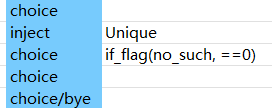

## 拡張機能

CWLには、劇本（ドラマ）用の拡張メソッドが多数組み込まれています。
詳細は[こちらのコード](https://github.com/gottyduke/Elin.Plugins/blob/master/CustomWhateverLoader/API/Drama/Expansions)で確認できます。

使用するには `Dialog.ExpandedActions` 設定を有効にする必要があります（デフォルトで有効）。

ドラマテーブル内で、CWL専用アクションである `invoke*` または `i*` を使用して拡張メソッドを呼び出します：

## 引数渡し

引数は `,`（半角カンマ）で区切ってください：

|action|param|actor|
|-|-|-|
|`invoke*`/`i*`|honk_honk(arg1, arg2)|`pc`|

ほとんどのメソッドは、`actor` 列に指定されたキャラクターを対象として実行されます。
`pc`（プレイヤー）、`tg`（ドラマで指定された対象キャラクター）、または有効な[キャラクターID](https://docs.google.com/spreadsheets/d/1CJqsXFF2FLlpPz710oCpNFYF4W_5yoVn/edit?gid=1622484657#gid=1622484657)が使用できます。空欄の場合はデフォルトで `tg` が対象となります。

同じ行に `jump` の値がある場合、拡張メソッドの**戻り値**によってジャンプを実行するかどうかが決定します。`true` を返した場合はジャンプを実行し、それ以外の場合は実行しません。

**数値式**: `+5`, `*10`, `=69`, `!=114` などの演算子を使用した式が、代入や条件判定に使用できます。

|数値式の例|意味|
|-|-|
|`69`|値を `69` に設定|
|`=69`|値を `69` に設定|
|`+5`|現在の値に `5` を加算|
|`-3`|現在の値から `3` を減算|
|`*10`|現在の値に `10` を乗算|
|`/2`|現在の値を `2` で除算|
|`==69`|値が `69` と等しいか判定|
|`!=114`|値が `114` と等しくないか判定|
|`>10`|値が `10` より大きいか判定|
|`>=20`|値が `20` 以上か判定|
|`<5`|値が `5` より小さいか判定|
|`<=3`|値が `3` 以下か判定|

## アクション

|メソッド|引数|説明|ジャンプ条件|
|-|-|-|-|
|`add_item`|[アイテムID](https://docs.google.com/spreadsheets/d/175DaEeB-8qU3N4iBTnaal1ZcP5SU6S_Z/edit?gid=1479265439#gid=1479265439), [素材alias](https://docs.google.com/spreadsheets/d/13oxL_cQEqoTUlcWsjKZyNuAaITFGK56v/edit?gid=33087043#gid=33087043)(省略可), レベル(省略可), 個数(省略可)|`actor`に指定アイテムを追加。デフォルトはランダム素材、自動レベル、個数 `1`|常に|
|`equip_item`|[アイテムID](https://docs.google.com/spreadsheets/d/175DaEeB-8qU3N4iBTnaal1ZcP5SU6S_Z/edit?gid=1479265439#gid=1479265439), [素材alias](https://docs.google.com/spreadsheets/d/13oxL_cQEqoTUlcWsjKZyNuAaITFGK56v/edit?gid=33087043#gid=33087043)(省略可), レベル(省略可)|`actor`に指定アイテムを装備。デフォルトはランダム素材、自動レベル|常に|
|`join_party`||`actor`をパーティーに加入させる|常に|
|`join_faith`|[信仰ID](https://docs.google.com/spreadsheets/d/16-LkHtVqjuN9U0rripjBn-nYwyqqSGg_/edit?gid=729486062#gid=729486062)(省略可)|`actor`を指定信仰に加入させる。空欄の場合は現在の信仰から脱退|成功時|
|`apply_condition`|[状態alias](https://docs.google.com/spreadsheets/d/16-LkHtVqjuN9U0rripjBn-nYwyqqSGg_/edit?gid=921112246#gid=921112246), 強度|`actor`に状態を付与|常に|
|`cure_condition`|[状態alias](https://docs.google.com/spreadsheets/d/16-LkHtVqjuN9U0rripjBn-nYwyqqSGg_/edit?gid=921112246#gid=921112246)|`actor`の状態を治療|成功時|
|`remove_condition`|[状態alias](https://docs.google.com/spreadsheets/d/16-LkHtVqjuN9U0rripjBn-nYwyqqSGg_/edit?gid=921112246#gid=921112246)|`actor`から状態を完全に削除|常に|
|(推奨:`eval`)|`build_ext`|アセンブリ名|指定アセンブリ内のメソッドをドラマ拡張テーブルに可能な限り追加|成功時|
|(推奨:`eval`)|`emit_call`|ext.メソッド名|外部の静的メソッドを呼び出す|常に|

## 演出

|メソッド|引数|説明|ジャンプ条件|
|-|-|-|-|
|`move_next_to`|[キャラクターID](https://docs.google.com/spreadsheets/d/1CJqsXFF2FLlpPz710oCpNFYF4W_5yoVn/edit?gid=1622484657#gid=1622484657)|`actor`を**同一マップ内の対象キャラクター**の隣へ移動|常に|
|`move_tile`|X, Yオフセット|`actor`を**相対座標**で移動（例：`1,1`）|常に|
|`move_to`|X, Y|`actor`を**絶対座標**へ移動（例：`1,1`）|常に|
|`move_zone`|[エリアID](https://docs.google.com/spreadsheets/d/16-LkHtVqjuN9U0rripjBn-nYwyqqSGg_/edit?gid=1819250752#gid=1819250752), 階層(省略可)|`actor`を指定エリアへ転送（デフォルト `0` 階）|常に|
|`play_anime`|[アニメID](https://gist.github.com/gottyduke/6e2847e37d205a5621bfd0615e5bd9e7#file-elin-animeid-md)|`actor`にアニメーションを再生|常に|
|`play_effect`|[エフェクトID](https://gist.github.com/gottyduke/6e2847e37d205a5621bfd0615e5bd9e7#file-elin-effects-md)|`actor`に特殊効果を再生|常に|
|`play_emote`|[表情ID](https://gist.github.com/gottyduke/6e2847e37d205a5621bfd0615e5bd9e7#file-elin-emo-md)|`actor`に表情（エモート）を表示|常に|
|`play_screen_effect`|[画面エフェクトID](https://gist.github.com/gottyduke/6e2847e37d205a5621bfd0615e5bd9e7#file-screeneffect-md)|画面全体に特殊効果を再生|常に|
|`pop_text`|テキスト|`actor`の上にテキスト（吹き出し）を表示|常に|
|`set_portrait`/`portrait_set`|立ち絵ID(省略可)|`actor`の会話立ち絵を設定。空欄でリセット。**Portrait**フォルダ内のカスタム立ち絵も使用可（例：`UN_myChara_happy.png` の場合は `happy` または `UN_myChara_happy`）|常に|
|`set_sprite`|スプライトID(省略可)|`actor`にカスタムスプライトを設定。空欄でリセット（**Texture**フォルダから取得）|常に|
|`show_book`|分類/書籍ID|本を開く。**LangMod/_*_*/Text** フォルダ内のファイルを指定可（例：`Text/Book/ok.txt` → `(Book/ok)`）|成功時|

## 変更

|メソッド|引数|説明|ジャンプ条件|
|-|-|-|-|
|`console_cmd`|コンソールコマンド 引数1 引数2...|コンソールコマンドを実行|常に|
|`destroy_item`|[アイテムID](https://docs.google.com/spreadsheets/d/175DaEeB-8qU3N4iBTnaal1ZcP5SU6S_Z/edit?gid=1479265439#gid=1479265439), 個数|`actor`のインベントリから指定個数のアイテムを削除|常に|
|`mod_affinity`|数値式|`actor`の好感度を変更|成功時|
|`mod_currency`|通貨種類, 数値式|`actor`の指定通貨を変更（`money` `money2` `plat` `medal` `influence` `casino_coin` `ecopo`）|常に|
|`mod_element`|[属性alias](https://docs.google.com/spreadsheets/d/16-LkHtVqjuN9U0rripjBn-nYwyqqSGg_/edit?gid=1766305727#gid=1766305727), 強度(省略可)|`actor`の指定属性（特性/耐性/スキルなど）を変更。デフォルト強度 `1`|常に|
|`mod_element_exp`|[属性alias](https://docs.google.com/spreadsheets/d/16-LkHtVqjuN9U0rripjBn-nYwyqqSGg_/edit?gid=1766305727#gid=1766305727), 数値式|`actor`の指定属性の経験値を変更|成功時|
|`mod_fame`|数値式|プレイヤーの名声を変更|常に|
|`mod_flag`|flag, 数値式|`actor`のフラグ値を変更|常に|
|`mod_keyitem`|[重要アイテムalias](https://docs.google.com/spreadsheets/d/175DaEeB-8qU3N4iBTnaal1ZcP5SU6S_Z/edit?gid=836018107#gid=836018107), 数値式(省略可)|プレイヤーの重要アイテム値を変更。デフォルト `=1`|成功時|

## 条件

これらのメソッドも `invoke*` アクションで呼び出せますが、戻り値を `jump` の条件として使用できます。

|メソッド|引数|説明|ジャンプ条件|
|-|-|-|-|
|`choice`|拡張条件|条件付きで選択肢行を有効化（例：`choice(if_lv(>=10))`）。**推奨**：`choice` アクションを使用し、paramに拡張メソッドを指定|条件を満たす|
|`eval`|C#スクリプト|C#スクリプトまたはファイルを直接実行（`<<<path.cs` 構文対応）。**推奨**：`eval` アクションを使用|`true` を返す|
|`if_affinity`|数値式|`actor`の好感度を判定|満たす|
|(推奨:`eval`)|`if_cint`|[CINT番号](https://elin-modding-resources.github.io/Elin-Decompiled/classCINT.html), 数値式|`actor`のCINT値を判定|満たす|
|(推奨:`eval`)|`if_cs_get`|C#クラスメンバー名, 数値式(省略可)|`actor`のC#クラスメンバーの値を判定（[Chara](https://elin-modding-resources.github.io/Elin-Decompiled/classChara.html)および[Card](https://elin-modding-resources.github.io/Elin-Decompiled/classCard.html)を参照）|満たす|
|`if_condition`|[状態alias](https://docs.google.com/spreadsheets/d/16-LkHtVqjuN9U0rripjBn-nYwyqqSGg_/edit?gid=921112246#gid=921112246)|`actor`が状態を持っているか判定|満たす|
|`if_currency`|通貨種類, 数値式|`actor`が指定通貨を所持しているか判定|満たす|
|`if_element`|[属性alias](https://docs.google.com/spreadsheets/d/16-LkHtVqjuN9U0rripjBn-nYwyqqSGg_/edit?gid=1766305727#gid=1766305727), 数値式|`actor`が指定属性を満たしているか判定|満たす|
|`if_faith`|[信仰ID](https://docs.google.com/spreadsheets/d/16-LkHtVqjuN9U0rripjBn-nYwyqqSGg_/edit?gid=729486062#gid=729486062), 信仰レベル(省略可)|`actor`が指定信仰に所属し、指定レベル以上か判定（デフォルト `0`）|満たす|
|`if_fame`|数値式|プレイヤーの名声を判定|満たす|
|`if_flag`|flag, 数値式|`actor`のフラグ値を判定|満たす|
|`if_has_item`|[アイテムID](https://docs.google.com/spreadsheets/d/175DaEeB-8qU3N4iBTnaal1ZcP5SU6S_Z/edit?gid=1479265439#gid=1479265439), 数値式(省略可)|`actor`が指定個数以上のアイテムを持っているか判定（デフォルト `>=1`）|満たす|
|`if_hostility`|陣営数値式|`actor`の陣営を判定（`Enemy` < `Neutral` < `Friend` < `Ally`）|満たす|
|`if_in_party`||`actor`がパーティーにいるか判定|満たす|
|`if_keyitem`|[重要アイテムalias](https://docs.google.com/spreadsheets/d/175DaEeB-8qU3N4iBTnaal1ZcP5SU6S_Z/edit?gid=836018107#gid=836018107), 数値式(省略可)|プレイヤーが指定条件の重要アイテムを持っているか判定（デフォルト `>0`）|満たす|
|`if_race`|[種族ID](https://docs.google.com/spreadsheets/d/1CJqsXFF2FLlpPz710oCpNFYF4W_5yoVn/edit?gid=140821251#gid=140821251)|`actor`が指定種族か判定|満たす|
|`if_tag`|タグ|`actor`が指定タグを持っているか判定|満たす|
|`if_zone`|[エリアID](https://docs.google.com/spreadsheets/d/16-LkHtVqjuN9U0rripjBn-nYwyqqSGg_/edit?gid=1819250752#gid=1819250752), 階層(省略可)|`actor`が指定エリアにいるか判定|満たす|

**複合条件**（上記の条件を組み合わせる特別なメソッド）：

|メソッド|使用例|ジャンプ条件|
|-|-|-|
|`and`|`and(if_flag(flag1, >0), if_flag(flag2, <0))`|すべて満たす|
|`or`|`or(if_race(lich), if_race(snail))`|いずれかを満たす|
|`not`|`not(if_zone(dungeon), if_zone(field), if_zone(underground))`|すべて満たさない|

## カスタムメソッドの実装

CWLは[シンプルなAPI](../API/Custom/drama)を提供しており、自身のスクリプトDLL内で拡張メソッドを追加できます。CWLアセンブリへの参照は必要ありません。