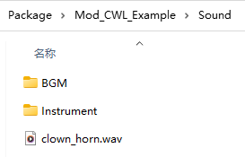
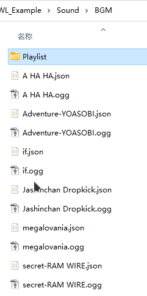
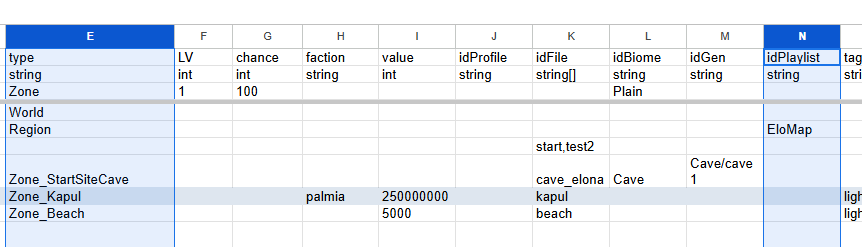
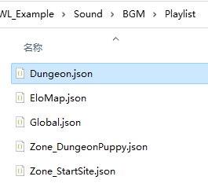
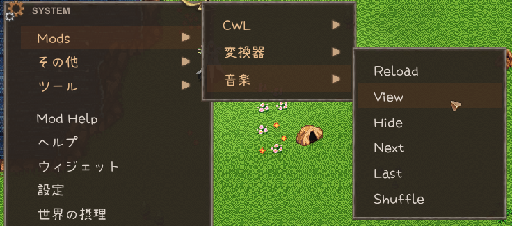
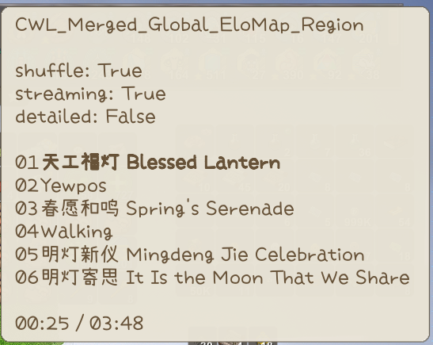

## 音声/BGM

オーディオファイルは **acc**、**mp3**、**ogg**、**wav** 形式で、ファイル名がオーディオIDとして使用されます。音声を使用すると、デフォルトの同名メタデータJSONが生成され、編集して次回ゲーム起動時に音声ファイルのメタデータを適用することができます。

メタデータで"type": "BGM"を設定すると、オーディオは**BGMData**としてではなく**SoundData**としてインスタンス化されます。また、メタデータ内でBGMの小節部分をカスタマイズすることもできます。

**同じIDを使用して、既存のゲーム内音声を上書きすることができます**。例えば、ひよこの鳴き声はID **Animal/Chicken/chicken**を使用しているので、**Sound/Animal/Chicken/**フォルダーに**chicken**という名前の音声ファイルを用意して上書きすることができます。

**Sound**フォルダー内のサブディレクトリはオーディオIDのプレフィックスとして使用されます。たとえば、`AI_PlayMusic`は`Instrument/sound_id`を使用するため、楽器音楽を置き換える場合は、同名のオーディオファイルを`Instrument`フォルダーに配置してください。

例：

```cs
pc.PlaySound("clown_horn"); // <- Card.PlaySound
SE.PlaySound("clown_horn");
```
---

## カスタム楽器音楽

**[Custom Instrument Track](https://steamcommunity.com/sharedfiles/filedetails/?id=3374708172)** モジュール（mod）が現在メンテナンスされていないため、以下に **CWL** を使用して楽器のオーディオトラックを手動で置き換える方法を説明します。

まず、**Sound/Instrument** フォルダー内にオーディオファイルを用意します。ファイル名には、以下のいずれかの**オーディオID**を使用してください。

**新しい**楽器を作成する場合は、その楽器の **ID**（Thing ID）をオーディオIDとして使用してください。

::: details ゲーム内楽器のオーディオID
|楽器ID|オーディオID|CN|EN|JP|
<!--@include: ../../assets/instrument_id.md-->
:::

ゲームを一度起動して、新しく追加したオーディオファイルの**メタデータ json ファイル**を生成し、その後ゲームを終了します。このメタデータ json ファイルを編集し、**type** を **BGM** に設定し、楽器演奏用にいくつかの **parts**（断片）を追加します。

```json
"parts": [
    {
        "start": 0.0,
        "duration": 4.0
    },
    {
        "start": 4.0,
        "duration": 4.0
    },
    {
        "start": 8.0,
        "duration": 4.0
    },
    {
        "start": 12.0,
        "duration": 4.0
    },
    {
        "start": 16.0,
        "duration": 4.0
    }
]
```

各 **part** には、**秒単位**の開始時間（**start**）と継続時間（**duration**）があります。楽器が演奏されている間、システムはこれらの断片をランダムに選択して再生します。

## カスタムBGM/プレイリスト

::: tip バージョン要件
この機能はCWL **`1.19.0`** 以降のバージョンが必要です。
:::

ゲームには100以上のBGMが含まれており、それぞれに数字IDと音声IDがあります。
::: details BGM
|BGM ID|音频 ID|BGM 名称|
<!--@include: ../../assets/bgm_items.md-->
:::

### 新しいBGMの追加

カスタムBGMは **Sound/BGM** サブフォルダーに配置されます。カスタム音效とは異なり、メタデータJSONの `id` フィールドを手動で編集する必要があります。CWLがファイルを生成できるように、最初にゲームを一度起動してください。

CWLは、ElinのUnityバージョン（2021.3.34f1）で使用されているデコーダーがMP3デコードエラーを起こしやすいため、**ogg**または**wav**形式の使用をお勧めします。



`id` は任意のユニークな数字で、ゲームで最後に使用されたBGM ID（`117`）より大きく、衝突を避けるために十分ユニークである必要があります。

**重要な注意事項、** この `id` はBGM専用です。音效のIDは拡張子なしのファイル名のままです, e.g. **`BGM/Happy Birthday`**

既存の `id` をBGMに割り当てると、それはグローバルBGMの置き換えになります。例えば、`Adventure-YOASOBI.json` の曲メタデータに `56` を割り当てると、ゲーム内のBGM `056 orc01` は `Adventure-YOASOBI` に置き換えられます。これが、新しいBGM（置き換え音楽ではない）がユニークな `id` を使用する理由です。そうでないと、次に同じ `id` を持つBGMがあなたの音楽を置き換えてしまいます。

> `056 orc01` はタイトルメニューのBGMです。

### プレイリストの追加

あなたのプレイリストファイルは **Sound/BGM/Playlist** サブフォルダーに配置されます。これらはシンプルなJSONファイルの形式です。 
```json
{
    "shuffle": true,
    "list": [
        "megalovania"
    ],
    "remove": [
        "024 PSML514",
        "023 mysterious-forest"
    ]
}
```

`list` に含まれるオーディオID（**BGM IDではありません**）はプレイリストに追加され、`remove` はプレイリストからエントリーを削除します（存在する場合）。既存のゲームオーディオIDを使用することもできます。`shuffle` はそのリストがランダムに並べ替えられるかどうかを設定します。

あなたは `list` と `remove` リストでワイルドカードを使用することもできます。現在、2つのモードが提供されています：
```json
"remove": [
	"**"
]
```
これは、マージ前にすべてのトラックをクリアします。

```json
"remove": [
	"<dir>/*"
]
```
これは、マージ前に **`Sound/BGM/<dir>/`** フォルダーからのすべてのトラックをクリアします。

### プレイリストタイプ

プレイリストのJSONファイル名は、以下のいずれかと一致する必要があります：

+ `"Global"`
+ 既存のプレイリスト名
+ エリアタイプリスト
+ エリアIDリスト

ここにゲーム内で既に存在するプレイリストがあります：
::: details プレイリスト
<!--@include: ../../assets/playlists.md-->
:::

`Blank` は、明示的に指定されたプレイリストがないすべてのZoneのデフォルトプレイリストです。

Zoneタイプ名とそのプレイリストを確認してください：
<LinkCard t="SourceZone" u="https://docs.google.com/spreadsheets/d/16-LkHtVqjuN9U0rripjBn-nYwyqqSGg_/edit?gid=2144211469#gid=2144211469" />



### 全局リスト

`Global.json` という特別なプレイリストを準備することで、すべてのプレイリストに統合されます。

### 指定プレイリスト

例えば、すべてのダンジョンエリア（`Zone_RandomDungeon`、`Zone_RandomDungeonFactory`、`Zone_Mine` など）は、`Dungeon` という名前のプレイリストを共有しています。このプレイリストに曲を追加または削除したい場合は、**Sound/BGM/Playlist/** フォルダー内に `Dungeon.json` を準備する必要があります。



`Dungeon.json` 内での変更は、ゲームの `Dungeon` プレイリストに統合され、曲の追加や削除が行われます。これは、このプレイリストを共有するすべてのエリアに影響を与えます。

別の一般的な使用例は、大マップにいるときに曲を追加することです。大マップは `Region` タイプのエリアであり、`EloMap` というプレイリストがあります。

### エリアタイプリスト

プレイリストの統合に加えて、各エリアタイプに対してエリアオーバーライドを指定することもできます。これらのプレイリストはエリアタイプ名を使用し、その内容はエリアのデフォルトプレイリストに統合されます（表に指定がない場合は `Blank` になります）。

例えば、`Zone_Vernis.json` はヴェルニスエリアタイプのオーバーライドを行い、`Zone_Forest` はこのタイプを使用する草原と森林に対してオーバーライドを行います。

したがって、`Region.json` を使用して大マッププレイリストに曲を追加することも可能です。なぜなら、これは `Region` タイプを使用しているからです。

### エリアIDリスト

同じエリアタイプに複数の異なるエリアが存在する場合、エリアIDを使用して個別にオーバーライドすることができます。例えば、`Zone_dungeon` 洞窟と `Zone_dungeon_ruin` 遺跡はどちらも `Zone_RandomDungeon` エリアタイプに属し、そのIDを使用して個別に指定できます。エリアIDを使用する際は、特定の `N` 層を指定するために `@N` を追加することもできます。例えば、ダルフィ地下1層は `Zone_derphy@-1.json` となります。

### 統合順序

複数のプレイリストが同時に存在することができ、それらは全局リスト、指定プレイリスト、エリアタイプリスト、エリアIDリストの順に統合されます。重複する曲は削除されます。プレイリストの統合順序は、Modの読み込み順序にも影響されます。`remove` リストでワイルドカードを使用する際は、プレイリストの統合順序が最終的な曲リストと順序に影響を与えることを忘れないでください。

### ホットリロード/BGM ビュー

ゲーム内でセーブデータを読み込んだ後、CWLパネルを使用して現在のプレイリストを表示および制御できます：





ゲームが実行中のときにプレイリストのJSONを編集した後、すべてのプレイリストをホットリロードできます。CWLには新しいオーディオのホットリロード用のコンソールコマンドがありますが、インデックスの問題が発生する可能性があるため、使用は推奨されません。

### 最後の例
大マップ探索のすべてのデフォルト曲を削除し、新しい曲を追加したい場合は、`Sound/BGM/Playlist/EloMap.json` または `Sound/BGM/Playlist/Region.json` を使用します：
```json
{
    "shuffle": true,
    "list": [
        "my new BGM sound id1",
        "my new BGM sound id2"
    ],
    "remove": [
        "**"
    ]
}
```