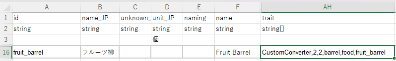

## カスタム変換を作成する

ゲームにはいくつかのコンテナタイプがあり、それらはコンバーター（変換器）です。例えば、**醸造樽**、**日干しラック**、および **熟成棚** です。これらは腐敗することはなく、その内容物を製品に変換します。

しかし、これらの製品はすべてハードコーディングされています。CWL Trait `CustomConverter` と変換ルールファイルを使用することで、コンテナをカスタムコンバーターに変えることができます。

例えば、この行は `brewery`（醸造樽）からコピーされたものです：



`trait` セルには5つのパラメーターがあり、それぞれ `CustomConverter`、`width`（幅）、`height`（高さ）、`inventory style`（在庫スタイル）、`inventory ID`（在庫ID）、`conversion rule ID`（変換ルールID）です。第5のパラメーターである `conversion rule ID` を空白にすると、アイテムIDが使用されます。

## 変換ルールを定義する

変換ルールはシンプルなJSONファイルで、`LangMod/**/Data/` フォルダーにあり、ファイル名は `converter_ID.json` です。このIDは変換ルールのユニークなIDであり、例えば `converter_fruit_barrel.json` のようなものです。
```json
{
    "DecaySpeed": 500,
    "IdMsg": "driedFood",
    "Conversions": {
        "origin:fruit": [
            {
                "Id": "dried_fruit",
                "Num": 1,
                "PriceAdd": "base * 0.25"
            }
        ],
        "grape": [
            {
                "Id": "raisin",
                "Num": 5,
                "PriceAdd": "base * 0.06 + 5"
            }
        ],
        "tomato": [
            {
                "Id": "dried_fruit",
                "Num": 1,
                "PriceAdd": "0"
            }
        ]
    }
}
```

`DecaySpeed`（腐敗速度）は変換速度で、`500` はゲーム内の **醸造樽**、**日干しラック**、および **熟成棚** のデフォルト値です。

`IdMsg` は変換が完了した際に表示される `LangGame` テキストIDで、関連するエントリーは `LangGame` テーブルで見つけることができます。または、`Game` テーブルで独自のフレーズを定義することも可能です。

<LinkCard t="Lang/Game" u="https://docs.google.com/spreadsheets/d/1cje2GHiKwjBd_YLYWqWlddm2YLsYnRiB/edit?gid=1110671768#gid=1110671768" />

`Conversions` は一連の変換ルールであり、各エントリーは初期アイテムのIDと一致する必要があります。または、`origin:originID` を使用して、同じ `_origin` を持つすべてのバリアントを含めることができます。特定のアイテムを上書きすることも可能で、例えば `origin:fruit` の中で `grape` エントリーを上書きできます。

各変換エントリーには製品の配列があり、各製品は [`StockItem`](../Character/2_merchant) からの同じフィールドを含んでいます。デフォルトのフィールドは省略可能です。`PriceAdd` フィールドは、製品に追加される追加価格を計算するための式であり、`base` は初期アイテムの価格です。

## テスト変換ルール

ゲームが実行中に変換ルールを編集することができます。変更を保存した後、コンソールコマンド `cwl.converter.reload` を使用してすべての変換ルールを再読み込みし、テストを行ってください。

## API

[CustomConverter](../API/Custom/converter)