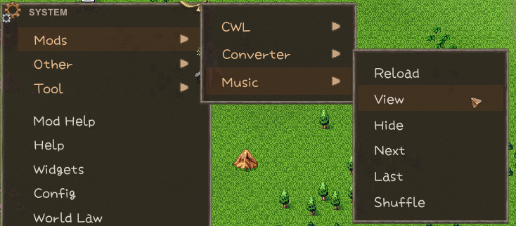

## Add Playlist

Your playlists are placed in the **Sound/BGM/Playlist** folder, and they are simple JSON files. It contains 2 lists and a single bool value `shuffle`.
```json
{
    "shuffle": true,
    "list": [
        "megalovania"
    ],
    "remove": [
        "024 PSML514",
        "023 mysterious-forest",
		"MySomeOtherBGM/*"
    ]
}
```

The sound ID (**not BGM ID**) in `list` will be merged into the playlist, and `remove` will remove the entries (if present) from the playlist. You can also use existing game sound IDs.

You may also use wildcards as the `list` and `remove` entry, currently 2 patterns are provided:
```json
"remove": [
	"**"
]
```
Which will remove all entries prior to merging.

```json
"remove": [
	"<dir>/*"
]
```
Which will remove all entries from **`Sound/BGM/<dir>/`** folder prior to merging.

## Playlist Type

The playlist JSON file name should match one of the following:

+ `"Global"`
+ An existing playlist name
+ A zone type name
+ A zone ID with/without level

Here are some of the game playlists:
::: details Playlists
<!--@include: ./assets/playlists.md-->
:::

`Blank` is the default playlist for all zones that don't have an explicit playlist defined. 

To view the zone type names and their playlists (if any):
<LinkCard t="SourceZone" u="https://docs.google.com/spreadsheets/d/16-LkHtVqjuN9U0rripjBn-nYwyqqSGg_/edit?gid=1894708317#gid=1894708317" />


## Global Override

A special playlist named `Global` can be provided and it will be merged into all playlists.

## Specific Playlist

For example, all nefia zones (`Zone_RandomDungeon`, `Zone_RandomDungeonFactory`, `Zone_Mine`...etc) share a playlist called `Dungeon`. If you want to add or remove songs for this playlist, you should use `Dungeon.json` in your **Sound/BGM/Playlist/** folder.


Your changes in `Dungeon.json` will be merged into game's `Dungeon` playlist, be it adding or removing songs. This will affect all zones that share this playlist.

Another common use case is to add songs when you are in overworld map. The overworld map is a zone type `Region` and it has a playlist `EloMap`. 

## Specific Zone Type

In addition to the playlist merge, you can also specifiy zone overrides for each zone type. These playlists will be using the zone type name, and its contents will be merged on top of the zone's default playlist (`Blank` if none specified in the sheet).

E.g. `Zone_Vernis.json` will merge into zone with type `Zone_Vernis`.

So, you could add songs to the overworld map playlist via `Region.json` instead of `EloMap.json` too, because overworld uses zone type `Region`.

## Specific Zone ID

Sometimes, a zone type may have multiple different zones, and you can individually specify them using the zone ID. 

For example, `Zone_dungeon` for Cave and `Zone_dungeon_ruin` for Ruin are both types of `Zone_RandomDungeon`, and you can specify them individually using their IDs. 

When using the area ID, you can also append `@N` to indicate a specific level `N`, such as the lower level of Derphy being `Zone_derphy@-1.json`.

## Merge Order

Multiple types of playlists will be applied in the order of `Global`, Specific Playlist, Specific Zone Type, and Specific Zone ID. They are also affected by your mod load order. Keep that in mind when you do nested `remove`, especially with `**` or `<dir>/*` pattern matching.

## Hot Reload/BGM View

After loading the save file in the game, you can view and control the current playlist using the CWL panel:




Once you have edited the playlist JSON while the game is running, you can hot-reload all playlists. Although the CWL has console commands for hot-reloading newly added audio files, it is not recommended due to potential indexing issues.

## Examples

To remove all songs in overworld exploration playlist and add your new songs, define these in `Sound/BGM/Playlist/EloMap.json` or `Sound/BGM/Playlist/Region.json`:
```json
{
    "shuffle": true,
    "list": [
        "my new BGM sound ID1",
        "my new BGM sound ID2"
    ],
    "remove": [
        "**"
    ]
}
```