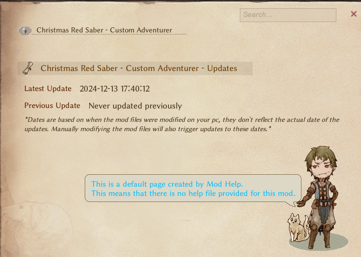
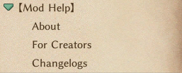

# Mod Help Usage Guide

## Introduction

**Mod Help** repurposes the game's Help UI to display all installed mods along with visual indicators for recently updated mods. It also supports other mod creators by allowing them to include a help file within their mods, which Mod Help will automatically load without dependency needs.

---

## How to - For Users

-   You can easily access mod help through the `ESC` context menu.
-   "Recently updated" mods will be displayed with a small little crystal next to their name. This indicator will persist until the mod page is accessed.

### Important notes:

-   **Mod Help** will generate default pages for all mods that don't have a help file provided by their creators.
    -   
-   Newly added mods won't show up as `recently updated`.
-   Manually modifying any content within mods folders will trigger the `recently updated` indicator.
-   The Search box works!

## How to - For Creators

### **Help File**

To provide a Help page for your own mod is simple, all you have to do is create a `help.txt` file in the following folder:
`\LangMod\EN\Data\Text\Help`  
**ModHelp** utilizes the **CWL** folder structure to load its help files, meaning you can easily localize your help file without adding CWL as a dependency for your mod. All you need to do is replicate the folder structure and simply swap the language code.  
`\LangMod\**\Data\Text\Help` → _`**` can be any existing Lang code, including mods. (e.g.: EN/JP/CN)_

### Pages

To create new pages under your own mod in the mod list, all you need to do is start a new line using the `$` character.  
Any line starting with `$` will make your mod show up as a folded dropdown button in the mods list and, under it, one page for each line started with `$`. The content following the `$` will be the name of the page.  
(Absence of any line with the syntax will make it a normal button listing):

| Line contents                                | Result                          |
| -------------------------------------------- | ------------------------------- |
| `$Subject`                                   |    |
| `$About`<br>`$For Creators`<br>`$Changelogs` |  |
| No lines starting with `$`                   |  |

### Recommendation

I highly recommend that if you are adding multiple pages to your mod, at least one of them be an equivalent to a **Changelog**. This mod was initially created for one sole purpose: providing users with information about updated mods. As I've borrowed the help window UI, it has evolved into a "framework" that can not only provide this type of update information but also general mod information, giving mod creators the freedom to deliver it however they see fit within the constraints of the mod.

---

## Supported Formatting

### **Text Styling**

-   **Sizing**:\
    `<size=24>Large Text</size>` → _Large Text_  
    `<size=12>Small Text</size>` → _Small Text_

-   **Bold Text**:\
    `<b>Bold Text</b>` → **Bold Text**

-   **Italic Text**:\
    `<i>Italic Text</i>` → _Italic Text_

-   **Coloring**:\
    `<color=#FF0000>Red Text</color>` → **Red Text**

-   **Combinations**:\
    `<color=#FF0000><b>Bold Red Text</b></color>` → **Bold Red Text**
    `<size=20><i>Large Italic Text</i></size>` → _Large Italic Text_

-   **Centering**
    `{center}` → Everything below this tag will be centered. (This is currently un-reversable)


---

### **Topics, Pairs and List**

-   **Topic Header**:\
    `{topic|Fancy Title}` → Creates a header.

-   **Key-Value Pair**:\
    `{pair|Key|Value}` → Displays a pair like:\
    **Key**: Value

-   **Lists**:\
    `・ Lists!` → Displays a bullet point.


---

### **Q and A**

-   **Replicate original help window Q and A section with**:\
    `{Q|I'm confused about this and that, so i make questions, can you bring me answers?}` → Displays a Question.  
    `{A|I asbolutely can!}` → Displays an Answer.


### **Links and Images**

-   **Link**:  
    `{link|Link Text|URL}` → Displays a Hyperlinked Button.

-   **Image**:  
    `{image,ImageName}` → Displays an Image.  
    _**This image need to be located at `modfolder\Texture` and needs to be a `.png`. (Currently it doesn't support rescaling, so big images will overflow and be cropped.)**_


### **Example `help.txt` File**:

```
$I
You can have many of me

$AM
I'm useful for many things


$A
I Recommend make one of me for Changelogs, so everyone stays up to date with your creations new additions!

$Topic
To make pages more well organized and looking nice you can use several keywords, like the ones below:
{topic|Fancy Title}
{pair|I am fancy|Pair}
・ Lists!
・ Yea!

{Q|I'm confused about this and that, so i make questions, can you bring me answers?}
{A|I asbolutely can!}

{nerun}Aaaaaaaaaaaaaaaaaa...
{link|I can LINK you to your ZELDA|https://static.wikia.nocookie.net/infinitas-guerras/images/a/a0/Zelda35.png/revision/latest?cb=20170410231750&path-prefix=pt-br}
{center}
I can be in the center!
And i can also be
<color=#FF0000>C</color><color=#FF7F00>O</color><color=#FFFF00>L</color><color=#00FF00>O</color><color=#0000FF>R</color><color=#4B0082>E</color><color=#8B00FF>D</color> <color=#FF0000>L</color><color=#FF7F00>I</color><color=#FFFF00>K</color><color=#00FF00>E</color> <color=#FF0000>T</color><color=#FF7F00>H</color><color=#FFFF00>I</color><color=#00FF00>S</color>


<size=24>Large Text</size>
<size=12>Small Text</size>
<b>Bold Text</b>
<i>Italic Text</i>
<color=#FF0000><b>Bold Red Text</b></color>
<size=20><i>Large Italic Text</i></size>

{layout,NoteHelp1}
Wowzers, I can be like this too!
{layout}

{layout,NoteHelp2}
Or like this even!
{layout}

{image,Bunny 9}
```
