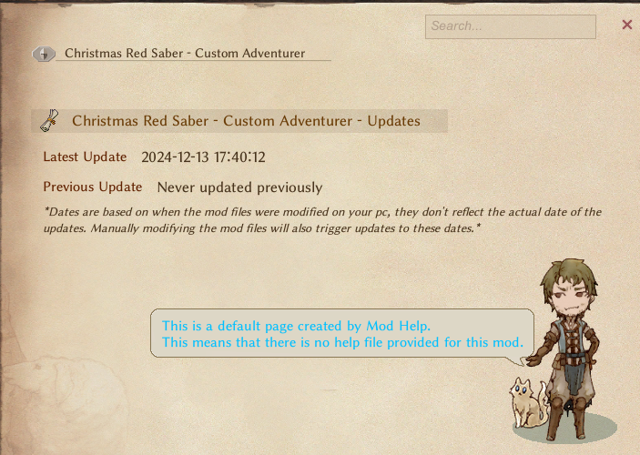
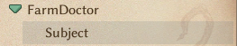
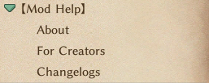
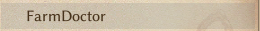
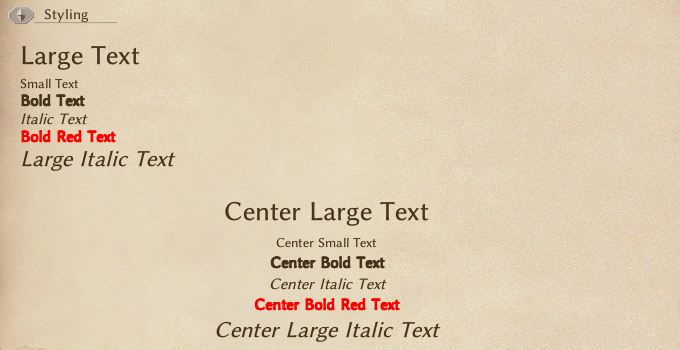
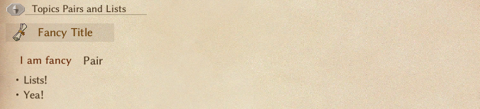
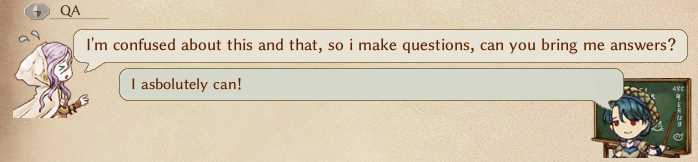
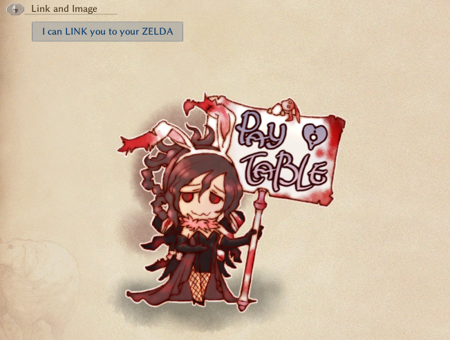

# Mod ヘルプ使用ガイド

::: warning  
これは ChatGPT で翻訳されました。不備がありましたら申し訳ありません。  
:::

## はじめに

**Mod Help**は、ゲームのヘルプ UI を再利用して、すべてのインストール済みの Mod を表示し、最近更新された Mod に視覚的なインジケーターを追加します。また、他の Mod 作成者が自身の Mod にヘルプファイルを含めることを可能にし、**Mod Help**が依存関係なしで自動的にロードします。

---

## ユーザー向け

-   `ESC`コンテキストメニューから簡単に Mod ヘルプにアクセスできます。
-   「最近更新された」Mod は、名前の横に小さなクリスタルが表示されます。このインジケーターは、Mod ページがアクセスされるまで表示され続けます。

### 重要な注意点:

-   **Mod Help**は、作成者がヘルプファイルを提供しないすべての Mod にデフォルトのページを生成します。
    -   
-   新しく追加された Mod は`最近更新された`として表示されません。
-   Mod フォルダー内のコンテンツを手動で変更すると、`最近更新された`インジケーターがトリガーされます。
-   検索ボックスは機能します！

## 作成者向け

### **ヘルプファイル**

独自の Mod 用のヘルプページを提供するのは簡単です。以下のフォルダーに`help.txt`ファイルを作成するだけです：
`\LangMod\EN\Data\Text\Help`  
**Mod Help**は**CWL**フォルダ構造を利用してヘルプファイルをロードします。そのため、CWL を Mod の依存関係として追加することなく、簡単にヘルプファイルをローカライズできます。フォルダ構造を複製し、言語コードを交換するだけです。  
`\LangMod\**\Data\Text\Help` → _`**` は任意の既存の Lang コード（例：EN/JP/CN）を指定できます。_

### ページ

Mod リスト内で独自の Mod の下に新しいページを作成するには、`$`文字を使用して新しい行を開始するだけです。  
`$`で始まる行は、Mod リスト内で折りたたみ可能なドロップダウンボタンとして表示され、その下に`$`で始まる各行ごとに 1 ページが表示されます。  
（この構文を含む行がない場合、通常のボタンリストとして表示されます）：

| 行内容                                       | 結果                                |
| -------------------------------------------- | ----------------------------------- |
| `$Subject`                                   |    |
| `$About`<br>`$For Creators`<br>`$Changelogs` |  |
| `$`で始まる行がない場合                      |  |

### 推奨事項

複数のページを Mod に追加する場合は、そのうちの少なくとも 1 つが**Changelog**（変更履歴）に相当するものであることを強くお勧めします。この Mod は、元々は更新された Mod に関する情報をユーザーに提供するという 1 つの目的のために作成されました。ヘルプウィンドウ UI を利用することで、この目的が進化し、Mod 作成者が Mod 内の制約に従って情報を提供する自由を与える「フレームワーク」としても機能します。

---

## サポートされているフォーマット

### **テキストスタイリング**

-   **サイズ指定**：\
    `<size=24>大きなテキスト</size>` → _大きなテキスト_  
    `<size=12>小さなテキスト</size>` → _小さなテキスト_

-   **太字テキスト**：\
    `<b>太字テキスト</b>` → **太字テキスト**

-   **斜体テキスト**：\
    `<i>斜体テキスト</i>` → _斜体テキスト_

-   **カラーリング**：\
    `<color=#FF0000>赤いテキスト</color>` → **赤いテキスト**

-   **組み合わせ**：\
    `<color=#FF0000><b>太字赤テキスト</b></color>` → **太字赤テキスト**  
    `<size=20><i>大きな斜体テキスト</i></size>` → _大きな斜体テキスト_

-   **中央揃え**  
    `{center}` → このタグ以下のすべてが中央揃えになります。（現在は元に戻せません）



---

### **トピック、ペア、およびリスト**

-   **トピックヘッダー**：\
    `{topic|魅力的なタイトル}` → ヘッダーを作成します。

-   **キーと値のペア**：\
    `{pair|キー|値}` → 次のようなペアを表示します：\
    **キー**: 値

-   **リスト**：\
    `・ リスト項目!` → 箇条書き項目を表示します。



---

### **Q&A**

-   **元のヘルプウィンドウの Q&A セクションを再現**：\
    `{Q|このことやあのことについて混乱しています。質問を作って、答えを持ってきてもらえますか？}` → 質問を表示します。  
    `{A|もちろんできます！}` → 答えを表示します。



### **リンクと画像**

-   **リンク**:  
    `{link|リンクテキスト|URL}` → ハイパーリンク付きボタンを表示します。

-   **画像**:  
    `{image,画像名}` → 画像を表示します。  
    _**この画像は `modfolder\Texture` にあり、`.png` ファイルである必要があります。（現在リスケールはサポートされておらず、大きな画像はオーバーフローして切り取られます。）**_



### **`help.txt` ファイルの例**:

```
$I
You can have many of me

$AM
I'm useful for many things


$A
I Recommend make one of me for Changelogs, so everyone stays up to date with your creations new additions!

$Topic
To make pages more well organized and looking nice you can use several keywords, like the ones below:
{topic|Fancy Title}
{pair|I am fancy|Pair}
・ Lists!
・ Yea!

{Q|I'm confused about this and that, so i make questions, can you bring me answers?}
{A|I asbolutely can!}

{nerun}Aaaaaaaaaaaaaaaaaa...
{link|I can LINK you to your ZELDA|https://static.wikia.nocookie.net/infinitas-guerras/images/a/a0/Zelda35.png/revision/latest?cb=20170410231750&path-prefix=pt-br}
{center}
I can be in the center!
And i can also be
<color=#FF0000>C</color><color=#FF7F00>O</color><color=#FFFF00>L</color><color=#00FF00>O</color><color=#0000FF>R</color><color=#4B0082>E</color><color=#8B00FF>D</color> <color=#FF0000>L</color><color=#FF7F00>I</color><color=#FFFF00>K</color><color=#00FF00>E</color> <color=#FF0000>T</color><color=#FF7F00>H</color><color=#FFFF00>I</color><color=#00FF00>S</color>


<size=24>Large Text</size>
<size=12>Small Text</size>
<b>Bold Text</b>
<i>Italic Text</i>
<color=#FF0000><b>Bold Red Text</b></color>
<size=20><i>Large Italic Text</i></size>

{layout,NoteHelp1}
Wowzers, I can be like this too!
{layout}

{layout,NoteHelp2}
Or like this even!
{layout}

{image,Bunny 9}
```
