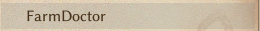
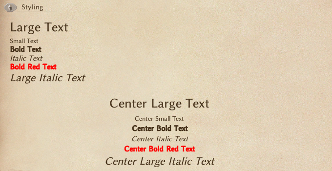
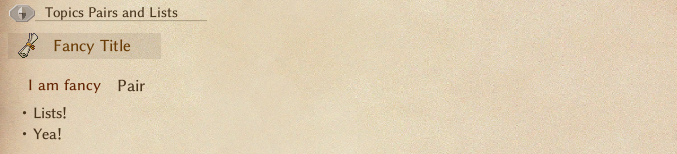

# Mod Help 使用指南

## 简介
Mod Help 在游戏内新增了一个帮助界面，展示所有已安装模组，并通过水晶标识提示最近更新的模组。本模组同时为其他创作者提供支持，允许通过内置帮助文件的形式展示额外信息，且无需建立依赖关系。

---

## 用户指南

- 通过 ESC 菜单的上下文选项可快速访问 Mod Help 界面
- "最近更新"的模组会在名称旁显示水晶标识，该标识将在查看相关页面后消失

### 重要说明：

- **Mod Help** 会为所有未提供帮助文件的模组生成默认页面
  - 
- 新安装的模组不会触发"最近更新"标识
- 手动修改模组文件夹内容会触发"最近更新"标识
- 支持搜索框功能！

## 创作者指南

### **帮助文件**

Mod Help 采用 CWL 的文件夹结构加载帮助文件，这意味着您可以轻松实现本地化支持而无需依赖 CWL 模组。 

创建帮助页面非常简单，只需在 `LangMod/**/Text/Help` 路径创建 `help.txt` 文件, `**` 可为任意有效语言代码（如 `EN`/`JP`/`CN`/`ZHTW`/`KR`）

### 页面管理

在模组页面下创建可折叠的子页面：

+ 使用 `$` 符号开启新行来创建分页
  + 
+ `$` 后的内容将作为页面标题
  + 
+ 未使用该语法时显示为普通按钮
  +  

### 建议

强烈建议包含**更新日志**页面。本模组的初衷是为玩家提供查看模组更新日志的可视化方案，现发展为可自由显示帮助信息的框架系统，创作者可充分发挥在界面限制内的表现力。

## 格式支持

其实就是[Unity的富文本格式](https://docs.unity3d.com/Packages/com.unity.ugui@1.0/manual/StyledText.html)。

### **文本样式**

- **字号调整**:\
    `<size=24>大号文本</size>` → <span class="text-lg">大号文本</span>  
    `<size=12>小号文本</size>` → <span class="text-sm">小号文本</span>

- **字体调整**:\
    `<b>粗体</b>` → <b>粗体</b>  
    `<i>斜体</i>` → <i>斜体</i>

- **颜色**:\
    `<color=#FF0000>红色</color>` → <span class="text-red-500">红色</span>

- **组合样式**:\
    `<color=#FF0000><b>红底加粗</b></color>` → <b class="text-red-500">红底加粗</b>   
    `<size=20><i>大号斜体</i></size>` → <i class="text-lg">大号斜体</i>  

- **居中**
    `{center}` → 该标签后的所有内容自动居中（当前不可逆）



---

### **标题与列表**

- **主题标题**:\
    `{topic|精美标题}` → 创建分类标题

- **键值对**:\
    `{pair|键名|数值}` → 显示为：**键名**: 数值

- **项目列表**:\
    `・ 列表项` → 显示列表



---

### **问答模块**

-   **还原原生帮助界面的Q&A样式：**:\
    `{Q|问题}` → 显示一个问题  
    `{A|答案}` → 显示一个回答  


### **外链与图片**

-   **超链接**:  
    `{link|按钮文字|URL}` → 生成可点击的链接按钮

-   **图片插入**:  
    `{image,图片名称}` → 显示图片\
    图片需存放于模组文件夹 **Texture** 路径，格式为PNG


### **示例 `help.txt` 文件**:

```
$I
You can have many of me

$AM
I'm useful for many things


$A
I Recommend make one of me for Changelogs, so everyone stays up to date with your creations new additions!

$Topic
To make pages more well organized and looking nice you can use several keywords, like the ones below:
{topic|Fancy Title}
{pair|I am fancy|Pair}
・ Lists!
・ Yea!

{Q|I'm confused about this and that, so i make questions, can you bring me answers?}
{A|I asbolutely can!}

{nerun}Aaaaaaaaaaaaaaaaaa...
{link|I can LINK you to your ZELDA|https://static.wikia.nocookie.net/infinitas-guerras/images/a/a0/Zelda35.png/revision/latest?cb=20170410231750&path-prefix=pt-br}
{center}
I can be in the center!
And i can also be
<color=#FF0000>C</color><color=#FF7F00>O</color><color=#FFFF00>L</color><color=#00FF00>O</color><color=#0000FF>R</color><color=#4B0082>E</color><color=#8B00FF>D</color> <color=#FF0000>L</color><color=#FF7F00>I</color><color=#FFFF00>K</color><color=#00FF00>E</color> <color=#FF0000>T</color><color=#FF7F00>H</color><color=#FFFF00>I</color><color=#00FF00>S</color>


<size=24>Large Text</size>
<size=12>Small Text</size>
<b>Bold Text</b>
<i>Italic Text</i>
<color=#FF0000><b>Bold Red Text</b></color>
<size=20><i>Large Italic Text</i></size>

{layout,NoteHelp1}
Wowzers, I can be like this too!
{layout}

{layout,NoteHelp2}
Or like this even!
{layout}

{image,Bunny 9}
```
