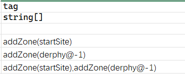
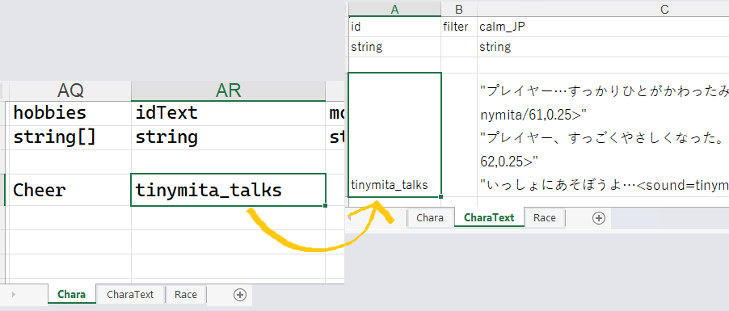
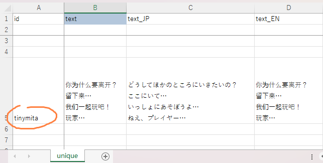

# Chara Sheet

<LinkCard t="SourceCard/Chara" u="https://docs.google.com/spreadsheets/d/1CJqsXFF2FLlpPz710oCpNFYF4W_5yoVn/edit?gid=1953808581#gid=1953808581" />

When making source sheets, always copy the first 3 rows from official rows and start your data at the 4th row. Do not alter the column order.

## Sheet Columns

|Column|Type|Description|
|-|-|-|
|id|string|The most important cell of an entry that distinguishes it from everything else on the Chara sheet. If the ID matches a vanilla entry's or another mod's entry's ID, the last sheet to load will override the others. This value cannot have any spaces in it, consider using snake_case style if needed, e.g. `mymod_chara_yajyuu_senpai`.|
|_id|integer|Used for sorting purposes in creature codex, can be any numeric value. This does not have to be unique.|
|name_JP|string|The Chara's in-name display name in Japanese.|
|name|string|The Chara's in-game display name in English. Other languages use SourceLocalization.json. |
|aka_JP|string|The Chara's in-name alias/title in Japanese.|
|aka|string|The Chara's in-game alias/title in English. Other languages use SourceLocalization.json. |
| idActor | string | Controls whether the Chara uses PCC-part rendering. Example: `pcc,unique,jure` loads PCC parts from `pcc/unique/jure`. |
| sort | string | Unused in SourceChara. |
| size | string | Tile dimensions occupied by the Chara; usually empty. Example: `2,2` makes the Chara occupy 2×2 tiles and prevents shoving. |
| _idRenderData | string | Controls sprite sheet referencing. `chara`/`chara_L`... uses tile IDs from `tiles` with textures in **Texture Replace** (limited slots, can be overridden). `@chara` uses same-ID texture from **Texture** (**mandatory** for modded Chara). |
| tiles | integer | tile IDs for sprite sheet, or [skinset](../15_Texture%20Mods/skins) for modded Chara. |
| tiles_snow | integer | Replacement tile sequence when on snowy maps. Modded Chara use [variation](../15_Texture%20Mods/variation) instead. |
| colorMod | integer | Currently mainly used with `100`, allowing grayscale sprites to inherit `mainElement` color. |
| components | string | Unused in SourceChara. |
| defMat | string | Unused in SourceChara. |
| LV | integer | Chara “Danger Level”; affects spawn threshold by map danger, selection cost (slave master/animal tamer), and base stat generation from race/job characteristics. |
| chance | integer | Modifier for map spawn chance (and possibly sale lists). Default `100`. |
| quality | integer | `0–2`: regular tiers. `3`: Unique Monsters (egg obtainable; cannot befriend/capture/tame). `4`: Unique Characters (only chicken eggs; can befriend but not capture/tame). |
| hostility | string | Temperament toward player/allies/bystanders. Blank: `Hostile`. `Neutral`: does not attack unless attacked. `Friend`: attacks anyone hostile to Friend units, including player if provoked. |
| biome | string | Increases (possibly doubles) spawn chance on specified floor type, decreases (possibly halves) on others. Example: `Water` strongly favors water-floor spawning. |
| tag | string | Known tags: `mini` (half sprite size), `noRandomProduct` (no panties from Fortune Drum; possibly no doujin), `random_color` (assigns hair color to grayscale regions when `colorMod=100`), `randomFish`, `staticSkin` (overrides gender-based sprite assignment), `snow` (prefers snow tiles), `water` (prefers water tiles). |
| trait | string | Complex trait list; refer to trait documentation and `Trait*` C# classes. |
| race | string | Race ID from SourceRace. |
| job | string | Job/class ID from SourceJob; default is `none`. |
| tactics | string | Overrides default tactics of assigned job. |
| aiIdle | string | AI behavior supplement/override. Examples: `Stand` (fully stationary, even when attacked), `Root` (stationary until attacked or recruited). |
| aiParam | string | Three values: preferred enemy distance, per-turn reposition chance to that distance, and (rarely used) bonus chance to reposition again. |
| actCombat | string | Active SourceElement entries usable in combat, comma-separated. Add `/N` for fixed use chance. For buffs, add `/pt` to target whole party (ally state only). Example: `ActThrowPotion/30,SpWeakness,SpSpeedDown,SpWisdom/50/pt`. Default chance is 100. |
| mainElement | string | Primary elemental affinity: `Fire`, `Cold`, `Lightning`, `Darkness`, `Nether`, `Sound`, `Chaos`, `Poison`, `Cut`, `Acid`, `Impact`. |
| elements | string | Passive SourceElement entries, comma-separated. Add `/N` for level/value where applicable. `0` or negative can modify inherited race elements. Examples: `invisibility/1` enables, `invisibility/0` disables inherited; `antidote/-30` makes meat poisonous, `antidote/30` cures poison or offsets racial `-30`. |
| equip | string | Overrides randomized job equipment template, **only if race EQ is not empty**. Example: a Thief-job unit with `equip=Archer` gets Archer gear; Dog-race units with empty race EQ still won’t spawn with equipment even if `equip` is set. |
| loot | string | Extra drops (Thing/ThingV IDs), comma-separated, each with `/N`. Every 20 = +1% drop chance. Example: `medal/500` = 25%; `medal/3000` = 150% (guaranteed 1 + 50% for another). |
| category | string | Most entries use default `chara`. |
| filter | string | Unused in SourceChara. |
| gachaFilter | string | Gacha picks a category (e.g., resident/livestock/Unique/default), then selects eligible Chara by this filter. Example: livestock results only include entries tagged for livestock. |
| tone | string | Dialogue modifiers for Japanese text. |
| actIdle | string | Out-of-combat behavior instructions. Examples: `readBook` (generates/reads/removes random book), `buffMage` (periodically casts buffs like `spResElement` or `spHero`). |
| lightData | string | Unused in SourceChara. The color emitted from light. |
| idExtra | string | Unused in SourceChara. Extra renderdata. |
| bio | string | Slash-separated values (no spaces): `gender` (`m`/`f`/`n`, required), `birthyear` (optional), `height` (optional), `weight` (optional), `tone` from `chara_tone.xlsx` (optional), `talk` from `chara_talk.xlsx` (optional). Example: <code>f/51044/152/46/friendly|私|あなた</code>. |
| faith | string | Fixed religion. Setting this will prevent changing in game. |
| works | string | Alias from SourceHobby. |
| hobbies | string | Alias from SourceHobby. |
| idText | string | Links to an entry in `CharaText` sheet. |
| moveAnime | string | Move animation type. `hop` or blank. |
| factory | string | Unused in SourceChara. |
| components | string | Unused in SourceChara; This is a duplicate column. |
| recruitItems | string | Special recruit dialog items, only used by mani right now. |
| detail_JP | string | Unused in SourceChara; can be used for notes. |
| detail | string | Unused in SourceChara; can be used for notes. |

## Allow Human Speak

To allow your character to talk without parentheses, you can add tag `humanSpeak` in SourceChara sheet. Alternatively you can add tag `human` or `humanSpeak` in the SourceRace sheet. 

## Spawn Setting

We use `tag` column to define a Chara's spawn settings.

### Zone Spawn

To spawn the character to a zone, add tag `addZone_*` to the SourceChara row and replace the `*` (asterisk) with **zone id** or keep the asterisk for a random zone. You may also specify zone level with `/n`.

For example, to spawn the chara in little garden, use `addZone_little_garden`. To also spawn in derphy underground, use another tag `addZone_derphy/-1`. Check the [SourceGame/Zone](https://docs.google.com/spreadsheets/d/16-LkHtVqjuN9U0rripjBn-nYwyqqSGg_/edit?gid=1819250752#gid=1819250752) and reference the **id** column.



For each `addZone` tag used, an instance of the Chara will be spawned there. For example, `addZone_lumiest,addZone_little_garden,addZone_specwing,addZone_*` will make sure all three selected zones plus a random zone will have this character spawned (as duplicates).

### Add Equipment/Thing

When spawning your character, you may also define the starting equipments and things for this character, using tag `addEq_ItemID#Rarity` and/or `addThing_ItemID#Count`.

To assign specific equipment to the character, use tag `addEq_ItemID#Rarity`, where `ItemID` is replaced by the item's ID, and `Rarity` being one of the following: **Random, Crude, Normal, Superior, Legendary, Mythical, Artifact**. If `#Rarity` is omitted, the default rarity `#Random` will be used. 

The rarity text in game is displayed as: **Crude, Normal, Good, Miracle, Godly, Special**

For example, to set a miracle `BS_Flydragonsword` and a random `axe_machine` as the main weapons for the character:
```
addZone_Palmia,addEq_BS_Flydragonsword#Legendary,addEq_axe_machine
```

To add starting items to the character, use tag `addThing_ItemID#Count`. If `#Count` is omitted, a default of `1` item will be generated. 

For example, to add `padoru_gift` x10 and `scroll of ally` x5 to the character:
```
addZone_Palmia,addThing_padoru_gift#10,addThing_1174#5
```

**Remember, tags are separated by `,` (comma) with no spaces in between**. 

### Adventurer

If your character has trait **`AdventurerBacker`**, the character will be imported as an adventurer, which will appear on the adventurer ranking list.

## Merchant Stock

You can define a custom merchant stock using tag `addStock` and a simple JSON file placed in your `LangMod/**/Data/` folder, with the name `stock_ID.json`. The ID is the unique identifier for this stock file or character. For example: `stock_my_cnpc_id.json` or `stock_unique_armor.json`.

When using the `addStock` tag without specifying ID, it will default to the character ID. You may also specify and/or combine multiple stock files using multiple tags, such as:
`addStock,addStock_unique_items,addStock_unique_armor`.

### Stock File

Within the stock JSON file, the structure is as follows:

```json
{
  "Items": [
    {
      "Id": "example_item",
      "Material": "",
      "Num": 1,
      "Restock": true,
      "Type": "Item",
      "Rarity": "Random",
      "Identified": true
    },
    {
      "Id": "example_item_limited",
      "Material": "granite",
      "Num": 1,
      "Restock": false,
      "Type": "Item",
      "Rarity": "Artifact",
      "Identified": true
    },
    {
      "Id": "example_item_craftable",
      "Material": "",
      "Num": 1,
      "Restock": false,
      "Type": "Recipe",
      "Rarity": "Random",
      "Identified": true
    },
    {
      "Id": "SpShutterHex",
      "Num": 5,
      "Type": "Spell"
    }
  ]
}
```

* `Items` is an array of items in the stock.
* `Id`
  The ID of the item (Thing). This field is **required**.
  For some stock types, this can be an alias of an element or a numeric ID, or a name.
* `Material`
  The material the item is made of. Leave it blank to use the default material defined in the Thing data.
  Default value: `""`
* `Num`
  The number of items.
  Default value: `1`
* `Restock`
  Determines whether the item restocks.
  Set to `false` for limited items that can only be purchased once.
  Default value: `true`
* `Rarity`
  Possible values: `Random`, `Crude`, `Normal`, `Superior`, `Legendary`, `Mythical`, `Artifact`
  Default value: `Normal`
* `IdentifyLevel`
  Determines the initial identification state of the item.
  Possible values: `Identified`, `RequireSuperiorIdentify`, `KnowQuality`, `Unknown`
  Default value: `Identified`
* `BlessedState`
  Determines the blessed state of the item.
  Possible values: `Doomed`, `Cursed`, `Normal`, `Blessed`
  Default value: `Normal`
* You can omit any fields to use their default values.

### Stock Item Types

|Type|Description|
|-|-|
|Item|A standard item. Supports material, level, and stack count.|
|Block|A placeable block item created from a block alias and material.|
|Cassette|A music cassette. If the bgm id is invalid, a random track will be used.|
|Currency|Currency item. Id can be `money` `money2` `plat` `medal` `influence` `casino_coin` `ecopo`. `Num` defines the amount.|
|Letter|A letter item. `Id` is the txt id in `LangMod/XX/Text/Scroll`.|
|Perfume|A perfume. `Id` is the element alias or id.|
|Plan|A plan. `Id` is the element alias or id.|
|Potion|A potion item. `Id` is the element alias or id. `Num` defines stack size.|
|Recipe|A recipe item for crafting.|
|RedBook|A red book item. `Id` is the txt id in `LangMod/XX/Text/Book`.|
|Rod|A rod item. `Id` is the element alias or id. `Num` defines charges.|
|Rune|A rune item. `Id` is the element alias or id.|
|RuneFree|A lawless rune item. `Id` is the element alias or id.|
|Scroll|A scroll item. `Id` is the element alias or id.|
|Skill|A skill book. `Id` is the element alias or id.|
|Spell|A spell book. `Id` is the element alias or id. `Num` defines the charge.|
|Usuihon|A special item. `Id` is the religion id.|

## Talk & Popups

### Barks (Popup)

Sometimes you want the character to banter/bark at certain conditions. The barks pop up above character's head in a speech bubble.


These barks are written in **CharaText** sheet, and your Chara sheet uses **idText** cell to link their IDs together.



|Column|Condition|
|-|-|
|calm|Idle default|
|fov|On sight|
|aggro|In combat|
|dead|Death rattle|
|kill|Kill confirmed|

### Let's Talk

To add some chatty texts to the character for the **Let's Talk** option, you'll need to use `dialog.xlsx` file placed in your `LangMod/**/Dialog/` folder.

Let's talk texts are line-separated texts in `unique` sheet and a row with your character's ID.

::: warning Format
The data starts at the 5th row.
:::

You can reference the game's dialog sheet at **Elin/Package/_Elona/Lang/_Dialog/dialog.xlsx**.



## Drama

A drama is the rich dialog that usually has options and additional actions. 

Drama guides are moved to their new section for now:

<LinkCard t="Drama System" u="/100_Mod Documentation/Custom Whatever Loader/Drama/0_basic.md" />
