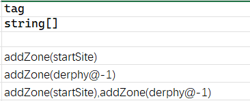
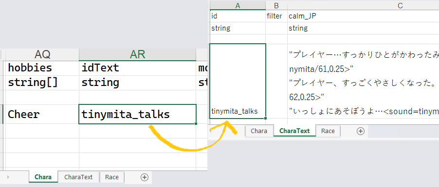
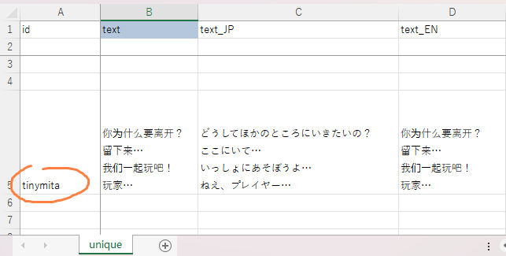

# Chara Sheet

<LinkCard t="SourceChara" u="https://docs.google.com/spreadsheets/d/1CJqsXFF2FLlpPz710oCpNFYF4W_5yoVn/edit?gid=1953808581#gid=1953808581" />

When making source sheets, always copy the first 3 rows from official rows and start your data at the 4th row.

::: warning About columns and empty cells
**Missing columns are silently filled with empty values** with no error at all — so copy the whole official header row and do not delete columns.

**A row with an empty `id` aborts the rest of the sheet**, every row after it is skipped, again with no warning. Do not use blank rows to group your data unless intentionally.

An empty cell is **not** an empty value either — the game falls back to the default on row 3. `race` defaults to `norland`, `job` to `none`, `category` to `chara`, `_idRenderData` to `chara`, `LV` to `1`, `chance` to `100`, `tiles` and `colorMod` to `0`.

You can change your default row 3 values to apply it to all other rows.
:::

## Sheet Columns

|Column|Type|Description|
|-|-|-|
|id|string|The most important cell of an entry that distinguishes it from everything else on the Chara sheet. If the ID matches a vanilla entry's or another mod's entry's ID, the last sheet to load will override the others. This value cannot have any spaces in it, consider using snake_case style if needed, e.g. `mymod_chara_yajyuu_senpai`.|
|_id|integer|Used for sorting purposes in creature codex, can be any numeric value. This does not have to be unique.|
|name_JP|string|The Chara's in-name display name in Japanese.|
|name|string|The Chara's in-game display name in English. Other languages use SourceLocalization.json. |
|aka_JP|string|The Chara's in-name alias/title in Japanese.|
|aka|string|The Chara's in-game alias/title in English. Other languages use SourceLocalization.json. |
| idActor | string[] | Controls whether the Chara uses PCC-part rendering. Example: `pcc,unique,jure` loads PCC parts from `pcc/unique/jure`. |
| sort | int | Unused in SourceChara. |
| size | int[] | Tile dimensions occupied by the Chara; usually empty. Example: `2,2` makes the Chara occupy 2×2 tiles and prevents shoving. |
| _idRenderData | string | Controls sprite sheet referencing. `chara`/`chara_L`... uses tile IDs from `tiles` with textures in **Texture Replace** (limited slots, can be overridden). `@chara` uses same-ID texture from **Texture** (**mandatory** for modded Chara). Note that leaving this blank does **not** mean "no render data": it falls back to the row-3 default `chara`, i.e. the tile-sheet mode — which is why a modded Chara without `@chara` shows the wrong sprite. |
| tiles | int[] | tile IDs for sprite sheet, or [skinset](../15_Texture%20Mods/skins) for modded Chara. |
| tiles_snow | int[] | Replacement tile sequence when on snowy maps. Modded Chara use [variation](../15_Texture%20Mods/variation) instead. |
| colorMod | integer | Color saturation modifier. Currently mainly used with `100`, allowing grayscale sprites to inherit `mainElement` color. `0` means no tinting. |
| components | string[] | Unused in SourceChara. |
| defMat | string | Default corpse material, selected from the alias column of the Material sub-sheet within SourceBlock. Leave it empty to use Race's default material. |
| LV | integer | Chara “Danger Level”; affects spawn threshold by map danger, selection cost (slave master/animal tamer), and base stat generation from race/job characteristics. |
| chance | integer | Modifier for map spawn chance (and possibly sale lists). Default `100`. |
| quality | integer | `0–2`: regular tiers. `3`: Named Monsters (name displayed with `《》` around it; fertilized eggs hatch into the same species; can befriend but cannot be captured with a monster ball). `4`: Unique Characters (name displayed with `『』` around them; fertilized eggs hatch only into chickens; can befriend but cannot be captured with a monster ball). Not required for custom adventurers. |
| hostility | string | Temperament toward player/allies/bystanders. Accepts `Enemy` / `Neutral` / `Friend` / `Ally` — note that hostile is spelled `Enemy`, not `Hostile`. Blank is treated as `Enemy`. `Neutral`: does not attack unless attacked. `Friend`: attacks anyone hostile to Friend units, including player if provoked. |
| biome | string | Restricts random spawning to a single biome. Set it and the Chara only appears in the matching biome; leave it blank for no restriction. This is a **yes/no filter, not a weight**. Write the biome name (`Water`, `Sand`, `Plain`, …); it is **case-sensitive**. |
| tag | string[] | Serves two purposes: **behavior tags** (bare words) and **spawn settings** (parameterized, see below). Behavior tags come from a fixed list and must be spelled exactly, **case included** — see [Behavior Tags](#behavior-tags). |
| trait | string[] | The Chara's trait, mapping to a `Trait*` C# class (omit the `Trait` prefix). **This column can hold several entries, but only the first one takes effect** — the rest are silently ignored. |
| race | string | Select from the Race ID column of SourceRace. Defaults to `norland` when left blank — a Chara with no race is a Norlander, not a Chara without a race. |
| job | string | Select from the Job ID column of SourceJob; default is `none`. This defines your character's class (job). |
| tactics | string | Overrides default tactics of assigned job. |
| aiIdle | string | Supplements or overrides idle AI behavior. Accepts `stand` (fully stationary) or `root` (stationary until attacked or recruited). **Must be lowercase** — `Stand` simply does not apply, the Chara wanders as usual, and nothing is reported. |
| aiParam | int[] | Three values: preferred enemy distance, per-turn reposition chance to that distance, and (rarely used) bonus chance to reposition again. |
| actCombat | string[] | Active abilities/spells usable in combat, selected from SourceElement entries and comma-separated. Add `/N` for fixed use chance. For buffs, add `/pt` to target whole party (ally state only). Example: `ActThrowPotion/30,SpWeakness,SpSpeedDown,SpWisdom/50/pt`. Default chance is 100. |
| mainElement | string[] | Primary elemental affinity: `Fire`, `Cold`, `Lightning`, `Darkness`, `Mind`, `Nether`, `Nerve`, `Sound`, `Chaos`, `Poison`, `Holy`, `Cut`, `Acid`, `Impact`. You may list **several**, comma-separated — the game picks one at random, weighted by the Chara's `LV` against each element's `eleP`. Add `/N` to set the element level (default `10`), e.g. `Poison/80`. The value is looked up as `ele` + the name (`Fire` → `eleFire`) in SourceElement's alias column, so a typo throws on spawn. |
| elements | string | Passives, such as feats/enchantments, selected from SourceElement entries and comma-separated. Add `/N` for level/value where applicable. `0` or negative can modify inherited race elements. Examples: `invisibility/1` enables, `invisibility/0` disables inherited; `antidote/-30` makes meat poisonous, `antidote/30` cures poison or offsets racial `-30`. |
| equip | string | Overrides the randomized job equipment template. Blank follows the job (the `equip` column on the Job sheet); `none` skips equipment generation entirely. Only three values actually do anything, and they are **case-sensitive** and lowercase: `archer` (bow/crossbow), `inquisitor` and `gunner` (gun). A non-empty value also triggers equipment generation on its own, even when the race's EQ is empty. |
| loot | string[] | Extra drops (Thing/ThingV IDs), comma-separated, **each one must carry `/N`** — leaving it out is an error. `N` is per **mille**: below 1000 it is the chance to drop one (`medal/500` = 50%), 1000 and above always drops, with `N / 1000` as the guaranteed count and the remainder as the per-mille chance of one extra (`medal/3000` = always 3; `medal/2500` = 2, plus 50% for a third). Nothing drops for PC-faction charas or in user-made zones. |
| category | string | Most entries use default `chara`. |
| filter | string[] | Unused in SourceChara. |
| gachaFilter | string[] | Decides whether this Chara can be drawn from the gacha. **This column accepts only two values: `resident` and `livestock`** (both may be listed). The gacha's own category is a separate thing: drawing citizens requires `resident`, drawing livestock requires `livestock`, and drawing uniques requires `resident` **and** a `quality` of `4` — there is no `Unique` or `default` filter value. |
| tone | string | **This column is read in and then never used**, so filling it in has no effect. The tone that actually applies is the 5th segment of `bio`. |
| actIdle | string[] | Out-of-combat behavior instructions. Examples: `readBook` (generates/reads/removes random book), `buffMage` (periodically casts buffs like `spResElement` or `spHero`). |
| lightData | string | The color emitted from light. It works for Chara too — vanilla uses `wisp`, `wisp_bright` and `fireplace` here. |
| idExtra | string | Extra renderdata. Also works for Chara (vanilla: `deep_jellyfish`). |
| bio | string | Slash-separated values (no spaces): `gender` (`m`/`f`/`n`), `age`, `height`, `weight`, `tone` from `chara_tone.xlsx`, `talk` from `chara_talk.xlsx`. Example: `f/51044/152/46/friendly\|私\|あなた`. Optional segments may only be dropped **from the tail** — see [The bio Column](#the-bio-column). |
| faith | string | Fixed religion. Setting this will prevent changing in game. |
| works | string[] | Select from the alias column of SourceHobby. |
| hobbies | string[] | Select from the alias column of SourceHobby. |
| idText | string | Links to an entry in `CharaText` sheet. For the bubbles that appear above a character's head, see the [Barks (Popup)](#barks-popup) section. |
| moveAnime | string | Move animation type. `hop` or blank. |
| factory | string[] | Unused in SourceChara. |
| components | string[] | Unused in SourceChara; This is a duplicate column. When a sheet has two columns of the same name, the **later** one wins. |
| recruitItems | string[] | Special recruit dialog items, only used by mani right now. |
| detail_JP | string | Unused in SourceChara; can be used for notes. |
| detail | string | Unused in SourceChara; can be used for notes. |

## The bio Column

```
gender/age/height/weight/tone/talk
```

No segment is strictly required, and **the optional segments may only be dropped from the tail**. `f////friendly` does not work.

`gender` (`m` / `f` / `n`) deserves a note of its own, because "blank" means two different things:

- **Leave the whole column empty** and everything is rolled at random, gender included. This is a perfectly normal way to define a Chara.
- **Leave only the first segment empty** — `/17/152/46` — and it is *not* random. The game always reads that segment when the column is non-empty, and anything that is neither `n` nor `f` falls through to **male**. An empty gender, or a typo such as `M`, silently produces a male Chara.

Two more things that are invisible from the sheet:

- **`age` is an age, not a year.** The game derives the birth year from it (birth year = current year − age). `height` and `weight` have no unit attached — they are just two numbers the game shows as-is.
- **Filling in `age` turns off the random portrait**, unless the Chara has the `randomPortrait` tag. Writing an age also makes the game look for `Data/PCC/<id>.txt` but that can be ignored.

The `tone` segment can itself be split with `|`:

```
toneId|firstPerson|secondPerson
```

`toneId` is an id from `chara_tone.xlsx` (blank behaves as `default`). The other two replace the first and second person pronouns in the Chara's lines, but that substitution **only happens in Japanese** — they do nothing in any other language.

This column has nothing to do with `addBio(ID)` and `bio_ID.json` further below: this one is the set of parameters used to *generate* the Chara, the other one is the biography text shown in the character sheet.

## Behavior Tags

Bare words in the `tag` column — the ones without parentheses — are behavior tags. The usable tags are
the fixed list below, and the spelling has to match exactly, **case included**; one wrong letter
simply means the tag is not there, and nothing is reported.

::: warning This list is shared with items
The same list is used by items and Charas, so quite a few of the values below (`seed`, `gift`,
`currency`, `dish_bonus`, …) only mean something on items and do nothing on a Chara.
:::

```
important, repeatSwing, nonHold, nonPick, canMelee, boss, currency, randomName,
noDrop, hidden, wilds, neg, replica, seed, rareSeed, gift, ignoreUse,
throwWeapon, throwWeaponEnemy, notHumanMeat, noRandomProduct, suicide, kamikaze,
randomSkin, noPortrait, randomPortrait, rareResource, tourism, staticSkin,
godArtifact, noWish, dish_bonus, dish_fail, random_color, noRandomEnc, noMix,
bigFish, noSkinRecipe, animal, human, undead, machine, horror, fish, fairy, god,
dragon, plant, antiSpider, shield, humanSpeak, throwBall, alwaysDropCorpse,
allowDevour, noRide, ride, allowIngredient
```

A few of these have a well-defined effect on Charas:

|Tag|Effect|
|-|-|
|`mini`|Height becomes one tenth.|
|`humanSpeak`|Talks without parentheses, see the next section.|
|`randomPortrait`|Keeps the random portrait even when `bio` has an age (writing an age otherwise turns it off).|
|`water`|**Aquatic behavior, not a spawn preference**: the Chara heads for deep water when idle, and will not wander out of deep water onto land. To restrict where it spawns, use the `biome` column.|

::: warning Tags that used to be listed here
`randomFish` and `snow` **do not exist** in the game and have no effect at all. To make a Chara prefer snow or water, use the `biome` column.
:::

## Allow Human Speak

To allow your character to talk without parentheses, you can add tag `humanSpeak` in SourceChara sheet. Alternatively you can add tag `human` or `humanSpeak` in the SourceRace sheet. 

## Spawn Setting

We use `tag` column to define a Chara's spawn settings.

::: warning Migrating From CWL
CWL specs are removed from the wiki, but they are still compatible. We recommend switching to the new format.
:::

Possible tag actions:
+ `addZone(zoneId@level)`
+ `addEq(ItemId#Rarity)` / `addEquipment(ItemId#Rarity)`
+ `addThing(ItemId#Count)`
+ `addFlag(FlagName)` / `addInt(FlagName=1)`
+ `addFlagValue(FlagName=some_value)` / `addStr(FlagName=some_value)`
+ `addBio(BioFileId)` / `addBiography(BioFileId)`
+ `addStock(StockFileId)`
+ `addDrama(DramaFileId)`

Detailed explanations are given below.

### Zone Spawn

To spawn the character to a zone, add tag `addZone(*)` to the SourceChara row and replace the `*` (asterisk) with **zone id** or keep the asterisk for a random zone. You may also specify zone level with `@n`.

For example, to spawn the chara in little garden, use `addZone(little_garden)`. To also spawn in derphy underground, use another tag `addZone(derphy@-1)`. Check the [SourceGame/Zone](https://docs.google.com/spreadsheets/d/16-LkHtVqjuN9U0rripjBn-nYwyqqSGg_/edit?gid=1819250752#gid=1819250752) and reference the **id** column.



For each `addZone` tag used, an instance of the Chara will be spawned there. For example, `addZone(lumiest),addZone(little_garden),addZone(specwing),addZone(*)` will make sure all three selected zones plus a random zone will have this character spawned (as duplicates).

### Add Equipment/Thing

When spawning your character, you may also define the starting equipments and things for this character.

To assign specific equipment to the character, use tag `addEq(ItemID#Rarity)` or `addEquipment(ItemID#Rarity)`, where `ItemID` is replaced by the item's ID, and `Rarity` being one of the following: **Random, Crude, Normal, Superior, Legendary, Mythical, Artifact**. If `#Rarity` is omitted, the default rarity `#Random` will be used. 

The rarity text in game is displayed as: **Crude, Normal, Good, Miracle, Godly, Special**

For example, to set a miracle `BS_Flydragonsword` and a random `axe_machine` as the main weapons for the character:
```
addEq(BS_Flydragonsword#Legendary),addEq(axe_machine)
```

To add starting items to the character, use tag `addThing(ItemID#Count)`. If `#Count` is omitted, a default of `1` item will be generated. 

For example, to add `padoru_gift` x10 and `scroll of ally` x5 to the character:
```
addThing(padoru_gift#10),addThing(1174#5)
```

**Remember, tags are separated by `,` (comma) with no spaces in between**. 

### Adventurer

::: warning Migrating From CWL
CWL specs used `AdventurerBacker`, which will still function the same as before. We recommend switching to the new format.
:::

If your character's trait column is filled in with **`AdventurerCustom`**, the character will be imported as an adventurer, which will appear on the adventurer ranking list.

## Merchant Stock

You can define a custom merchant stock using tag `addStock` and a simple JSON file placed in your `LangMod/**/Data/` folder, with the name `stock_ID.json`. The ID is the unique identifier for this stock file or character. For example: `stock_my_cnpc_id.json` or `stock_unique_armor.json`.

When using the `addStock` tag without specifying ID, it will default to the character ID. You may also specify and/or combine multiple stock files using multiple tags, such as:
`addStock,addStock(unique_items),addStock(unique_armor)`.

### Stock File

Within the stock JSON file, the structure is as follows:

```json
{
  "Items": [
    {
      "Id": "example_item",
      "Material": "",
      "Num": 1,
      "Restock": true,
      "Type": "Item",
      "Rarity": "Random",
      "IdentifyLevel": "Identified"
    },
    {
      "Id": "example_item_limited",
      "Material": "granite",
      "Num": 1,
      "Restock": false,
      "Type": "Item",
      "Rarity": "Artifact",
      "IdentifyLevel": "Identified"
    },
    {
      "Id": "example_item_craftable",
      "Material": "",
      "Num": 1,
      "Restock": false,
      "Type": "Recipe",
      "Rarity": "Random",
      "IdentifyLevel": "Identified"
    },
    {
      "Id": "SpShutterHex",
      "Num": 5,
      "Type": "Spell"
    }
  ]
}
```

::: tip Field name casing does not matter
The game reads these field names case-insensitively, so both `Items` and `items`, `Id` and `id`, work fine. This page capitalizes them consistently; existing mods use both styles, and either is fine to keep.
:::

* `Items` is an array of items in the stock.
* `Id`  
  The ID of the item (Thing). This field is **required**.  
  For some stock types, this can be an alias of an element or a numeric ID, or a name.
* `Material`  
  The material the item is made of. Leave it blank to use the default material defined in the Thing data.  
  Default value: `""`
* `Num`  
  The number of items.  
  Default value: `1`
* `Lv`  
  The item level. Leave it at `-1` to follow the shop level, or set a value to override it.  
  Default value: `-1`
* `Restock`  
  Determines whether the item restocks.    
  Set to `false` for limited items that can only be purchased once.  
  Default value: `true`
* `Type`
  See the type description table below.
* `Rarity`  
  Possible values: `Random`, `Crude`, `Normal`, `Superior`, `Legendary`, `Mythical`, `Artifact`  
  Default value: `Normal`
* `IdentifyLevel`  
  Determines the initial identification state of the item.  
  Possible values: `Identified`, `RequireSuperiorIdentify`, `KnowQuality`, `Unknown`  
  Default value: `Identified`
* `BlessedState`  
  Determines the blessed state of the item.  
  Possible values: `Doomed`, `Cursed`, `Normal`, `Blessed`  
  Default value: `Normal`
* `NoCopy`  
  Cannot by copied.  
  Default value: `false`
* `NoRandomSocket`  
  Does not generate random ranged gun sockets.  
  Default value: `false`
* `Sockets`  
  List of ranged gun enchant aliases to attach as socket. Empty string for empty socket.  
* `PriceCalc`  
  Arithmetic calc expression to override the item price.  
  Arguments: `base` (base price), `lv` (item level), `rarity` (item rarity)  
  Example: `"base * 0.2 + lv * 5"`
* `MapStr`  
  Additional mapStr values to merge into the item after creation.
* `MapInt`  
  Additional mapInt values to merge into the item after creation.
* You can omit any fields to use their default values.

### Stock Item Types

|Type|Description|
|-|-|
|Item|A standard item. Supports material, level, and stack count.|
|Block|A placeable block item created from a block alias and material.|
|Cassette|A music cassette. If the bgm id is invalid, a random track will be used.|
|Currency|Currency item. Id can be `money` `money2` `plat` `medal` `influence` `casino_coin` `ecopo`. `Num` defines the amount.|
|Category|Spawn from category. `Id` is the category name.|
|Filter|Spawn from filter. `Id` is the filter name.|
|Tag|Spawn from tag. `Id` is the tag name.|
|Letter|A letter item. `Id` is the txt id in `LangMod/XX/Text/Scroll`.|
|Map|A map item. `Id` is the map id.|
|Perfume|A perfume. `Id` is the element alias or id.|
|Plan|A plan. `Id` is the element alias or id.|
|Potion|A potion item. `Id` is the element alias or id. `Num` defines stack size.|
|Recipe|A recipe item for crafting.|
|RedBook|A red book item. `Id` is the txt id in `LangMod/XX/Text/Book`.|
|Rod|A rod item. `Id` is the element alias or id. `Num` defines charges.|
|Rune|A rune item. `Id` is the element alias or id.|
|RuneFree|A lawless rune item. `Id` is the element alias or id.|
|Scroll|A scroll item. `Id` is the element alias or id.|
|Skill|A skill book. `Id` is the element alias or id.|
|Spell|A spell book. `Id` is the element alias or id. `Num` defines the charge.|
|Usuihon|A special item. `Id` is the religion id.|

If you are not using a code editor, you can use [JSONLint](https://jsonlint.com/) to validate your JSON.

## Talk & Popups

### Barks (Popup)

Sometimes you want the character to banter/bark at certain conditions. The barks pop up above character's head in a speech bubble.


These barks are written in **CharaText** sheet, and your Chara sheet uses **idText** cell to link their IDs together.



|Column|Condition|
|-|-|
|calm|Idle default|
|fov|On sight|
|aggro|In combat|
|dead|Death rattle|
|kill|Kill confirmed|

### Let's Talk

To add some chatty texts to the character for the **Let's Talk** option, you'll need to use `dialog.xlsx` file placed in your `LangMod/**/Dialog/` folder.

Let's talk texts are line-separated texts in `unique` sheet and a row with your character's ID.

::: warning Format
The data starts at the 5th row.
:::

You can reference the game's dialog sheet at **Elin/Package/_Elona/Lang/_Dialog/dialog.xlsx**.



## Drama

A drama is the rich dialog that usually has options and additional actions. 

Drama guides are moved to their new section for now:

<LinkCard t="Drama System" u="/10_Source Sheets/drama.md" />

## Biography

To add more flavor to your character, you may use tag `addBio(ID)` to define a custom biography. The bio file is (yet another) json file placed in your `LangMod/**/Data/` folder, with name `bio_ID.json`, the ID is the unique ID for this biography file, such as `bio_my_chara.json`.

You may reuse the same biography file for multiple characters by specifying the same ID.

Within the bio file, it's simply as follows:
```json
{
    "BirthDay": 11,
    "BirthMonth": 4,
    "BirthYear": 514,
    "BirthPlace": "Earth",
    "BirthLocation": "",
    "Mom": "Best Mom",
    "Dad": "Best Dad",
    "Background": "An absolutely normal living being\nBut on ylva...",
    "FavFood": "mushroom_rare",
    "FavCategory": "mushroom",
    "LikeThing": "stethoscope",
    "LikeHobby": "martial"
}
```

+ `FavFood`: Thing/ThingV/Food id.
+ `FavCategory`: Category id.
+ `LikeThing`: Thing/ThingV/Food id.
+ `LikeHobby`: Element alias.

If you are not using a code editor, you can use [JSONLint](https://jsonlint.com/) to validate your JSON.

## Portrait and Sprite

### Portrait

Portraits, also known as character art (tachie), are the images displayed on the left side of the popup dialog when conversing with a character.

Portraits should be placed in the `Portrait` folder, and this `Portrait` folder should be located within your [mod package](../2_Getting%20Started/basic_mod).

For more detailed information regarding portraits, please proceed to [Portraits](../15_Texture%20Mods/portraits#portrait-for-a-new-character-mod) and read the portrait section for character mods.

### Texture (Sprite)

The texture of a character on the map is more accurately described as a Sprite.

When preparing a new image to serve as a character sprite for your mod character, you must first enter `@chara` into the `_idRenderData` column of the source sheet.

A character sprite is a `.png` image with a transparent background, which should be placed in the `Texture` folder. The `Texture` folder should be located in your `Game Installation Directory/Elin/Package/Your Custom Mod Folder Name` (where `Your Custom Mod Folder Name` is your [mod package](../2_Getting%20Started/basic_mod)).

Generally, the file name for the character sprite should be `ID.png`, with ID being the exact character ID.

You can also utilize animated sprites, larger canvas sizes, and sprite variants that change depending on different conditions. For further details, please navigate to the `Texture Mods` section in the main directory.<!--Menu=Main Directory=メニュー。Texture Mods=Texture Mods=テクスチャMOD--> 

### Examples

For portraits and sprites, you can refer to the Tiny Mita example:

<LinkCard t="CWL Example: Tiny Mita" u="https://steamcommunity.com/sharedfiles/filedetails/?id=3396774199" i="https://raw.githubusercontent.com/gottyduke/Elin.Plugins/refs/heads/master/CwlExamples/TinyMita/preview.jpg" />
