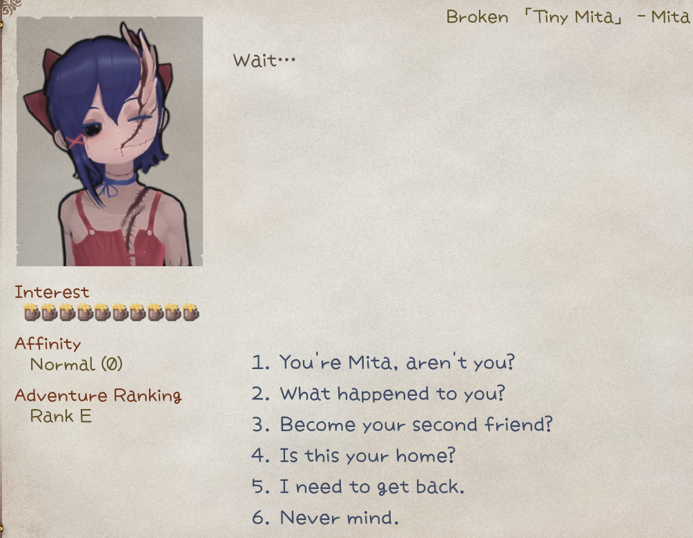
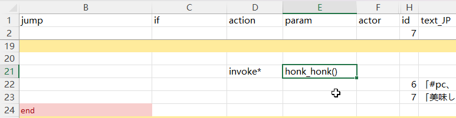
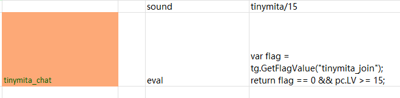

# Drama

A drama is the rich dialog that usually has options and additional actions. 



## Routing

To give character a default drama, place `id.xlsx` in `LangMod/**/Dialog/Drama/`, using the character's ID as the file name (e.g., `tinymita.xlsx` for `tinymita`).

To use a different drama file, add the tag `addDrama(DramaFileId)` to the character's source row. 

You can also use C# API `chara.SetDramaOverride(DramaFileId)` or `chara.ShowDialog(DramaId, step)`.

Refer to the game sheets in `Elin/Package/_Elona/Lang/_Dialog/Drama` when making new drama sheets, or download the Tiny Mita example for a template.

<LinkCard t="CWL Example: Tiny Mita" u="https://steamcommunity.com/sharedfiles/filedetails/?id=3396774199" i="https://raw.githubusercontent.com/gottyduke/Elin.Plugins/refs/heads/master/CwlExamples/TinyMita/preview.jpg" /> 

::: tip Hot Reload
Drama sheets can be edited during gameplay. Changes apply automatically next time the dialog opens.
:::

## Definition

### Line

A drama sheet is read top to bottom and consists of multiple lines. Each line has these fields (defined in the first row):

* **step**: Marks the start of a step; all following lines belong to this step until another `step` appears.
* **jump**: The step to jump to after this line runs.
* **if / if2**: Conditions to check before execution. If `if2` is present, both must be true.
* **action**: The action to perform.
* **param**: Parameter for the action.
* **actor**: The speaker for the action or talk line.
  * `?`: `???`.
  * `tg`: Target drama character. Default when `actor` is blank.
  * `narrator`: Default narrator.
  * `pc`: Player.
* **id**: Unique ID, <span style="color: red;">required</span> for `text` and `choice` lines. Not needed for other lines.
* **text_XX / text_JP / text_EN / text**: Dialogue content. `XX` is a language code (e.g., `text_CN`, `text_ZHTW`). `text` is the fallback if a non-builtin language is missing. `text_JP` and `text_EN` is required, but you don't have to provide translations.
  
(Click to zoom)


### Step

Drama flow is organized into steps. Each step contains one or many lines, which can include dialogue, actions, and conditions.

`main` is the default starting step, and `end` exits the drama.

When creating a sheet, avoid creating step names starting with `_` or `flag` to prevent conflicts with internal steps.

::: details Builtin Steps
After executing `inject/Unique` action, a lot of builtin drama steps will be injected into the drama sheet. To use them, simply set them as the `jump` target. Some steps are already used in the default `inject/Unique` dialogues and you usually do not need to re-use them on your own.

|step name|usage|
|-|-|
|`_banish`|End the drama|
|`_bye`|End the drama|
|`_toggleSharedEquip`|Toggle `tg` shared equipment usage|
|`_daMakeMaid`|Set `tg` as maid|
|`_joinParty`|If `tg` trait is joinable, set as party member. **THIS IS NOT INVITING**|
|`_leaveParty`|Remove `tg` from party, and sent to home zone|
|`_makeLivestock`|Set `tg` as faction livestock|
|`_makeResident`|Set `tg` as faction resident|
|`_depart`|Remove `tg` from faction|
|`_rumor`|Rumor|
|`_sleepBeside`|Toggle `tg` sleep beside player state|
|`_disableLoyal`|Toggle `tg` loyal state|
|`_suck`|`tg` sucks pc. **Prioritizes blood sucking over cat huffing**|
|`_insult`|Toggle `tg` taunt state|
|`_makeHome`|Set current zone branch as `tg` home branch|
|`_invite`|Try inviting `tg` as ally, checks player attributes and `tg` invitable state. To unconditionally invite as ally, use expanded action [`join_party()`](#invoke-expression)|
|`_Guide`|Guide player to a list of locations|
|`_tail`|Have sex, for money|
|`_whore`|Have sex, cost money|
|`_bloom`|Deepen bond with `tg`|
|`_buy`|Buy stuff from `tg`|
|`_buyPlan`|Buy research plan from `tg`|
|`_give`|Give stuff to `tg`|
|`_blessing`|Blessing upon party|
|`_train`|Train skills with `tg`|
|`_changeDomain`|Change `tg` domain|
|`_revive`|Revive dead allies|
|`_buySlave`|Buy slave from `tg`|
|`_trade`|Trade items with `tg`|
|`_identify`|Identify items with `tg`|
|`_identifyAll`|Identify all items with `tg`|
|`_identifySP`|Identify items with `tg` using superior skill|
|`_bout`|Challenge to a duel|
|`_news`|Spawn a random dungeon on map|
|`_heal`|Heal the player|
|`_food`|Buy some food from `tg`|
|`_deposit`|Deposit with `tg`|
|`_withdraw`|Withdraw with `tg`|
|`_copyItem`|Duplicate item with `tg`|
|`_extraTax`|Pay additional tax|
|`_upgradeHearth`|Upgrade hearth stone|
|`_sellFame`|Sell fame|
|`_investZone`|Invest current zone|
|`_investShop`|Invest `tg` barter shop|
|`_changeTitle`|Change player title|
|`_buyLand`|Expand current zone map|
|`_disableMove`|Set `tg` to not move|
|`_enableMove`|Set `tg` can move|
:::

## Actions

**Text lines** are the most common. They only have `id`, `text` columns, and optionally `if` condition. When executed, text lines require player input (click or key press) to advance.

**Action lines** (except `choice`) execute automatically without input. If both `action` and `text` are present, `text` is generally ignored.

For example, an action line placed after a text line won't execute until the text line is clicked to advance.

::: details Builtin Actions
|action|param|description|
|-|-|-|
|`inject`|`Unique`|Insert "Let's Talk" and a lot of useful steps|
|`choice`||Add a choice to the last text line. Requires `text` and `jump`|
|`choice/bye`||Insert a default bye choice|
|`cancel`||Set right click / escape key behavior. Requires `jump`, usually set to `end`|
|`setFlag`|flag name,value(optional)|Set a flag with value or default 1 if not provided|
|`reload`||Reload the drama so any flag changes made in the current drama can be applied. Requires `jump`, usually set to `main`. Don't confuse this with hot reload during development - for that you only need to save the changes and it will be reloaded next time you start the drama|
|`enableTone`||Enable dialog tone for the entire drama|
|`addActor`||Add a drama actor to use later, `text` can be used to set a name override. This is done automatically when you fill in new id in `actor` cell. Requires [character id][character-id-link] in `actor`|
|`invoke`|method name|Call a method. All of them are hardcoded for specific use.|
|`setBG`|image name(optional)|Set an image as background or use empty to clear it. Can be provided **Texture** folder|
|`BGM`|BGM id|Switch the BGM to specific one by id. Check the [Sound & BGM page](../20_Sound%20Mods/0_sound) for custom BGM|
|`stopBGM`||Stop the BGM and do not continue|
|`lastBGM`||Stop the BGM and continue the last one played|
|`sound`|sound id|Play a sound by id. Check the [Sound & BGM page](../20_Sound%20Mods/0_sound) for custom sounds|
|`wait`|duration|Pause the execution in this line for seconds, good to use when you want the animation or stuff to finish|
|`alphaIn` `alphaOut`|duration|Alpha transition(transparency) in seconds|
|`alphaInOut`|duration,wait time|`alphaIn` first, wait in seconds, then `alphaOut`|
|`fadeIn` `fadeOut`|duration,`white`/`black`(optional)|Fade transition in seconds|
|`fadeInOut`|duration,wait time,`white`/`black`(optional)|`fadeIn` first, wait in seconds, then `fadeOut`|
|`hideUI`|transition|Hide the HUD elements with a transition in seconds. Restored when exiting drama|
|`hideDialog`||Hide the drama dialog so you can do cutscenes, however text lines force show dialogs, so you need to combine this with `wait`|
|`end`||Explicitly end the drama. Same as `jump` to drama step `end`|
|`addKeyItem`|[keyitem id](https://docs.google.com/spreadsheets/d/175DaEeB-8qU3N4iBTnaal1ZcP5SU6S_Z/edit?gid=836018107#gid=836018107)|Add keyitem with id to the player|
|`drop`|[item id][item-id-link]|Drop an item as reward at player's position|
|`addResource`|[resource name](https://gist.github.com/gottyduke/6e2847e37d205a5621bfd0615e5bd9e7#file-homeresource-md),count|Add home resource by count|
|`shake`||Shake the screen|
|`slap`||Slap the drama owner character|
|`destroyItem`|[item id][item-id-link]|Find and destroy the item with id from player's inventory|
|`focus`||Immediately move and focus camera to the drama owner character|
|`focusChara`|[character id][character-id-link],speed(optional)|Move and focus camera to the character with id **on the same map**|
|`focusPC`|speed(optional)|Move and focus camera to the player|
|`unfocus`||Reset and unfocus camera|
|`destroy`|[character id][character-id-link]|Destroy a character with id **on the same map**|
|`save`||Save game|
|`setHour`|hour|Set the game time in hours|

When providing multiple parameters, they are **separated by comma(`,`) with no spaces in between**.
:::

## Text

Text in `text_JP`, `text_EN`, `text_XX` columns will be used as a talk event, player must click or press key to continue. You cannot combine action lines with text lines unless the action says otherwise.

### Random Topic

`$topic` will pick a random line from a defined topic in `chara_talk.xlsx`, either from the Elin default file at `Package/_Elona/Lang/EN/Data/chara_talk.xlsx` or from `LangMod/**/Data/chara_talk.xlsx`. For example, `$sup` will play one of the following lines randomly:
```
What?
Huh?
...?
Did you need something?
What do you want?
What's up?
Is something wrong?
What is it?
```

### Substitutions

| text | value |
|--------|--------|
| `#tg_his` | `tg`'s possessive pronoun |
| `#tg_him` | `tg`'s object pronoun |
| `#tg` | `tg` character name |
| `#last_choice` | text of the last choice |
| `#newline` | newline character |
| `#costHire` | cost to hire `tg` (number, localized) |
| `#self` / `#me` | full name of character `tg` (including title) |
| `#his` | `tg`'s possessive pronoun |
| `#him` | `tg`'s object pronoun |
| `#1` ~ `#5` | external variables `refDrama1` ~ `refDrama5` (number auto-formatted) |
| `#god` | name of the god (if `tg` is not empty, uses its faith; otherwise random religion) |
| `#player` / `#title` | player's title |
| `#zone` | current zone name |
| `#guild_title` | title of the guild associated with the current plot |
| `#guild` | name of the guild in the current plot |
| `#race` | player's race name |
| `#pc` | player's short name |
| `#pc_full` | player's full name (including title) |
| `#pc_his` | player's possessive pronoun |
| `#pc_him` | player's object pronoun |
| `#pc_race` | player's race |
| `#aka` | player's alias |
| `#bigdaddy` | localized string `"bigdaddy"` |
| `#festival` | festival name (if the zone has a festival, use its name; otherwise generic) |
| `#brother2` | "brother" or "sister" (based on player gender) |
| `#brother` | random term for brother/sister (randomly from `bro` or `sis` list) |
| `#onii2` | random term for older brother/sister (from `onii2`/`onee2` lists) |
| `#onii` | random term for older brother/sister (from `onii`/`onee` lists) |
| `#gender` | random term based on player gender (from `gendersDrama` list) |
| `#he` | "he" or "she" (based on player gender) |
| `#He` | same as above, but with initial capital letter |

### Dynamic Content

Text columns **starting with** `#eval <C# script here..>` that returns a `string` can evaluate text content dynamically.

## Conditions

Conditions determine whether the line should be executed or not.

### Static Conditions

Static conditions are evaluated **once** on load.

Attach conditions to any line using the `if` (and optionally `if2`) column.

|Condition|Param|Description|
|-|-|-|
|`hasFlag`|flag name|Player has flag and value ≠ 0|
|`!hasFlag`|flag name|Player doesn’t have flag or value = 0|
|`hasMelilithCurse`|—|Player has Melilith curse|
|`merchant`|—|Player is at Merchant Guild|
|`fighter`|—|Player is at Fighter Guild|
|`thief`|—|Player is at Thief Guild|
|`mage`|—|Player is at Mage Guild|
|`hasItem`|item id|Player has the item in inventory|
|`isCompleted`|quest id|Player has completed the quest|

**Simple value checks** (most common for flags/counters):
```
=,example_flag,1
>,example_counter,20
!,example_flag,69
```

Most lines only need the `if` column. Add an `if2` column if you need multiple conditions.

### Dynamic Conditions

To enable/disable a line dynamically, use:
- `invoke*` condition expression, or
- `eval` action that returns a `bool`


## Branching

Set `jump` to a drama step to branch into that step.

Set `jump` to `eval_result` and use an `eval` action that returns a `string` to dynamically choose the `jump` target.


## Invoke* Expression

In the drama sheet, a special action `invoke*` (or `i*` for short) can be used to call expansion methods:


### Syntax

The pseudocode syntax is simple, set `action` to `invoke*` or `i*`, and `param` to one of the valid methods:

|action|param|actor|
|-|-|-|
|`invoke*`/`i*`|`honk_honk(arg1, arg2)`|`pc`|

This invokes a method called `honk_honk` with 2 parameters, `arg1` and `arg2`.

### Parameter

Parameters are separated by comma `, ` and written within the parentheses of the expansion method, similar to code syntax. If there're no parameters, use empty `()` parentheses. 

Most of the methods also take `actor` cell as the target character to execute the method on, such as `pc` or `tg`(the drama target character), or any valid [character id][character-id-link]. Default is `tg`.

If the `jump` in the same line has any value, then the return value of the expansion method will be used to determine if the `jump` can be executed. Returns `true` will execute the `jump`, otherwise not.

### Value Expression Syntax

`DramaValueExpression` is used to evaluate or assign values.

Examples:
|Expression|Meaning|
|-|-|
|`69`|Assign value `69`|
|`=69`|Assign value `69`|
|`+5`|Increase original value by `5`|
|`-3`|Decrease original value by `3`|
|`*10`|Multiply original value by `10`|
|`/2`|Divide original value by `2`|
|`==69`|Check if equal to `69`|
|`!=114`|Check if not equal to `114`|
|`>10`|Check if greater than `10`|
|`>=20`|Check if greater than or equal to `20`|
|`<5`|Check if less than `5`|
|`<=3`|Check if less than or equal to `3`|

### Expanded Actions

|method|param|description|jump|
|-|-|-|-|
|`add_item`|[item id][item-id-link], [material alias][material-alias-link](optional), level(optional), count(optional)|Add the item with id to `actor`, default random material, auto level, and count of `1`|always|
|`equip_item`|[item id][item-id-link], [material alias][material-alias-link](optional), level(optional)|Equip the item with id on `actor`, default random material, auto level|always|
|`destroy_item`|[item id][item-id-link], count(optional)|Destroy items with id on `actor`, default of 1|always|
|`join_faith`|[religion id][religion-id-link](optional)|Make `actor` join the specific religion with id or leave the current religion with empty religion id|If success|
|`join_party`||Make `actor` join player party unconditionally|always|
|`apply_condition`|[condition alias][condition-alias-link], power|Apply a condition with id to `actor`, default power `100`|always|
|`remove_condition`|[condition alias][condition-alias-link]|Remove the condition on `actor`|always|

### Expanded Scene Play

|method|param|description|jump|
|-|-|-|-|
|`move_next_to`|[character id][character-id-link]|Move `actor` next to the character with id **on the same map**|always|
|`move_tile`|x offset, y offset|Move `actor` with the **relative** tile offset, such as `1, 1` or `2, -1`|always|
|`move_to`|x, y|Move `actor` to the **absolute** tile position on the map, such as `64, 44` or `12, 0`|always|
|`move_zone`|[zone id][zone-id-link], level(optional)|Move `actor` to a specific zone with id, and specific level, default level `0`|if success|
|`move_zone_2`|zone full name|Move `actor` to a specific zone using zone full name syntax, such as `derphy@-1`|if success|
|`play_anime`|[anime id](https://gist.github.com/gottyduke/6e2847e37d205a5621bfd0615e5bd9e7#file-elin-animeid-md)|Play animation on `actor`|always|
|`play_effect`|[effect id](https://gist.github.com/gottyduke/6e2847e37d205a5621bfd0615e5bd9e7#file-elin-effects-md)|Play effect on `actor`|always|
|`play_effect_at`|[effect id](https://gist.github.com/gottyduke/6e2847e37d205a5621bfd0615e5bd9e7#file-elin-effects-md), x, y|Play effect at tile position on the map|always|
|`play_emote`|[emote id](https://gist.github.com/gottyduke/6e2847e37d205a5621bfd0615e5bd9e7#file-elin-emo-md)|Play emote on `actor`|always|
|`play_screen_effect`|[screen effect id](https://gist.github.com/gottyduke/6e2847e37d205a5621bfd0615e5bd9e7#file-screeneffect-md)|Play screen effect|always|
|`pop_text`|text|Pop a text bubble above `actor` head|always|
|`set_portrait`|portrait id(optional)|Set `actor` portrait used during dialog to a specific one or reset with empty id, from **Portrait** folder, e.g. `UN_myChara_happy.png` could be set with `happy` or `UN_myChara_happy`|always|
|`set_portrait_override`|portrait id(optional)|Set `actor` portrait used outside of dialog to a specific one or reset with empty id, from **Portrait** folder. Must be full id. This does not affect current dialog portrait(as changed above)|always|
|`set_sprite`|texture id(optional)|Set the custom sprite override for `actor` or reset with empty id, from **Texture** folder|always|
|`show_book`|category/book id|Open a book, supports **LangMod/_*_*/Text** folder, for example, use `Book/ok` for `Text/Book/ok.txt`|If success|

### Expanded Modifications

|method|param|description|jump|
|-|-|-|-|
|`mod_affinity`|value expression|Modify `actor` affinity with value expression|If success|
|`mod_currency`|currency type, value expression|Modify `actor` currency with value expression. `money` `money2` `plat` `medal` `influence` `casino_coin` `ecopo`|always|
|`mod_element`|[element alias][element-alias-link], power(optional)|Modifies a specified element (feat/resistance/skill, etc.) for the `actor`, default power `1`. Different types of elements use different power scaling|always|
|`mod_element_exp`|[element alias][element-alias-link], value expression|Modifies the exp of a specified element for the `actor`|If success|
|`mod_fame`|value expression|Modify player fame with value expression|always|
|`mod_flag`|flag, value expression|Modify the flag value from `actor` with value expression, such as `+1`, `=1`, `0`. This supports non player character|always|
|`mod_keyitem`|[keyitem alias](https://docs.google.com/spreadsheets/d/175DaEeB-8qU3N4iBTnaal1ZcP5SU6S_Z/edit?gid=836018107#gid=836018107), value expression(optional)|Modify player's keyitem value with expression, default `=1`|If success|

### Expanded Conditions

These are still expansion methods that uses `invoke*` action same as above, but their return value is important.

|method|param|description|jump|
|-|-|-|-|
|`if_affinity`|value expression|Check `actor` affinity with expression, such as `<5`, `>=90`, `!=0`|If satisfies|
|`if_condition`|[condition alias][condition-alias-link]|Check if `actor` has active condition with alias|If active|
|`if_currency`|currency type, value expression|Check `actor` currency with value expression. `money` `money2` `plat` `medal` `influence` `casino_coin` `ecopo`|If satisfies|
|`if_element`|[element alias][element-alias-link], value expression|Check `actor` element with expression|If satisfies|
|`if_faith`|[religion id][religion-id-link], reward rank(optional)|Check if `actor` is certain religion and above reward rank, default `>0`|If satisfies|
|`if_fame`|value expression|Check player's fame with value expression|If satisfies|
|`if_flag`|flag name, value expression|Check `actor` flag value with expression, such as `=5`, `1`, `!=0`|If satisfies|
|`if_lv`|value expression|Check `actor` level with value expression|If satisfies|
|`if_has_item`|[item id][item-id-link], value expression(optional)|Checks if `actor` possesses a quantity of the item that meets the expression, default `>=1`|If satisfies|
|`if_hostility`|hostility value expression|Checks if `actor` meets a specific hostility, such as `=Ally` or `>Enemy`. Value in ascending order: `Enemy`, `Neutral`, `Friend`, `Ally`|If satisfies|
|`if_in_party`|`true` or `false`(optional)|Check if `actor` is in player's party, default to `true`|If satisfies|
|`if_keyitem`|[keyitem alias](https://docs.google.com/spreadsheets/d/175DaEeB-8qU3N4iBTnaal1ZcP5SU6S_Z/edit?gid=836018107#gid=836018107), value expression(optional)|Check if player has keyitem with expression, default `>0`|If satisfies|
|`if_race`|[race id](https://docs.google.com/spreadsheets/d/1CJqsXFF2FLlpPz710oCpNFYF4W_5yoVn/edit?gid=140821251#gid=140821251)|Check if `actor` is of certain race|If satisfies|
|`if_tag`|tag|Check if `actor` has certain tag defined in Chara row|If defined|
|`if_zone`|[zone id][zone-id-link], level(optional)|Check if `actor` is in certain zone and optionally check level|If present|
|`if_zone_2`|zone full name|Check if `actor` is in certain zone with zone full name syntax, such as `derphy@-1`|If present|

### Special Methods
|method|param|description|jump|
|-|-|-|-|
|`console_cmd`|cmd param1 param2...|Run console command|always|
|`eval`|C# script or file with `<<<path.cs` syntax|Execute the C# script. It's **recommended** to use `eval` action (instead of `invoke*` with `eval()`)|If returns `true`|
|`and`|`and(if_flag(flag1, >0), if_flag(flag2, <0)...)`|Take invoke* expressions as parameters, evaluates all of them|If all satisfies|
|`or`|`or(if_race(lich), if_race(snail)...)`|Take invoke* expressions as parameters, evaluates all of them|If any satisfies|
|`not`|`not(if_zone(dungeon), if_zone(field), if_zone(underground)...)`|Take invoke* expressions as parameters, evaluates all of them|If none satisfies|

### API

Elin offers easy API to add custom expansion methods from your own script DLL.

#### Action Parser

Parsers are called on registered action lines that isn't builtin during drama loading, and are responsible for creating events.
```cs
[ElinDramaActionParser("my_action")]
public static bool ExampleParser(DramaManager dm, Dictionary<string, string> line) 
{
    dm.AddEvent(new DramaEventTalk(line["actor"], () => {
        // processing
        return "A text line!";
    }));
    // this line is handled
    return true;
}
// or register manually
CustomDramaExpansion.AddDramaActionParser("my_action", ExampleParser);
```

#### Action Invoke

Invokes are automatically compiled into `invoke*` expressions and are called when the line is executed during drama play.

::: code-group
```cs [Auto Convert Parameter]
[ElinDramaActionInvoke]
public static bool add_item(DramaManager dm, Dictionary<string, string> line,
                            string itemId,
                            string materialAlias = "wood",
                            int lv = -1,
                            int count = 1)
{
    var chara = dm.GetChara(line["actor"]);

    var mat = sources.materials.alias.TryGetValue(materialAlias, "wood");
    var item = ThingGen.Create(itemId, mat.id, lv).SetNum(count);
    chara.Pick(item);

    return true;
}

[ElinDramaActionInvoke("nodiscard")]
public static bool if_element(DramaManager dm, Dictionary<string, string> line,
                              string elementAlias,
                              DramaValueExpression expr) 
{
    var chara = dm.GetChara(line["actor"]);
    return chara.HasElement(elementAlias) && expr.Compare(chara.Evalue(elementAlias));
}
```

```cs [No Parameter Unpacking]
[ElinDramaActionInvoke]
public static bool console_cmd(DramaManager dm, Dictionary<string, string> line, 
                               params string[] parameters)
{
    string.Join(' ', parameters).EvaluateAsCommand();
    return true;
}
```

:::

Drama invoke methods must be `static`, return `bool`, and paramters start with `DramaManager dm, Dictionary<string, string> line`. 

The actual expression parameters can be auto converted by Elin, or passed as `string[]`. Auto convertable parameters can be any builtin data types, `DramaValueExpression`, or custom types with `static bool TryParse(string, out T)` method.

See `CustomDramaExpansion` implementation for example usages.

## Scripting

You can run **C# code** directly in a drama sheet using the `eval` action.

It offers the same scripting capabilities as regular C#, with these differences:

- Script state is tied to the current drama instance (persists until the drama ends, then auto-resets).
- Shortcuts: `dm` = DramaManager, `line` = current line `Dictionary<string, string>`, `tg` = target `Chara`, `pc` = player `Chara`.


**Return value behavior:**
- `bool` + valid `jump` target → determines whether to jump.
- `string` + `jump` cell set to `eval_result` → uses the string as the new jump target.
- No return value → treated as a simple action.

Import a script file from the same folder with: `<<<script_snippet.cs`

### Passing Variables

Use the shared `Script` dictionary:

```cs
// First eval
var value = EClass.rnd(100) * 5;
Script["random_value"] = value;

// Later eval
var value = (int)Script["random_value"];
```

### Common Examples

|Function|Code|
|-|-|
|Jump to step               |`dm.Goto("my_new_step");`|
|Add "Let's chat!" option   |`dm.InjectUniqueRumor();`|
|Add temporary talk         |`dm.AddTempTalk("topic", "actor", "jump");`|
|Get Chara instance         |`var chara = dm.GetChara("tg");`|
|Recruit to party           |`chara.MakeAlly();`|
|Modify level               |`chara.SetLv(chara.LV + 5);`|

Need help? Ask on Elona Discord: **@freshcloth** or [reach via email](mailto:dk@elin-modding.net).

[item-id-link]: https://docs.google.com/spreadsheets/d/175DaEeB-8qU3N4iBTnaal1ZcP5SU6S_Z/edit?gid=1479265439#gid=1479265439
[material-alias-link]: https://docs.google.com/spreadsheets/d/13oxL_cQEqoTUlcWsjKZyNuAaITFGK56v/edit?gid=580505110#gid=580505110
[condition-alias-link]: https://docs.google.com/spreadsheets/d/16-LkHtVqjuN9U0rripjBn-nYwyqqSGg_/edit?gid=921112246#gid=921112246
[character-id-link]: https://docs.google.com/spreadsheets/d/1CJqsXFF2FLlpPz710oCpNFYF4W_5yoVn/edit?gid=1622484657#gid=1622484657
[religion-id-link]: https://docs.google.com/spreadsheets/d/16-LkHtVqjuN9U0rripjBn-nYwyqqSGg_/edit?gid=729486062#gid=729486062
[zone-id-link]: https://docs.google.com/spreadsheets/d/16-LkHtVqjuN9U0rripjBn-nYwyqqSGg_/edit?gid=1819250752#gid=1819250752
[element-alias-link]: https://docs.google.com/spreadsheets/d/16-LkHtVqjuN9U0rripjBn-nYwyqqSGg_/edit?gid=1766305727#gid=1766305727