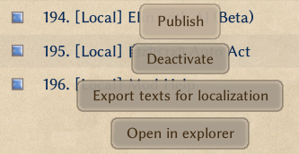

# Source Sheet Translation

Source sheets contain English and Japanese columns by default, such as `name` and `name_JP`, or `aka` and `aka_JP`.

Source sheets should be placed in the `EN` or `JP` folders.

## Adding Translations to Your Mod

To add translations for your mod's source sheets in languages other than English and Japanese:

1. Switch the game to the target language.
2. Restart the game to export the translatable entries.

A `SourceLocalization.json` file should now appear in your mod's `LangMod/XX` folder, where `XX` is the current language code, such as `CN` for Simplified Chinese.

Edit this `json` file to translate the source sheets.

> [!NOTE] Tip
> For drama sheets and `dialog.xlsx`, see [this section](#drama-and-dialog).

## Providing Translations for Other Mods {#translating-other-mods}

### Publishing a Translation Patch Mod

If you want to provide translations for someone else's mod:

1. Copy the original mod into your local `Package` folder (`<Game Installation Directory>/Elin/Package`).
2. Start the game in the language you want to translate into.

A `SourceLocalization.json` file should now appear in that mod's `LangMod/XX` folder, where `XX` is the current language code, such as `CN` for Simplified Chinese.

Edit this `json` file to translate the source sheets.

For drama sheets and `dialog.xlsx`, see [this section](#drama-and-dialog).

After finishing the translation, you can:

- Send the translation file to the mod author.
- Publish a standalone translation patch mod that contains only `SourceLocalization.json`. **Do not include the source sheets.**

For publishing a translation patch mod, see [Elin Mod Package](../2_Getting%20Started/basic_mod).

### Updating a Translation Patch Mod

When the original mod updates:

1. Put the latest version of the original mod into your local `Package` folder.
2. Put your existing `SourceLocalization.json` back into the original mod's `LangMod/XX` folder.
3. Start the game.

The game will automatically append any newly added, untranslated source-sheet entries to `SourceLocalization.json`.

After translating the new entries, update your mod. For update instructions, see [Elin Mod Package](../2_Getting%20Started/basic_mod), especially the `Upload & Update` section.

> [!NOTE] Tip
> Drama sheets and `dialog.xlsx` do not automatically append new content. You need to compare and translate new entries manually.

## Translating Drama Sheets and `dialog.xlsx` {#drama-and-dialog}

Drama sheets and `dialog.xlsx` are not translated through `json`. Instead, you translate the sheets directly. Strictly speaking, they are not source sheets either.

For adding translations to your own mod:

You can use the Tiny Mita example mod below as a reference:

<LinkCard t="CWL Example: Tiny Mita" u="https://steamcommunity.com/sharedfiles/filedetails/?id=3396774199" i="https://raw.githubusercontent.com/gottyduke/Elin.Plugins/refs/heads/master/CwlExamples/TinyMita/preview.jpg" />

For more information, see [Chara](../10_Source%20Sheets/character) and [Drama](../10_Source%20Sheets/drama).

For translating someone else's mod:

1. Copy the original mod's drama sheets and `dialog.xlsx` into the matching path under the target language folder. For example, copy them from `EN` or `JP` to `CN`.
2. Add the matching language columns. For example, for Chinese you would add `text_CN`. You can use the Tiny Mita example mod and the articles above as references.
3. Delete `text_EN` and `text_JP`, but keep the `text` column.

## Additional Notes

### Force Overwriting an Existing `json` File

::: details Click to expand

Under normal circumstances, starting the game only appends newly added untranslated entries to `SourceLocalization.json`.

If you need to re-export the entire file:

1. Put the mod into `<Game Installation Directory>/Elin/Package`.
2. Make sure the mod name has the `[Local]` prefix, and make sure the mod is enabled (shown in blue).
3. Switch the game to the target language.
4. Click the mod and choose **Export texts for localization**.

<!-- This button label in Chinese / English / Japanese:
导出本地化文本
Export texts for localization
ローカライゼーション用のテキストをエクスポート -->

The game will regenerate `LangMod/XX/SourceLocalization.json`.

> [!WARNING] Warning
> This will overwrite your existing `SourceLocalization.json`, so back it up first.
:::

### Another Way to Translate Source Sheets

::: details Click to expand
#### Another Way to Translate Source Sheets

Besides translating directly inside the `json` file as described above, you can also translate inside the source sheets first and then export the result as a `json` file.

Let's use `name_JP` and `name` as an example of one column group:

+ Columns with the `_JP` suffix are the Japanese columns.
+ In the same group, the column without a suffix is the English column, but it can also be used as the translation column.
+ Columns without a suffix that are not part of such a group are gameplay data columns or other non-translation data, so do not translate them.
+ For example, `aka_JP` and `aka` are another Japanese-plus-translation column group.

Because of this, you can first copy the source sheets into `LangMod/XX`.

Using Chinese as the target language as an example:

+ Copy the source sheets from `LangMod/EN` or `LangMod/JP` into `LangMod/CN`.
+ Translate the no-suffix translation columns in each group.
+ After translating, follow the overwrite steps above to regenerate the `json` file, then delete the source sheets you just copied into `LangMod/CN`.

You only need one copy of the source sheets in your mod, and it only needs to be in either the `EN` or `JP` folder. If you are translating someone else's mod, you do not need to include source sheets in your translation patch. You only need the `json` translation file in the matching language folder, because the original mod already contains the source sheets.

You can use [JSONLint](https://jsonlint.com/) to check whether your `json` is valid.

This workflow is better for manual, spreadsheet-first translation. The [JSON export workflow above](#translating-other-mods) is usually better when translating with AI. If you use AI, remember to have it produce a terminology glossary.

#### Step 2: Drama Sheets and `dialog.xlsx`

At this point the source sheets are translated, but do not forget the drama sheets and `dialog.xlsx`. They are not translated through `json`.

Refer back to [this section](#drama-and-dialog) to finish those translations.

If you use AI translation, remember to reuse the glossary you made in step 1.
:::

## Tools

If you are not using a code editor, you can use [JSONLint](https://jsonlint.com/) to validate your JSON.
