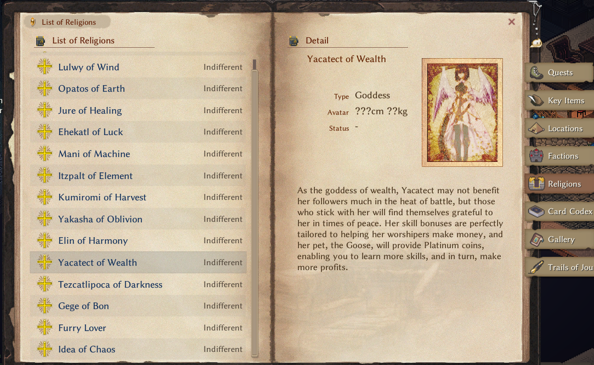
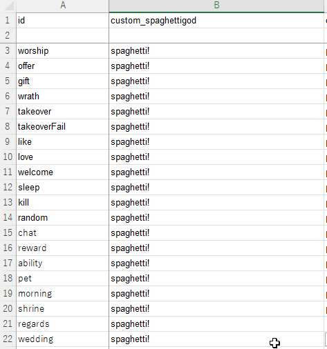

# Religion Sheet

<LinkCard t="SourceGame/Religion" u="https://docs.google.com/spreadsheets/d/16-LkHtVqjuN9U0rripjBn-nYwyqqSGg_" />

When making source sheets, always copy the first 3 rows from the official sheet and start your data at the 4th row. Do not alter the column order.

::: warning Migrating From CWL
CWL specs have been removed from the wiki, but mods using a CWL spec (such as `cwl_xxx#minor#cannot`) are still compatible. We recommend switching to the new format.
:::

## Sheet Columns

|Column|Type|Description|
|-|-|-|
|id|string|Custom religion ID must begin with **custom**, for example: custom_spaghettigod|
|name_JP|string|Display name in Japanese|
|name|string|Display name in English. For other languages, use [`SourceLocalization`](./localization)|
|name2_JP|string[]|Domain name, short name, in Japanese|
|name2|string[]|Domain name, short name, in English|
|type|string|Display category only: shown as the `("sub_" + type)` lang entry in faction lists/logs. Whether a religion is treated as custom is decided by the id prefix (`custom`), and custom religions are always instantiated as `ReligionCustom`; this column does not pick a C# type. A custom `Religion` subclass requires code registration via `RegisterCustomReligion`|
|idMaterial|string|Material alias of the altar|
|faith|string|Unused|
|domain|string|Unused|
|tax|int|Religion tax percentage. Blank means `100`|
|relation|int|Starting relation. Blank means `50`|
|elements|elements|Religion elements bonus given to chara, as `element_alias/value`|
|cat_offer|string[]|Offering category|
|rewards|string[]|Gift rank 1 & 2 rewards|
|textType_JP|string|Avatar type in Japanese|
|textType|string|Avatar type in English|
|textAvatar|string|Avatar information|
|detail_JP|string|Detail in Japanese|
|detail|string|Detail in English|
|textBenefit_JP|string|Blessing information in Japanese|
|textBenefit|string|Blessing information in English|
|textPet_JP|string|God pet information in Japanese|
|textPet|string|God pet information in English|

## Portrait

To create an optional custom portrait for your religion, put a .png image named after the religion ID in the **Texture** folder, such as **custom_spaghettigod.png**.



## God Talks

A god talk sheet placed at `LangMod/**/Data/god_talk.xlsx` provides the god's voice lines; without it the religion still functions, but god talks are blank. For reference, the base game sheet is at **Elin/Package/_Elona/Lang/EN/Data/god_talk.xlsx**.



## Religion Data

Supplementary religion data goes in a JSON file named `religion_data.json` in your `LangMod/**/Data/` folder.
```json
{
    "custom_spaghettigod": {
        "CanJoin": true,
        "IsMinorGod": false,
        "NoPunish": false,
        "NoPunishTakeover": false,
        "Artifacts": [
            "my_awesome_weapon",
            "my_awesome_armor"
        ],
        "Elements": [
            "vopal",
            "eleLightning",
            "bane_all",
            "r_life"
        ],
        "GodAbilities": [
            "my_awesome_ability"
        ],
        "OfferingMtp": {
            "spaghetti": 20
        },
        "OfferingValue": {
            "mushroom": "base * 16 + 520 + lv * 3 + rarity * 2"
        }
    },
    "custom_example_religion2": {
        data...
    }
}
```

* `CanJoin`  
  Can join this religion.  
  Default value: `true`  
* `IsMinorGod`  
  A minor religion.  
  Default value: `false`  
* `NoPunish`  
  No punishment when leaving.  
  Default value: `false`  
* `NoPunishTakeover`  
  No punishment when taking over.  
  Default value: `false`  
* `Artifacts`  
  List of Thing IDs that are this religion's artifacts. Entries from CWL mods that used the `godArtifact,religion_id` tag spec are added automatically.  
* `Elements`  
  List of Element aliases that only work on the artifact while the religion is active. Entries from CWL mods that used the `religion_elements.json` spec are added automatically.  
* `GodAbilities`  
  List of Element aliases that count as god abilities; performing one triggers the `ability` god talk. The element's row must also carry the `godAbility` tag for the trigger to fire. Entries from CWL mods that used the `godAbility,religion_id` tag spec are added automatically.  
* `OfferingMtp`  
  Offering multiplier override for specific Thing IDs. Entries from CWL mods that used the `religion_offerings.json` spec are added automatically.  
* `OfferingValue`  
  Offering value override for specific Thing IDs, written as an arithmetic expression.  
  Arguments: `base` (the offering value computed by the base game, from item weight/category), `lv` (item level), `rarity` (item rarity)  
* Omit any field to use its default value.

## God Favor

You can add an optional god favor feat in the Element sheet. Name it using the format `featGod_` + `YourReligionID` + `1` (for example, `featGod_custom_spaghettigod1`). Reference the [SourceElement](./element) sheet and copy one of the built-in favors, such as `featGod_element1`, as a base row to modify.