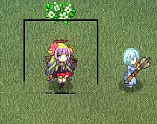

# I Need More Space

Default canvas size of 128x128 may not satisfy your drawing needs. When using a larger canvas, make sure it's center aligned (pivot at center):

|**128x128**|**256*256**|
|-|-|
|||

For your characters and items to display correctly as icons and avatars, modify `pivotX` and `scaleIcon` accordingly in the [pref file](./pref).

> 256 Art by Veila