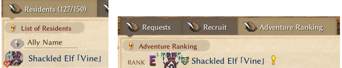
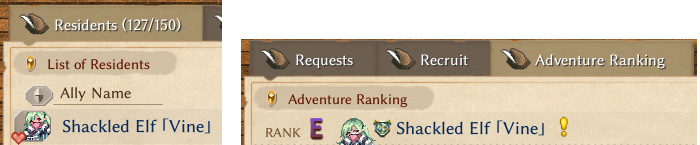

# Pref File

Sometimes the default rendering settings for your sprites may not be ideal. Customize them by creating a `.pref` file.

It can be used to fine-tune sprites, shadows, small NPC avatar icons on the resident board, icons in the adventure ranking, and more.

To create a `.pref` file, simply create a `.txt` file and change the filename to `id.pref` (changing the extension from `.txt` to `.pref`, where `id` represents your character or item sprite ID). Open it with Notepad or any text editor.

::: tip
`.pref` files are hot-loaded. This means you can preview the effect in real time after modifying values, without restarting the game.

Therefore, you can create a `.pref` file first, and continuously test values by checking the display effect in the game.
:::

## File Content

The complete file is as follows, but you may omit any unused fields.

It uses INI format, and values must be integers. `;` comments can also be used.

```ini
x = 0
y = 0
z = 0
pivotX = 0
pivotY = 0
shadow = 0
shadowX = 0
shadowY = 0
shadowRX = 0
shadowRY = 0
shadowBX = 0
shadowBY = 0
shadowBRX = 0
shadowBRY = 0
height = 0
heightFix = 0
scaleIcon = -40
liquidMod = 0
liquidModMax = 0
hatY = 0
equipX = 0
equipY = 0
stackX = 0
```

For the explanation of each line, please refer to the detailed explanation section below.

## Detailed Explanation

+ `x`, `y`, `z` position offset
+ `pivotX`,`pivotY` pivot offset, used on small sprites such as resident board avatar
+ `shadow` ShadowData id (see section below)
+ `shadowX`, `shadowY` shadow position offset
+ `shadowRX`, `shadowRY` shadow reverse
+ `shadowBX`, `shadowBY` shadow back
+ `shadowBRX`, `shadowBRY` shadow back reverse
+ `height` tile height modifier
+ `heightFix` text component height offset (floating little widgets)
+ `scaleIcon` icon size scaling
+ `liquidMod` tile liquid level modifier; can be negative
+ `liquidModMax` tile liquid level max
+ `hatY` hat renderer y position offset
+ `equipX`, `equipY` held position offset 
+ `stackX` tile stacking x position offset

## Shadow Data ID

<!--@include: ./assets/shadow_data.md-->

## Example Mods

### Modify Shadow

<LinkCard t="Keeper of Garden Pole Dance" u="https://steamcommunity.com/sharedfiles/filedetails/?id=3711895231" i="/pole.gif" />

This mod uses `shadow` in the `.pref` file to modify the shadow.

### Small Icons

<LinkCard t="Lost Case Monster Girl Takeover" u="https://steamcommunity.com/sharedfiles/filedetails/?id=3609895215" i="https://images.steamusercontent.com/ugc/13866943819130003260/AF709B61B8CC0DB914A09239906A08359D2B0316/?imw=5000&imh=5000&ima=fit&impolicy=Letterbox&imcolor=%23000000&letterbox=false" />

This mod modifies the display of the character's icon on the resident board and the adventure ranking. It uses `pivotX` and `pivotY` in the `.pref` file.

**Before modifying the character icon:**



<p align="center" style="font-size: 14px; color: var(--vp-c-text-3);">Left is the resident board, right is the adventure ranking</p>

**After modifying the character icon using the `.pref` file:**



<p align="center" style="font-size: 14px; color: var(--vp-c-text-3);">Left is the resident board, right is the adventure ranking</p>

The pref values used for this character in this mod:

```ini
pivotX=0
pivotY=-37
```

Note:

* The `.pref` filename, the sprite filename, and the id column in the mod’s Excel must all match exactly.
* `pivotX` and `pivotY` affect both the resident board and the adventure ranking simultaneously; therefore, you should take both into account when testing values.
* Due to the hot-loaded nature of `.pref` files, you do not need to restart the game; you can preview the effect in real time, allowing for fine-tuning.