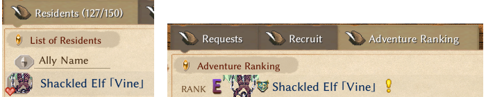
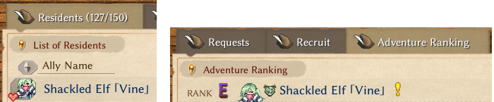

# Pref File

Sometimes the default rendering settings for your sprites may not be ideal. Customize them by creating a `.pref` file.

It can be used to fine-tune sprites, shadows, small NPC avatar icons on the resident board, icons in the adventure ranking, and more.

To create a `.pref` file, simply create a `.txt` file and change the filename to `id.pref` (changing the extension from `.txt` to `.pref`, where `id` represents your character or item sprite ID). Open it with Notepad or any text editor.

::: tip
`.pref` files are hot-loaded. This means you can preview the effect in real time after modifying values, without restarting the game.

Therefore, you can create a `.pref` file first, and continuously test values by checking the display effect in the game.
:::

## File Content

The complete file is as follows, but you may omit any unused fields.

It uses INI format, and values must be integers. `;` comments can also be used.

```ini
x = 0
y = 0
z = 0
pivotX = 0
pivotY = 0
shadow = 0
shadowX = 0
shadowY = 0
shadowRX = 0
shadowRY = 0
shadowBX = 0
shadowBY = 0
shadowBRX = 0
shadowBRY = 0
height = 0
heightFix = 0
scaleIcon = -40
scaleTex = 100
liquidMod = 0
liquidModMax = 0
hatY = 0
equipX = 0
equipY = 0
stackX = 0
```

For the explanation of each line, please refer to the detailed explanation section below.

## Detailed Explanation

+ `x`, `y`, `z` position offset
+ `pivotX`,`pivotY` pivot offset, used on small sprites such as resident board avatar
+ `shadow` ShadowData id (see section below)
+ `shadowX`, `shadowY` shadow position offset
+ `shadowRX`, `shadowRY` shadow reverse
+ `shadowBX`, `shadowBY` shadow back
+ `shadowBRX`, `shadowBRY` shadow back reverse
+ `height` tile height modifier
+ `heightFix` text component height offset (floating little widgets)
+ `scaleIcon` icon size scaling
+ `scaleTex` pixel density of the texture, as a percentage of the default (see section below); `0` and `100` both mean the default
+ `liquidMod` tile liquid level modifier; can be negative
+ `liquidModMax` tile liquid level max
+ `hatY` hat renderer y position offset
+ `equipX`, `equipY` held position offset 
+ `stackX` tile stacking x position offset

## High Resolution Sprites

By default a sprite is rendered at 100 pixels per world unit, so a texture with more pixels simply renders **bigger** rather than sharper. `scaleTex` tells the game how dense your texture is, letting you ship a higher resolution sprite that occupies exactly the same space in game.

The whole rule is one formula — keep the world size unchanged:

```
world size = canvas pixels / scaleTex * 100
```

| Original | High resolution | scaleTex | World height | Result |
| --- | --- | --- | --- | --- |
| 128x256 | 256x512 | 200 | 2.56 | same size, 2x sharper |
| 128x256 | 512x1024 | 400 | 2.56 | same size, 4x sharper |
| 128x128 | 384x384 | 300 | 1.28 | same size, 3x sharper |

Every other value in your `.pref` — `y`, `heightFix`, `pivotY`, `shadowX`, `equipY` and the rest — is expressed in world units. Once the world size is unchanged, **they all stay valid and need no readjustment**. That is the point of `scaleTex`: swapping in a sharper texture should not cost you the positioning you already tuned.

::: warning
`scaleTex` must match a texture you actually scaled up. Setting `scaleTex = 200` while keeping the original texture halves the world size, so the sprite becomes smaller **and appears to float above the ground** — sprites are anchored at their center, so shrinking one lifts its bottom edge.

If your sprite floats after setting `scaleTex`, it almost always means the texture was not enlarged to match.
:::

::: tip
Prefer whole multiples (`200`, `300`, `400`). Textures are sampled with nearest neighbour filtering, so a fractional density such as `scaleTex = 80` makes some pixel rows one screen pixel wide and others two, producing uneven edges.
:::

Note that tiles and objects are already drawn at 50 pixels per world unit, meaning they are displayed at 2x magnification today. For those, `scaleTex = 200` gives a genuine 1:1 pixel mapping on screen — the sharpest possible result with no resampling at all.

## Shadow Data ID

<!--@include: ./assets/shadow_data.md-->

## Example Mods

### Modify Shadow

<LinkCard t="Keeper of Garden Pole Dance" u="https://steamcommunity.com/sharedfiles/filedetails/?id=3711895231" i="/pole.gif" />

This mod uses `shadow` in the `.pref` file to modify the shadow.

### Small Icons

<LinkCard t="Lost Case Monster Girl Takeover" u="https://steamcommunity.com/sharedfiles/filedetails/?id=3609895215" i="https://images.steamusercontent.com/ugc/13866943819130003260/AF709B61B8CC0DB914A09239906A08359D2B0316/?imw=5000&imh=5000&ima=fit&impolicy=Letterbox&imcolor=%23000000&letterbox=false" />

This mod modifies the display of the character's icon on the resident board and the adventure ranking. It uses `pivotX` and `pivotY` in the `.pref` file.

**Before modifying the character icon:**



<p align="center" style="font-size: 14px; color: var(--vp-c-text-3);">Left is the resident board, right is the adventure ranking</p>

**After modifying the character icon using the `.pref` file:**



<p align="center" style="font-size: 14px; color: var(--vp-c-text-3);">Left is the resident board, right is the adventure ranking</p>

The pref values used for this character in this mod:

```ini
pivotX=0
pivotY=-37
```

Note:

* The `.pref` filename, the sprite filename, and the id column in the mod’s Excel must all match exactly.
* `pivotX` and `pivotY` affect both the resident board and the adventure ranking simultaneously; therefore, you should take both into account when testing values.
* Due to the hot-loaded nature of `.pref` files, you do not need to restart the game; you can preview the effect in real time, allowing for fine-tuning.