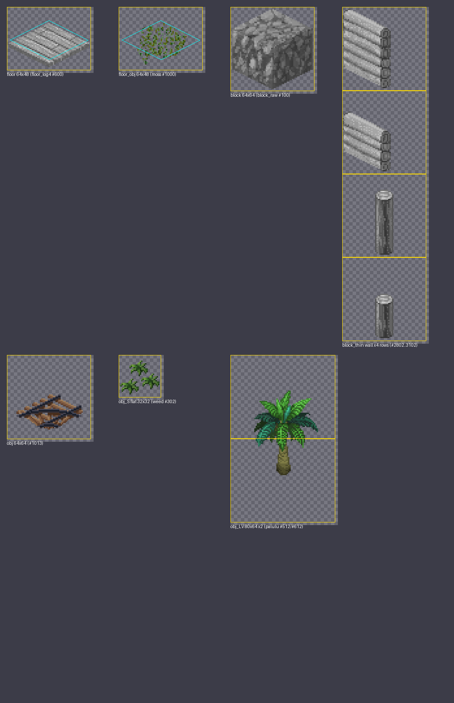

# Texture Replace and Tile Textures

Map tiles (blocks, floors, objects, decorations, cell effects) are drawn from a few big sprite sheets. Each sheet is divided into equal cells, and a source row only says **which cell** to draw (the `tiles` column). There are two ways to add your own art:

|Method|Folder|Use it for|
|-|-|-|
|**Texture Replace**|`Texture Replace/<sheet>_<slot>.png`|Repainting a cell that already exists: vanilla art, or an item/NPC sprite.|
|**Tile Textures**|`Texture/<Table>/<alias>.png`|Art for **new** Block / Floor / Obj / Deco / CellEffect rows. The game finds a free cell for you at startup.|

::: warning Do not use Texture Replace for new rows
A slot number is just a number. Two mods that pick the same slot overwrite each other without any warning, and a game update that starts using that cell overwrites both. New rows should always use the `Texture/<Table>/` folder described below.
:::

## Texture Replace

Put the files in the `Texture Replace` folder of your mod, named `<sheet>_<slot>.png` (lowercase `.png`).

|Sheet|Cell size|Used by|
|-|-|-|
|`block`, `blockSnow`|64×64|Block rows (walls, blocks, roofs, pillars)|
|`floor`, `floorSnow`|64×48|Floor rows|
|`obj`, `objSnow`|64×64|Obj rows with `_idRenderData` = `obj`|
|`objS`, `objSSnow`|32×32|Obj rows with `obj_S` / `obj_S flat` (small plants, crops, weeds)|
|`objL`, `objLSnow`|80×64|Obj rows with `obj_L` / `obj_LV` (trees, tall objects)|
|`objC`, `objCL`, `objCLL`|—|Thing / Chara sprites that use a slot-based `_idRenderData` (see [Thing](/articles/10_Source%20Sheets/thing))|

+ **Slot number**: `row * 100 + column`, counted from the top-left cell of the sheet. It is the number in a row's `tiles` column, and the number the Texture Viewer shows (Esc → Tools → Texture Viewer).
+ **Image size**: any multiple of the cell size. A bigger image starts at the slot's top-left corner and covers the cells to the right of it and **below** it.
+ **Snow**: the `...Snow` sheets are separate. When you repaint `block_1234.png`, also repaint `blockSnow_1234.png`.
+ Files reload while the game runs, so you can tweak them without restarting.

## Tile Textures for New Rows

Give the row an `alias`, leave its `tiles` column empty (or at the default `0`), and put the PNG in `Texture/<Table>/<alias>.png`:

```txt:no-line-numbers
Mod_MyTiles/
  package.xml
  LangMod/EN/mytiles.xlsx          ← sheets named Block / Floor / Obj / Material ...
  Texture/
    Block/
      mymod_wall.png               ← 64×256: wall + 3 pillar rows (see Walls)
      mymod_wall_snow.png          ← optional snow version, same size
    Floor/
      mymod_floor.png              ← 64×48
    Obj/
      mymod_statue.png             ← 64×64
      mymod_path.png               ← 1024×48: 16 autotile edge shapes (floor_obj)
      mymod_wheat.png              ← 448×64: 7 growth frames
```

+ `<Table>` is `Block`, `Floor`, `Obj`, `Deco` or `CellEffect`. Upper and lower case do not matter for folder and file names.
+ The file name must be the row's `alias`. Put `<alias>_snow.png` next to it for the snow version.
+ The image must be a multiple of the cell size for that row (table above; the row's `_idRenderData` decides it, e.g. `obj_S flat` → 32×32, `obj_LV` → 80×64). Up to 99 cells wide and 4 cells tall.
+ At startup the game picks a free spot in the sheet, pastes your image there and fills in `tiles`. You cannot run out of space: when a sheet is full, the game makes it bigger. Cells used by `Texture Replace` files are never given away.

::: tip Cell numbers are not saved
Cells are handed out fresh every launch. Saves only remember your row **id**, so installing or removing other mods never breaks a map. Do not write a cell number into `tiles` yourself.
:::

### Drawing inside the cell

Elin is drawn in a 2:1 isometric view, so a cell is never simply "filled in": every kind of tile has its own shape and anchor point, and a plain square ends up oversized and half sunk into the ground. The easiest way to get it right is to copy a vanilla cell of the same kind as a template (Esc → Tools → Texture Viewer) and repaint it. The numbers below are measured on the vanilla sheets, pixel rows counted from the top of the cell:



**The ground footprint is a 60×30 diamond.** Neighbouring tiles sit 30 px apart horizontally and 15 px vertically, so that is the only diamond that tiles the grid without seams. Going down one row, the shape must get exactly 4 px narrower or wider. A diamond with a different slope (62×34, say) leaves diagonal strips of ground showing between tiles, however big it is.

::: warning Ground objects: extend the two back edges only
The floor of the cell in **front** is always drawn over your tile, so the outer few pixels along the two front edges (bottom-left, bottom-right) are covered whatever you draw; keep fine detail away from them. The two **back** edges (top-left, top-right) are never covered, and that is where the grass under a path or field peeks through the seam.

For a ground object that should join up with its neighbours, extend a back edge outwards by about 5 px only where the same tile continues on that side, and keep every other edge exactly on the diamond. Extending all four sides breaks the outline instead, and the tiles no longer look joined. Keep the two extensions apart at the top corner: extend each edge only across the neighbour it faces, never into the cell diagonally behind.
:::

::: tip A carpet is a floor, not an object
A ground object cannot hide the grass it lies on: every cell's floor is drawn in front of the objects of the cells behind it, and grass blades reach far into the cell behind, landing in the middle of a rug rather than just on its edge. All vanilla carpets are Floor rows; the vanilla autotile objects are roads, moss and borders, whose ragged edges look intended. Put anything that should read as a solid covering on the Floor sheet, and keep autotile objects for paths.
:::

|Cell|What goes where|
|-|-|
|**Floor** 64×48, and flat objects on `floor_obj`|The **60×30 diamond** centred at (32, 25), rows 10–40. Vanilla floors draw that footprint plus about 5 px along the two front edges, and nothing past it on the back edges. Plank-style floors draw the top face a few rows lower and add a lip of thickness below it; that is an art style, not a requirement.|
|**Solid block** 64×64 (`_idRenderData` empty)|An isometric cube filling the whole cell: the top diamond plus the two visible sides.|
|**Thin wall** `block_thin` 64×64|The wall is a slab standing on the **back-left edge** of the diamond and uses only the **left 38 px** (x 0–37, rows 1–62); the right side stays empty. The other direction is mirrored by the game, so draw one direction only. The four rows, top to bottom: wall / low wall (from row 16) / corner pillar (x 25–39, from row 12) / low corner pillar (from row 28).|
|**Object** `obj` 64×64|Bottom-anchored and centred: the feet sit near the bottom of the cell (rows 57–63 in vanilla). **Flat things lying on the ground** (paths, moss, fallen leaves) should not use `obj`: use `floor_obj`, which lives on the floor sheet (64×48) with exactly the floor geometry, like the vanilla moss and flower fields. A carpet belongs on the **Floor** sheet, see the tip above.|
|**Small object** `obj_S flat` 32×32|Bottom-anchored (rows 27–30) and centred; crops and weeds use it.|
|**Tall object** `obj_LV` 80×64 × 2 rows|The tree is centred on the **border between the two cells**: the trunk base sits in the **upper half of the bottom cell** (vanilla palulu: rows 0–28, the 36 rows below stay empty) and the canopy in the lower half of the top cell (rows 27–63). A harvest frame (fruit) goes in the same place in the bottom cell.|

### One cell per frame: strips

A PNG wider than one cell is a **strip**: every cell is one frame. What the frames mean depends on the row:

|Row|Frames mean|
|-|-|
|Plain row|Variants. The game picks one by direction, like vanilla rows with several `tiles` values.|
|Row with an `anime` column (Floor, Deco, CellEffect)|Animation frames. `anime` = `frames,ms[,loop[,sound]]`.|
|Obj with `autotile` in `tag`|The 16 edge shapes of a path or field. The frame number is the sum of the sides that have **no** neighbour of the same object: 1 back, 2 right, 4 front, 8 left. Frame 0 is surrounded on all four sides, frame 15 stands alone. On screen, left is the top-left edge, back the top-right, right the bottom-right and front the bottom-left. Ground objects use `_idRenderData` = `floor_obj` (64×48 frames); a carpet goes on the Floor sheet instead.|
|CellEffect|8 frames; the game animates frames 5 to 8 for liquids.|
|Obj with `_growth`|Growth stages, see below.|

The `anime` column does nothing on **Obj** rows; do not use it there.

### Walls and fences: extra rows below

A Block whose `_tileType` is a Wall or Fence type is drawn from four cells stacked vertically: the wall itself, the **low wall** (shown when walls are lowered), the **corner pillar** and the **low corner pillar**. Make the image 4 cells tall in that order, top to bottom. Fences need at least the wall and the pillar.

### Tall objects: one row above

Objects drawn with `obj_LV` (trees and other tall objects) use one extra cell **above** the base cell. Make the image 2 rows tall: trunk in the bottom row (its base in the upper half of that cell), canopy in the top row, see *Drawing inside the cell* above.

### Growth strips (crops, trees, weeds) {#growth}

For rows with a `_growth` column (`_growth = Class,stageFrame,harvestFrame,harvestThing,maxCount`) the strip holds the growth stages. **`stageFrame` and `harvestFrame` are frame numbers in your strip**, counting from 0.

|`_growth` class|Stage frames|Harvest frame|Example `_growth`|
|-|-|-|-|
|`Crop`, `Berry`, `Plant`, `Flower`, `SunFlower`, `Herb`|4 (the first stage uses the game's shared sprout image)|optional, 1 frame|`Crop,0,4,carrot,2` → 5 frames|
|`Rose`, `Cactus`, `Cha`, `Pasture`, `Seaweed`|5|optional|`Rose,0,5,flower,1` → 6 frames|
|`Kinoko`|4|none (write `0`)|`Kinoko,0,0,#mushroom`|
|`Wheat`, `Rice`|5|required, **2 frames**: with grain, then harvested|`Wheat,0,5,wheat,2` → 7 frames|
|`Tree`, `TreeFeywood`|5 (the first two stages share frame 0), **2 rows tall**|optional, drawn over the trunk|`Tree,0,5,apple,3` → 6 frames × 2 rows|
|`Weed`|5 frames; the 3rd one is the picture used in menus|—|`Weed,0`|
|`Deco`, `TreeCoralwood`|frames are variants, no stages|—|`Deco,0`|

+ `harvestThing` is the item you get (an item id, or `#category` for a random item of that category); `maxCount` is the most you can get at once.
+ The menu icon is picked for you: trees show frame 2, other plants show the harvest frame if there is one, otherwise the ripe stage.
+ Trees need `_idRenderData` = `obj_LV`, `_tileType` = `Tree` and `valType` = `Growth`; small crops and weeds use `obj_S flat`.
+ If the strip is too short, the missing stages are simply blank. Your art never spills over another mod's cells.

See [Tile Sheets](/articles/10_Source%20Sheets/tile#growth) for the other columns a crop needs.

### Snow

Snow art is drawn **on top of** the normal art while the tile is under snow, so a tile without a `_snow.png` simply keeps its normal look in winter.

+ **Block**: add `<alias>_snow.png` (same size, pillar rows included) if you want a snowy version.
+ **Floor**: outdoor floors are replaced by the snow floor while it snows, unless the row has `noSnow` in `tag`. A `_snow.png` only matters for floors that stay visible.
+ **Obj**: objects look the same in winter; you can skip the snow file. An Obj row with `snowTile` > 0 is hidden under snow instead.

### Live editing

Tile PNGs reload when the file changes, like other replaces. **Do not change the image size** while the game runs: the space was reserved at startup, and a bigger file would spill into the cells next to it until you restart.
