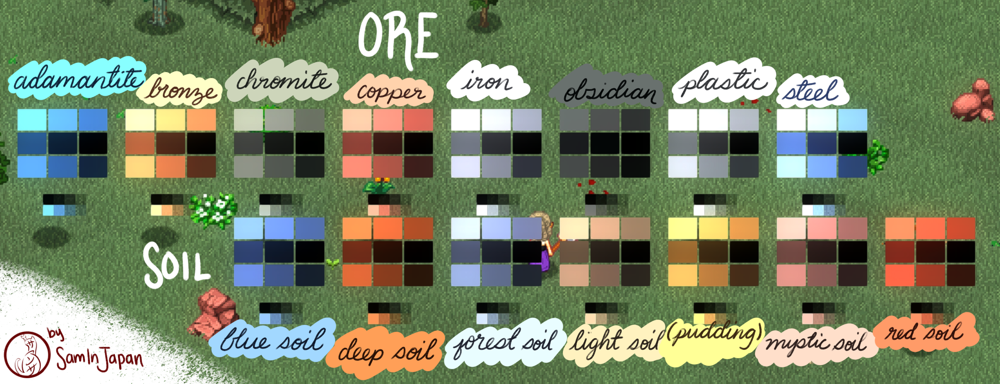

# Color Test Blocks

A great piece of reference if you want to make alt-colors/material based tiles for Elin.

[download the complete blocktest package](https://github.com/Elin-Modding-Resources/Elin.Docs/raw/refs/heads/master/articles/5_Texture%20Mods/assets/sam_blocktest/sam_blocktest.zip)

