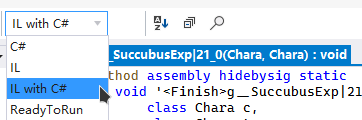

# Customizing Succubus EXP

Say you want to customize the EXP gained from sleeping with others as a succubus, you locate the responsible method:
```cs{8-14}
// Elin, Version=0.0.0.0, Culture=neutral, PublicKeyToken=null
// AI_Fuck
internal static void <Finish>g__SuccubusExp|21_0(Chara c, Chara tg)
{
	if (!c.HasElement(1216)) {
		return;
	}
	foreach (Element item in tg.elements.ListBestAttributes()) {
		if (c.elements.ValueWithoutLink(item.id) < item.ValueWithoutLink) {
			c.elements.ModTempPotential(item.id, 1 + EClass.rnd(item.ValueWithoutLink - c.elements.ValueWithoutLink(item.id) / 5 + 1));
			c.Say("succubus_exp", c, item.Name.ToLower());
			break;
		}
	}
}
```

The logic here is simple, we go through the target's best attributes and find one that's higher than ours, then gain said attribute's potential accordingly. 

## C#

The final potential gained is calculated as follow:
```cs:no-line-numbers
1 + EClass.rnd(item.ValueWithoutLink - c.elements.ValueWithoutLink(item.id) / 5 + 1)
```

So how do we multiply this value by an arbitrary amount? One may think to completely rewrite this method and modify the formula, or use one of other aforementioned workarounds.

## IL with C#

Let's take a peek at this method's decompiled IL instructions, example with ILSpy:


Now you see a whole bunch of random things, don't worry, follow the comments and locate the following:
```cs:no-line-numbers
// truncated for brevity
call int32 EClass::rnd(int32)
add
ldc.i4.0
callvirt inst class Element ElementContainer::ModTempPotential(int32, int32, int32)
```

As you can see, this is the call to `c.elements.ModTempPotential(int ele, int v, int threshMsg = 0)`, in this specific use case, the 1st argument will be `item.id`, the 2nd will be the actual value gained, the 3rd will be default value `0`.

## Calling Convention

We've found out where to the patch, now let's figure out the how.

For more information about the calling convention, checkout the [Transpiler Walkthrough](../transpiler_walkthrough).

In this case, when the call to `ModTempPotential(int ele, int v, int threshMsg = 0)` happens, there are 4 arguments on the stack:

|index|name|type|value|
|-|-|-|-|
|3|threshMsg|int32|`0`|
|2|v|int32|calculated|
|1|ele|int32|`item.id`|
|0|`this`|ElementContainer|`c.elements`|

The IL line above the call is `ldc.i4.0`, it means **load constant 4-byte-int(int32) of 0**, which corresponds to the 3rd argument `int threshMsg = 0`.
```cs:no-line-numbers
call int32 EClass::rnd(int32)
add
```

Going up we see a call to `EClass.rnd()` and an `add` that adds the previous value to the number returned from `EClass.rnd()`, and the final result will be left on the stack, serving as our 2nd argument `int v`. 

This is our target value, by modifying this value before it gets consumed by the `ModTempPotential()`, we can achieve the custom potential gain behaviour.

## Solution

We now know the calling convention, so the ideal way to solve this is inserting a call to our method that takes the original value, and returns a modified value.

Our modified IL instructions would look like this:
```cs
call int32 EClass::rnd(int32)
add
// now v is on the stack top
// <- insert a call here, v is consumed
// return modified_v on the stack top
ldc.i4.0
```

With our method looking like this:
```cs
static int ModPotential(int original) 
{
    return original * 2;
}
```

::: warning Static Method
Remember to use static methods, so it does not require a hidden `this` argument.
:::

## Implement

First we declare a basic **`Transpiler`** patch:
```cs
// in a patch class
[HarmonyPatch(typeof(AI_Fuck), "<Finish>g__SuccubusExp|21_0")]
internal static IEnumerable<CodeInstruction> Transpiler(
    IEnumerable<CodeInstruction> instructions)
{
    return new CodeMatcher(instructions)
        .InstructionEnumeration();
}
```

### Match 

We already know where in the IL instructions to patch, so we use a `CodeMatcher` to locate the line:
```cs
return new CodeMatcher(instructions)
    .MatchEndForward( // [!code focus]
        new CodeMatch(OpCodes.Call, AccessTools.Method( // [!code focus]
            typeof(EClass), // [!code focus]
            nameof(EClass.rnd))), // [!code focus] 
        new CodeMatch(OpCodes.Add), // [!code focus]
        new CodeMatch(OpCodes.Ldc_I4_0)) // [!code focus]
    .InstructionEnumeration();
```

This is a match for:
```cs
call int32 EClass::rnd(int32)
add
ldc.i4.0
```

`MatchEndForward()` will set the current IL cursor at the line `ldc.i4.0`.

### Call

After matching, we can now insert a call before the line `ldc.i4.0`, so we can return the modified value as 2nd argument(`int v`) before the 3rd argument gets pushed onto the stack.

```cs
return new CodeMatcher(instructions)
    .MatchEndForward(
        new CodeMatch(OpCodes.Call, AccessTools.Method(
            typeof(EClass),
            nameof(EClass.rnd))),
        new CodeMatch(OpCodes.Add),
        new CodeMatch(OpCodes.Ldc_I4_0))
    .InsertAndAdvance( // [!code focus]
        Transpilers.EmitDelegate(ModPotential)) // [!code focus]
    .InstructionEnumeration();

// somewhere  // [!code focus]
internal static int ModPotential(int original)  // [!code focus]
{  // [!code focus]
    return original * 2;  // [!code focus]
}  // [!code focus]
```

`Transpilers.EmitDelegate(func)` is a helper for writing call instruction, and also supports delegates.

::: details Another Way to Write CodeInstruction.Call 
```cs
new CodeInstruction(OpCodes.Call, AccessTools.Method(
    typeof(ThisPatchClass), 
    nameof(ThisPatchClass.ModPotential)));
```
:::

## Voilà

The complete patch:
```cs
// in a patch class
[HarmonyPatch(typeof(AI_Fuck), "<Finish>g__SuccubusExp|21_0")]
internal static IEnumerable<CodeInstruction> Transpiler(
    IEnumerable<CodeInstruction> instructions)
{
    return new CodeMatcher(instructions)
        .MatchEndForward(
            new CodeMatch(OpCodes.Call, AccessTools.Method(
                typeof(EClass),
                nameof(EClass.rnd))),
            new CodeMatch(OpCodes.Add),
            new CodeMatch(OpCodes.Ldc_I4_0))
        .InsertAndAdvance(
            Transpilers.EmitDelegate(ModPotential))
        .InstructionEnumeration();
}

internal static int ModPotential(int original) 
{
    return original * 2;
}
```

That's it! You may now customize succubus exp gained from fucking people.