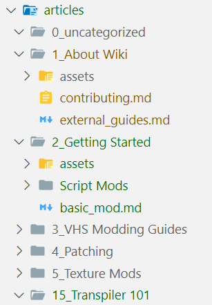

# Welcome to the Wiki!

If you're interested in sharing your guides, write-ups, notes, modding ideas, thought processes, learning experiences, or anything else you find worth sharing with the community, I encourage you to contribute here!

The wiki is built with [vitepress](https://github.com/vuejs/vitepress) and currently hosted on Elin Modding Resources using GitHub Pages. To join and contribute, you'll need to have a GitHub account.

<LinkCard t="Elin Modding Resources" u="https://github.com/Elin-Modding-Resources"/>

**Markdown** is the primary syntax used with the wiki, you could also use **HTML**, or the combination of both.

## Setup Wiki Dev Environment

If you do not need to live preview your page locally before commiting, or have worked with vitepress/static sites before, you can skip to [Wiki Layout](#wiki-layout).

### Install Tools

You need to have some necessary tools installed on your PC.
+ [Git/GitHub desktop](https://git-scm.com/downloads)
+ [Node.JS](https://nodejs.org/en)
+ [pnpm](https://pnpm.io/installation)
+ A code editor, like [Visual Studio Code](https://code.visualstudio.com/)

### GitHub Codespace

Instead of manually installing above kits, you could also use GitHub Codespace, that comes with everything pre-packed. Each GitHub free account includes a monthly allocation of 120 core-hours, which roughly equals to 60 real-world hours when using a default GitHub image. This should be more than sufficient for wiki editing purposes.

::: details One Click Setup
Go to the wiki's repository page, and start your codespace.

:::

### Clone the Wiki

Use GitHub desktop application or Git in your favorite terminal, clone the wiki repository onto your local environment. You can skip this step if you are using a GitHub Codespace.
```ps
git clone https://github.com/Elin-Modding-Resources/Elin.Docs.git
```

### Install Dependencies

At the repo's root directory, use `pnpm` to install dependencies:
```ps
pnpm i
```

### Start Local Site

You have finished setting up the dev environment and are ready to edit, use `pnpm` to start vitepress dev mode:
```ps
pnpm docs:dev
```

You should now see the wiki site served on your localhost. The site content **refreshes each time you make changes to any file and save**(`Ctrl+S`). To stop the local dev site, focus on the terminal and press `Ctrl+C` to terminate the localhost.

## Wiki Layout

+ `.github`
+ `.vitepress`
+ `articles`
+ `diff`
+ `public`
+ `<other files>`

Unless you are making changes to the wiki itself, including changing styles, modifying vue components, site configs, etc, the only folder you should care about is the `articles` folder.

### Category

Upon opening the `articles` folder, you'll notice folders with names prefixed by a numeric index followed by an underscore (`_`). These folders represent categories which is shown on the left, and the numbers indicate their sorting order.

Articles should be placed within the appropriate category folder. If an existing category doesn't fit your article, feel free to create a new folder. The `uncategorized` folder should only be used temporarily and is not intended for actual storage.

You can also create sub categories, by creating a sub folder under a category folder and place articles inside, note that sub categories do not use numeric prefix for sorting.



### Article

Each article is a **Markdown** file (`.md`), but you can freely use **HTML** syntax in there too. To write a new article, create a file in the category folder and change its extension to `.md`.

### Frontmatter

You should always write frontmatter at the beginning, it contains the metadata about the article. Let's take the example of current page:
```md
---
title: Contributing Guidelines
author: DK
description: Thanks for being a part of the modding community!
date: 2024/11/26
tags: Wiki
---

# Welcome to the Wiki!
... normal content continues
```

As you can see, frontmatter is surrounded by triple dashes (`---`), and they are just simple `key: value` pairs.

The keys are pretty much self-explanatory, there's one special note about the `tags`: you can assign multiple tags to one article by separating them with forward slash (`/`), like so:
```md
tags: Hello/Just a Thought/Okay
```

And it would look like this:  
<span class="border border-indigo-300 px-2 py-1 text-xs rounded-lg inline-block bg-indigo-100 cursor-pointer" v-for="(tag, index) in ['Hello', 'Just a Thought', 'Okay']" :key="index">
<b>{{ tag }}</b>
</span>

### Formatting & Snippets

You can use **Markdown** and **HTML** syntax in the article, common ones including but not limited to:
```md
*italic*
**bold**
<u>underline</u>
~~strikethrough~~
[url text](https://google.com)


```

To write code snippets, use triple backtick blocks (\`\`\`) with syntax highlighting:

<<< ./assets/code_block.md#snippet

There are more useful formattings, you can always check them out later:

<LinkCard t="VitePress Markdown Extension" u="https://vitepress.dev/guide/markdown#markdown-extensions"/>

## Upload the Article

🥳 Congrats! Now you have finished the write up and are satisfied with the result in your local dev site, you can use Git or GitHub desktop application to push the changes onto upstream. Once committed, the Wiki will automatically build itself and serve the latest content.

Should any problem regarding the wiki occur, please reach me @freshcloth on Elona discord or via GitHub.

**Thank you for being a part of the modding community!**
