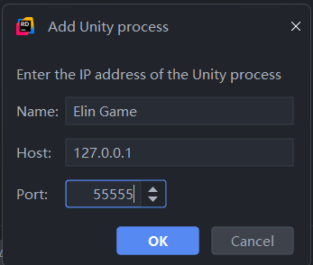
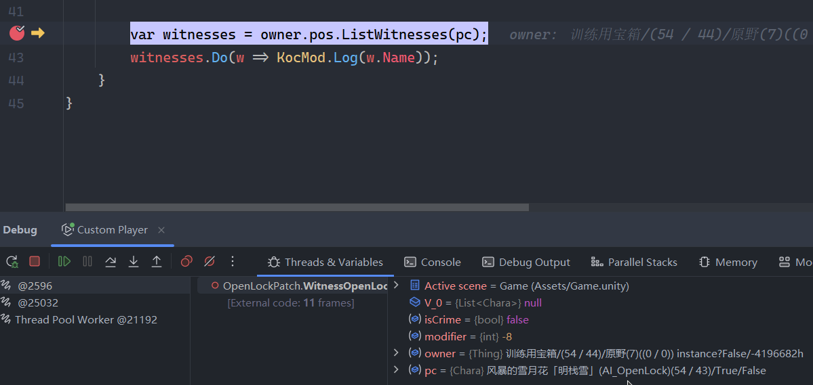

# Debug Your Plugin

It's important in development phase to see what's happening and where it's happening. You might want to debug the execution of code, watch the values of variables, inspect the data...etc.

## Manual Logging

One of the most common ways of debugging. It's like driving a bumper car.

When you make a `BepInPlugin`, it comes with a default `Logger` that writes to both Player.log and BepInEx console. To expose the `Logger` to the entire plugin scope to access, you can do so with an static method:

<<< ../assets/mod_entry.cs#logger_snippet

Simple logging helper that allows you to log anywhere in the project, which will write to BepInEx console and `Player.Log`.
```cs
MyElinMod.Log($"This is {114}th attempts!");
```

An alternative to the `BepInPlugin.Logger` is `Debug.Log` from Unity, which writes log strings to the Player.log without any prefix.

## Unity Explorer

By using Unity Explorer, you can inspect/modify all C# instances(including Unity Objects) at runtime. 

<LinkCard t="Unity Explorer at Steam Workshop" u="https://steamcommunity.com/sharedfiles/filedetails/?id=3364902496"/>

## Attach Debugger

You'll need a debug build of MonoBleedingEdge runtime to replace the Elin's packaged release version.

<a href="https://github.com/Elin-Modding-Resources/Elin.Docs/raw/refs/heads/master/articles/2_Getting%20Started/Script%20Mods/assets/mono-2.0-bdwgc.dll" download>mono-2.0-bdwgc.dll</a>

::: warning Backup First
Before replacing `Elin\MonoBleedingEdge\EmbedRuntime\mono-2.0-bdwgc.dll`.
:::

Now you can attach a debugger to Elin at `127.0.0.1:55555`, example with Rider:


You may set breakpoints on your plugin code and step into/over each line. It's recommended to start the debugger before launching Elin so you can hit the early breakpoints(if any).


::: info Build Configuration
Your plugin needs to be built with Debug configuration and with full PDB(by default).
:::