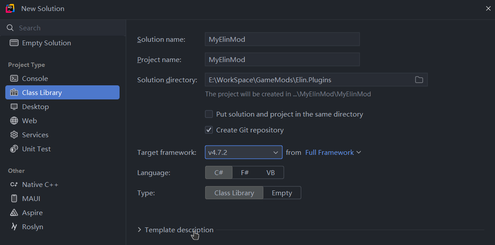
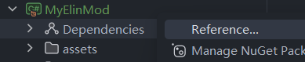
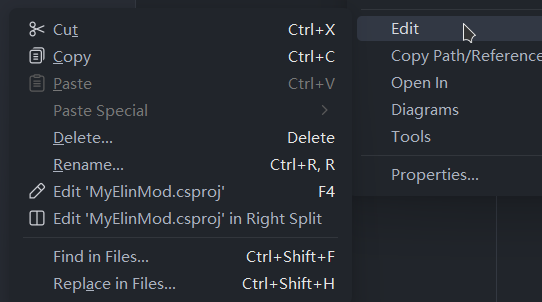
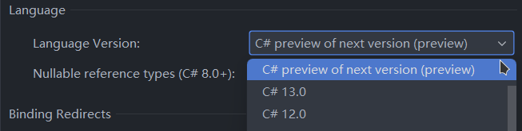

# Script Mods

Script mods are class libraries written in C# and loaded into game by BepInEx loader. To make a script mod, you'd need the follow tools:

## Code Editor/IDE

+ [Visual Studio Code](https://code.visualstudio.com/)
+ [Visual Studio](https://visualstudio.microsoft.com/)
+ [JetBrain Rider](https://www.jetbrains.com/rider/)

Pick your poison and make sure you have .NET development package installed for Visual Studio families.

## Decompiler

To modify game code, you'd need to know what to modify first. You'll want a .NET decompiler to browse the game source code. 

No, do not soley rely on your IDE's auto decompiling, use an actual decompiler from the following:
+ [ILSpy](https://github.com/icsharpcode/ILSpy/releases)
+ [dnSpyEx](https://github.com/dnSpyEx/dnSpy)
+ [dotPeek](https://www.jetbrains.com/decompiler/)

If you are using dnSpyEx, don't forget to turn off metadata tokens and RVA display, you won't need those info.

Simply open the `Elin/Elin_Data/Managed/Elin.dll` in the decompiler and load its dependencies, now you can freely browse game source code.

## C# Project

If you want to use MinusGix's template mod, you can skip to [Debugging](./debugging).

<LinkCard t="MinusGix Elin Mod Template" u="https://github.com/MinusGix/ElinExampleMod"/>

### Target framework

Example with Rider, create a new class library project with target `.NET framework 4.7.2`:


You could target `netstandard 2.0/2.1` too, but since noa suggests mod authors to target `.NET framework`, we'll stay on that path. Besides there's really not much differences because you get to use C# 12/13 features with both anyway.

### Dependencies

An Elin script mod will of course depend on Elin's libraries. Let's first add the dependencies to the project:


Then add the following basic libraries from game folder, you can multi-select:
+ `Elin_Data\Managed\Elin.dll`
+ `Elin_Data\Managed\Plugins.BaseCore.dll`
+ `Elin_Data\Managed\UnityEngine.dll`
+ `Elin_Data\Managed\UnityEngine.CoreModule.dll`
+ `BepInEx\core\0Harmony.dll`
+ `BepInEx\core\BepInEx.Core.dll`
+ `BepInEx\core\BepInEx.Unity.dll`

You should always reference from game folder, so that you get the updated libraries as the game updates. You can also add more libraries when you need, or just add a bunch of them at the start(excluding any `System.*` libraries) and refactor them at the end.

After adding dependences, for each reference, set `Copy Local` to false so they won't be copied to your output folder. 

For Rider users, you need to manually edit the project file and add `<Private>False</Private>` to each reference, like so:

```xml
<Reference Include="Plugins.BaseCore">
    <HintPath>$(ElinGamePath)\Elin_Data\Managed\Plugins.BaseCore.dll</HintPath>
    <Private>False</Private>
</Reference>
``` 

### Project Setup

In the properties setting, you can set C# language version to **12/13/preview**:


For the **output dir**, you should use `ElinGamePath\Package\Mod_$(AssemblyName)\` so that you always build into mod folder and ready to test. 

Again, for Rider users, you need to manually edit the project file again and change the `<OutputPath>` for both `Debug` and `Release` configurations:
```xml
<OutputPath>$(ElinGamePath)\Package\Mod_$(AssemblyName)\</OutputPath>
```

## Basic Plugin

We are making a BepInEx plugin, so it's all the same stuff. Create file `MyElinMod.cs` at the project root:

<<< ../assets/mod_entry.cs#plugin_snippet

Here we chose the same Guid as mod ID in `package.xml`. This needs to be an unique identifier for your mod, so make it very unique.

After building the project and launching the game, you should see the message in the log output, either via BepInEx console or `Player.log` at `%localappdata%low\Lafrontier\Elin\Player.log`.

::: details Enable BepInEx Console
Open the BepInEx config file at `Elin\BepInEx\config\BepInEx.cfg` and change the following:
```ini
[Logging.Console]

## Enables showing a console for log output.
# Setting type: Boolean
# Default value: false
Enabled = true
```
:::
