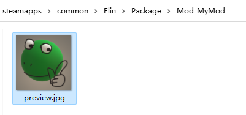
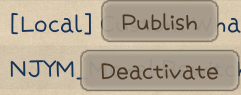

# Elin Mod Package

Elin supports a variety of mod types, let's walk through the steps of creating a basic example mod.

## Mod Folder

Your locally developed mod should be placed under `<ElinGamePath>/Package/<ModName>` folder.

If you are not sure where that is, right click Elin in your steam library, go to `Properties`>`Installed Files`:


Click `Browse` and open up the `Package` folder, this is where local mods are placed, including Elin's own core files. Create a new folder for your mod, all of the mod contents will be placed within.


## Show File Extensions

To proceed and make your life easier, file extensions must not be set to hidden:


::: details Windows 10
+ Open File Explorer; if you do not have an icon for this in the task bar; click Start, click Windows System, and then File Explorer.
+ Click the View tab in File Explorer.
+ Click the box next to File name extensions to see file extensions.
:::

::: details Windows 11
+ Open File Explorer; if you do not have an icon for this in the task bar; click Start, click Windows System, and then File Explorer.
+ Click the View dropdown in File Explorer.
+ Click the Display option and check file extensions;
:::

## Preview / Thumbnail (preview.jpg)

A preview image will be used as the thumbnail in workshop page. It has to be named `preview`, in `.jpg` format, and preferably under 1MB in size, otherwise you might encounter upload problem.


## Writing package.xml

A `package.xml` describes the mod. Create a new text file in the mod folder and change its name **and extension** to `package.xml`:


Open it with an editor - not chrome/your browser, and fill in the following information:
```xml
<?xml version="1.0" encoding="utf-8"?>
<Meta>
  <title>My Elin Mod</title>
  <id>my.veryunique.modid</id>
  <author>Me</author>
  <loadPriority>100</loadPriority>
  <version>0.23.50</version>
  <tags></tags>
  <description>
  </description>
  <builtin>false</builtin>
</Meta>
```

### title

Your mod title. Enter your mod's title within this tag. When you upload your mod to the Workshop for the first time, the text in this tag will be displayed as the mod's title.

When updating your mod, this text will be ignored. If you need to change the title, please do so directly in the Workshop.

Example: `<title>My Elin Mod</title>`

### id

Enter a unique ID to identify your mod. If the ID conflicts with an existing mod, the upload will fail. Choose a name unlikely to conflict with others.

Example: `<id>my.veryunique.modid</id>`

::: danger Updating Mod
Do not change the **`id`** of the mod once you publish it. Otherwise it will be treated as a new mod and fail to update.
:::

### author

Enter the name of the author. You can write anything here.

Example: `<author>Me, Myself, and I</author>`

### loadPriority

Specifies the default order in which mods are loaded. Enter any number, mods with lower numbers are loaded first. The value is clamped to `-999` ... `999`, and anything that is not a number falls back to the default `100`.

`loadPriority` only decides where a mod lands the **first** time the game sees it. As soon as the mod is listed in `loadorder.txt` - which happens the moment you reorder or toggle mods in the Mod list - the saved order wins instead. 

Example: `<loadPriority>100</loadPriority>`

### version

Write the version of the Elin main game that your mod was last confirmed to work with. Currently, it’s okay to skip frequent updates to this value unless necessary. If the Elin main game introduces significant changes to mods, mods with versions older than the main game’s update will no longer be loaded.

::: warning
This is **not** your mod's version! Set this version to your game's version. 
:::

Example: `<version>0.23.212</version>`

### tags

Specify tags for the Workshop, separated by commas(`,`) if multiple tags are used. You may register any tags you like. Using official tags will make your mod visible in the Workshop categories. 

<LinkCard t="Official Tags" u="https://docs.google.com/document/d/e/2PACX-1vR7MjQ_5hAmavFB8iMW6xm7vSYJg_g8I1s8KtvjBO-N_zNATnsmdmyQsmxQ8z9yEpZxNoc-TTdZm8so/pub"/>

Example: `<tags>General,QoL,Utility,My Fun Mods,Use With Caution</tags>` 

### description

Provide a description of your mod. This text will be displayed as the mod's description when it’s first uploaded to the Workshop.

When updating your mod, this text will be ignored. If you need to change the description, do so in the Workshop.

Example: `<description />` you should do this in workshop page.

### builtin

Set this to false. Don't worry about it. Don't think about it.

Example: `<builtin>false</builtin>`

### optional: visibility

Specifies the visibility of the uploaded mod. Possible values are:
+ `Public`
+ `Unlisted`
+ `Private`
+ `FriendsOnly`

If this tag is omitted, the mod will be uploaded as `Public` by default.

Example: `<visibility>Unlisted</visibility>`

### optional: dependency

Declares another mod that has to be loaded before yours. The target mod's id goes into the `id` **attribute** - text written inside the element is ignored.

```xml
<dependency id="dk.elinplugins.customwhateverloader" />
```

+ Ids are trimmed and matched case-insensitively, so `id=" Foo.Bar "` and `foo.bar` are the same mod.
+ Several ids in one attribute, separated by commas(`,`), mean **any one of them** is enough: `<dependency id="mod.a,mod.b" />`
+ Repeat the element when you need **all** of them:
  ```xml
  <dependency id="mod.a" />
  <dependency id="mod.b" />
  ```
+ A dependency also implies `loadAfter`: the target is sorted before your mod automatically.
+ When the requirement is not met your mod is **not loaded**, and the Mod list shows what is missing.

::: warning Do not depend on builtin packages
Builtin packages (`_Elona`, `_Lang_Chinese`, `_ModdingKit`, `Mod_Slot`) can not be used as a dependency target - your mod would never load.
:::

Example: `<dependency id="dk.elinplugins.customwhateverloader" />`

### optional: incompatible

Declares mods that must never be loaded together with yours. Same syntax as `dependency`.

```xml
<incompatible id="some.other.mod" />
```

+ The declaration works **both ways** - only one of the two mods needs to declare it.
+ The mod that loads **first** wins, the other one is blocked and the Mod list shows which mod blocked it.
+ Declaring your own id is ignored, and so is declaring a builtin package.
+ `loadAfter` / `loadBefore` between two incompatible mods have no effect.

Example: `<incompatible id="mod.a,mod.b" />`

### optional: loadAfter / loadBefore

Ordering hints. Unlike `dependency` they never stop a mod from loading.

```xml
<loadAfter id="mod.that.loads.first" />
<loadBefore id="mod.that.loads.later" />
```

+ Same `id` attribute syntax as `dependency` (comma separated, repeatable).
+ Targets that are not installed are ignored, so it is safe to point at optional mods.
+ Builtin packages can not be used as a target.

Example: `<loadAfter id="dk.elinplugins.customwhateverloader" />`

## Upload & Update

That's it, a basic empty mod that does nothing has been created. Launch Elin and open the Mod Viewer page, find your mod, it should be loaded as `[Local]` because it's a local mod in the `Package` folder.

Click your mod and you should see `Publish` button. If this mod hasn't been published to the workshop yet, it will be **published**. Otherwise the mod will be **updated**.
