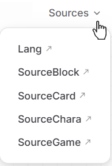

# Introduction

No coding necessary for most mods in Elin!

By creating a [Mod Package](./basic_mod) with the necessary files and using formatted xlsx files, you can add all kinds of things into Elin.

For details on how to fill out the xlsx files, please refer to the `Source Sheets` section in the Menu.

::: details Principle Overview
+ The `package.xml` and `preview.jpg` inside the mod package allow Elin to load your mod and display a cover image. Naturally, this requires the mod package to be placed in the correct file path.
+ The formatted xlsx files add SourceData into the game.
:::

## Example Mod Setup

The complete folder structure is shown below, but you can omit any folders you don't use, except for the mod folder itself (Mod Package), `package.xml`, and `preview.jpg`:


The **LangMod** folder contains subfolders named after language codes. However, to get started you only need to use one of them: either `EN` or `JP`. 

Inside the language code folder you choose, place your mod data — for example, an xlsx file. This xlsx file will act as your Source Sheet.

## Source Sheets

Checkout the official Elin Sources on the nav bar dropdown:



::: details Can't find it?
If your screen is small or your zoom level is too high, this button might be hidden. Click the hamburger menu (three horizontal lines) to find the **Sources**.

:::

Here you will find all of the Source Sheets uploaded by the developer for modders to reference.

Ensure you have a method to read and write xlsx files. They are the standard XML based spreadsheets.
The most common methods to work with this kind of file is Microsoft Excel. Other options would include LibreOffice Calc or Google Sheets.

The Drive has multiple Source Files broken down into categories. Each category contains multiple sheets. When you open one of the files, at the bottom you can see the Source Sheets included.
Make sure the name of these sheets line up with one of the original sheet names (e.g. Chara, Race, Job.)

When making your own Source Sheet file, you need to make sure the format is correct.
You can have a single Source.xlsx file for your entire mod that has a variety of sheets inside it.

Add new sheets as needed (Click the + button) and rename them (Right click) at the bottom to match the original Source Sheets.

|Excel|LibreOffice|
|-|-|
|||

Supported `SourceData` are: 
```txt:no-line-numbers
Chara, CharaText, Tactics, Race, Job, Hobby
Thing, ThingV, Food, Recipe, SpawnList, Category, Collectible, KeyItem
Element, Calc, Stat, Check, Faction, Religion, Zone, ZoneAffix, Quest, Area, HomeResource, Research, Person
GlobalTile, Block, Floor, Obj, CellEffect, Material
```

Supported `SourceLang` are: 
```txt:no-line-numbers
General, Game, List, Word, Note
```

Note that this the **sheet name**, not the file name.

For organizing purposes:

+ You may put all these sheets into a single xlsx file.
+ You may also split the sheets into multiple xlsx files.

## Data Rows

All Source Sheets data rows should start on the 4th Row. (Exception of dialog.xlsx, but we'll go over that later)  
+ **1st row** is the header, containing what each column represents. Don't change this.  
+ **2nd row** is the type, containing what type each column should be.  
+ **3rd row** is the default value for that column.  
+ **4th row** is where you can start filling it out with what you want to mod into the game.

When you set up your sheets, you should go to the original sheets and copy the first 3 rows into your own Sheet. Make sure you get the whole row.


## Quick Summary

### Lang
- The Language files. It's a bit hard to explain this, but these are the words that you the player will see, from in the logs, to UI elements, everything.
Modders who plan on adding extensive new content should get used to this file, but you likely do not need to do too much here if you are aren't planning to code.

### SourceCard
- Thing - Items.
- ThingV - Furniture Variations of items.
- Food - Food Items and their stats.
- Recipe - Crafting Recipes.
- SpawnList - Spawn lists for either shop inventories or what monsters spawn in which areas.
- Category - Item Categories.
- Collectible - Junk items, mostly for decoration, or quests.
- KeyItem - Key Items.

### SourceChara
- Chara - Character entries.
- CharaText - Bark Text that the characters would say over their heads, or in the log based on the scenario.
- Tactics - Combat AI. Weights on what kind of action each tactic style would take in a given turn.
- Race - Character Races.
- Job - Character Jobs. Can be referred to as Classes as well.
- Hobby - Character Hobbies, the one each character has at least two of.

### SourceGame
- Element - Basically all the Attributes/Skills/Feats/Spells/Abilities are housed here.
- Calc - Dice calculation for various spells or abilities.
- Stat - Conditions, like Buffs and Debuffs.
- Check - Don't worry about this.
- Faction - Factions of the game. This part is heavily hardcoded.
- Religion - Religions of the game.
- Zone - Zone data.
- ZoneAffix - For random nefias, adds a prefix adjective.
- Quest - Quest Data like descriptions, who is the quest giver, what is the quest name.
- Area - Possible room designations.
- HomeResource - Various stats of a Zone.
- Research - Licenses and rewards.
- Person - Drama actors that are defined explicitly. It's not mandatory to use.

### SourceBlock
- GlobalTile - Tiles used on the world map, pointing to what zone they should spawn when you enter it. This does not include prefab locations (e.g. cities, dungeons, nefias)
- Block - Blocks, Walls, Roofs, Stairs. For building with.
- Floor - Floor data. Self explanatory.
- Obj - Object data.
- CellEffect - Extra effects applied to the tile.
- Material - What materials are made available in the game.

## Languages Other Than Japanese and English

### Before You Begin

Let's first understand some basics, taking a column group like `name_JP` and `name` as an example:
+ The column with the `_JP` suffix in the group is the Japanese column.
+ The column without a suffix is the English column, but it can also be used as the translation column.

### Example

Taking Chinese (`CN`) as an example, create a `CN` folder.
1. Fill out your source sheet in either the `EN` or `JP` folder, and then copy it to the `CN` folder. For detailed instructions on filling out source sheets, please refer to the `Source Sheets` section in the main menu.
2. Start translating your source sheet. Do not modify the Japanese columns; instead, translate the "translation columns" (the ones without suffixes mentioned above) into your target language.
3. Afterward, export it as a `SourceLocalization.json` translation file and delete the source sheet in the `CN` folder. For details on how to export the `json`, see the [Translation](../10_Source%20Sheets/localization) page. 

Alternatively, you can export the `SourceLocalization.json` file first and translate it directly within the `json` file. For details, see the [Translation](../10_Source%20Sheets/localization) page. 
