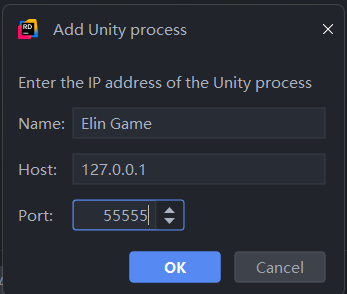

# Debug Your Plugin

## Manual Logging

One of the most common ways of debugging. It's like driving a bumper car.

## Unity Explorer

By using Unity Explorer, you can inspect/modify all C# instances(including Unity Objects) at runtime. 

<LinkCard t="Unity Explorer at Steam Workshop" u="https://steamcommunity.com/sharedfiles/filedetails/?id=3364902496"/>

## Attach Debugger

You'll need a debug build of MonoBleedingEdge runtime to replace the Elin's packaged release version.

<a href="./assets/mono-2.0-bdwgc.dll" download>mono-2.0-bdwgc.dll</a>

::: warning Backup First
Before replacing `Elin\MonoBleedingEdge\EmbedRuntime\mono-2.0-bdwgc.dll`.
:::

Now you can attach a debugger to Elin at `127.0.0.1:55555`, example with Rider:

After attaching, you may set breakpoints on your plugin code and step into/over each line.

::: info Build Configuration
Your plugin needs to be built with Debug configuration and with full PDB(by default).
:::