## Creating new Items and importing sheets

Great, now we can really begin working on our mod, our first order of business is also the easiest one, all we need to do is use the already included `ModUtil` to load an .xlsx file that contains both of the items we need to create, along with all of their information and their recipes. Before we move to code let's fetch ourselves a copy of the `SourceCard.xlsx` provided by Noa for us modders. Head over [here](https://docs.google.com/spreadsheets/d/175DaEeB-8qU3N4iBTnaal1ZcP5SU6S_Z/edit?gid=75329941#gid=75329941), and make a copy for yourself so we can edit it.

::: info Benevolence
As the great me is very benevolent, here is a folder with he two most significant Sources emptied for your convenience. [Empty Source files](https://drive.google.com/drive/folders/1MKagpBHUsW6EAF586jfd17JuyZwXuFPj?usp=drive_link)
:::

::: details If you'd like to do it yourself:
After fetching a copy remove all the existing data from all sheets from row number 4 on-wards, then we can add our own data.
:::

Now that we have our sheet ready to go, all we need to do is fill out its data. We will start by creating our Genetic gun, here are the only columns we need to worry right now(I will omit the obvious ones like name, weight, value):
| id | category | sort | \_idRenderData | tiles | factory | components | defMat | detail |
| --- | --- | --- | --- | --- | --- | --- | --- | --- |

There are many more columns in the sheets but we either don't need them whatsoever or we'll make use of them later, for now, we can leave them empty. Let's go over each item to understand what they are and fill them accordingly :
::: details \_JP affixed columns
You might have noticed that we have some columns with the \_JP suffix, if you'd like you can fill those with their JP translations for a <span style="color: red;">M</span>
<span style="color: orange;">u</span>
<span style="color: yellow;">l</span>
<span style="color: green;">t</span>
<span style="color: blue;">i</span>
<span style="color: indigo;">l</span>
<span style="color: violet;">i</span>
<span style="color: red;">n</span>
<span style="color: orange;">g</span>
<span style="color: yellow;">u</span>
<span style="color: green;">a</span>
<span style="color: blue;">l</span> mod.
:::

-   `[string] id`: This is our item unique identifier, its the value used to create an instance of our item.
-   `[string] category`: This is our item category, it's used for things like auto-dumping.
-   `sort`: Self-explanatory used for item sorting.
-   `[string] _idRenderData`: This is the id(name of the file in this case) of where our sprite is. We'll learn how to identify that along with tiles in a bit.
-   `[int] tiles`: This is the tile coordinate of our sprite in the spritesheet we defined on \_idRenderData.
-   `[string[]] factory`: This is ids of the crafters that can make our item. E.g.: factory_tinker if we would like to have our item be crafted at the Tinker's table.
-   `[string[]] components`: This is our recipe, all the items that will be used to craft our item are listed here using the ingredient id or a category if multiple type of items can be used, separated by a comma, and if the recipe calls for more than 1 item we append its id with `/n`, n being the number of ingredients required. E.g.: bone/2
-   `[string] defMat`: This is the default material of the item.
-   `[string] detail`: This is our item description, the one that shows up on tooltips.

| id       | category | sort      | \_idRenderData | tiles | factory       | components         | defMat | detail                                                    |
| -------- | -------- | --------- | -------------- | ----- | ------------- | ------------------ | ------ | --------------------------------------------------------- |
| gene_gun | \_tool   | item_tool | obj_S EQ       | 1030  | genetic_table | ingot,glass,seed/5 | iron   | A Disposable gun used to fire extracted genes onto crops. |

## Choosing a sprite

Awesome, our new little item is now defined, you may notice that I've put `genetic_table` on the factory column, that just in anticipation for our next item, for now we can test out our item using the console. Moving on, before we proceed to import our sheet into the game let's go over the `_idRenderData` and `tiles`, the way i have them filled now (obj_S EQ 1030) translates to `objS_1030` on the spritesheet(Let's ignore the EQ fow now, i'll explain in it in a bit), and it is obviously the sprite of a gun, but how did i found that you may be asking, well that's simple enough, let's go into the game, load any save and follow this steps:
<br> `Esc > tools > Texture Viewer`

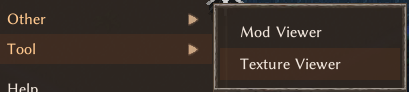

You are now seeing a window with a ton of sprites, this is most likely the blocks spritesheet, a look at the top of the window you will see listed all other existing spritesheets:

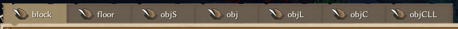

We are looking for the sprite of a gun, which is an equipment and considerably a "small object" or a `objS`, get it? Ok, time to find our gun, if you hover over any sprite you see that their name matches the translation I've exemplified earlier, and we can even break it down further as `objS_(row)(column)`. Now you know how to find sprites and identify their tile so you can fill your sheet data, the only detail left is that little `EQ` we have on our `_idRenderData`, if you look at the original sheet you'll notice several items have these suffixes, `EQ` not being the only suffix, for example we've got `flat`, `tall` and a few others, they are there to further define what kind of sprite is being selected or what is its purpose and in doing so the game will "offset" the sprite position when rendering it, our `EQ` stands for Equipment, so it offsets our sprite to be closer our character hands when holding it. Here are a few examples of how our gun looks using different suffixes:

| Nothing                      | EQ                         | flat                         | tall                         |
| ---------------------------- | -------------------------- | ---------------------------- | ---------------------------- |
| 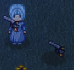 | 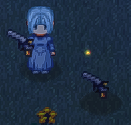 | 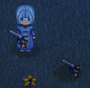 | 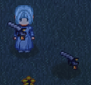 |

Neat right? Now its finally time, lets import our sheet and test if our gun is working!

## Importing the sheet

This is fairly easy as well. First, we need to save our spreadsheet as `.xlsx`, and put it on our mod folder, you can put it in sub folders if you so desire, with that done, let's go to the entry point of our mod, the one inheriting the `BaseUnityPlugin` class and add the following snippet, taking care to correctly input the highlighted lines:

```cs{4,6}
    public void OnStartCore()
    {
        var dir = Path.GetDirectoryName(Info.Location);
        var excel = dir + "/SourceCard.xlsx";
        var sources = Core.Instance.sources;
        ModUtil.ImportExcel(excel, "Thing", sources.things);
    }
```

For a quick overview:

-   `dir` holds the path to our mod, considering you are working on a unreleased mod this path will be `(steamapp)/Elin/Package/YourModName`
-   `excel` adds our spreadsheet to the path, make sure the name matches the _FILE_ name and don't forget to add any sub folders if you've put your sheet in there. E.g.:`MySubfolder/SourceCard.xlsx`
-   `sources` is simply acquiring a reference to the SourceManager, no need to bother with this, just leave it be.
-   Last but not least is our call to `ModUtil.ImportExcel` and as you can see, it expects:

    -   The path to our _FILE_ (`excel`);
    -   The name of a _SHEET_ within the file, so make sure to match that, the empty source files I've provided all have multiples sheets but since we are only making using of the "Thing" sheet that's what we are using. If you need to import multiple sheets just make another call to `ModUtil.ImportExcel` using a different sheet name;
    -   What type of `SourceData` we are importing, in our case, its a thing, so `sources.things`.

    And done! We can now build our mod, and head over to the game. A quick way to check if our weapon is working is:

    -   Open the console. `Esc > Other > Console`
    -   Enable cheats by entering the 'Cheat' command
    -   Spawn our item using the spawn command with its id, in our case `gene_gun` so "Spawn gene_gun"

> [!Caution]Warning
> At least two cases have been reported on the discord of the import process erroring out for no apparent reason, with a little bit of testing with a file that was causing an error, just by re-saving the file using 'LibreOffice Calc' seemed to fix the problem, so we believe that there is a chance that googlesheets exports to .xlsx can possibly cause some sort of incompatibility, if that happens to you try re-exporting or re-saving the file with another software.

And... Voilà!
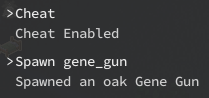

## Adding a new crafting table

Now that we have our gun, let's make our new crafting table, fill everything up as we did before, but this time we have five relevant changes to make.

| id            | category | <span style="color: red;">\_tileType</span> | \_idRenderData | tiles | <span style="color: red;">recipeKey</span> | <u>factory</u> | <span style="color: red;">components</span> | <span style="color: red;">LV</span> | <span style="color: red;">trait</span> |
| ------------- | -------- | ------------------------------------------- | -------------- | ----- | ------------------------------------------ | -------------- | ------------------------------------------- | ----------------------------------- | -------------------------------------- |
| genetic_table | crafter  | **ObjBig**                                  | obj            | 1545  | \*                                         | **workbench2** | **#table,#chair,bone/2,fertilizer/5**       | **5**                               | **Workbench,farming**                  |

One small thing, we've change our factory to be workbench2, so we can craft our crafting table at the draft table, now to the bigger changes:

-   `_tileType`: To be honest, I'm not entirely sure what other uses the column has, but with `ObjBig` we prevent movement on top of it, and I prefer it like this, if you don't you can leave it empty.
-   `recipeKey`: For convenience we're setting this to "\*", that means this recipe is always known. We can add it to our gene_gun as well.
-   `components`: Noticed something different with our recipe? For this one we are using `#table` and `#chair` to designate that any item categorized as table and chair can be used as an ingredient.
-   `LV`: We've left this empty on our Gene gun, but now you can go back and fix it, because LV defines the crafting skill level of our item. But level of what skill you might be asking, for our new crafting table it will the `Crafting` skill because its factory is the `workbench2`, for our gene gun we will define it on the next important column change;
-   `trait`: In this column we are giving our crafting table the `Workbench` Trait so the game will recognize it as an actual crafting table, but not only that, we are also defining the skill that governs crafting in this table, since this is mainly a farming item we are assigning it the `farming` skill. `Workbench,farming`. There are other crafting related traits if you check source data but we are not going over those, and as for traits we are not diving deeper on them yet, but I encourage you go over the source data and see how they are assigned to different things.

All done, time to go in game again, this time we don't need the console if you already have a drafting table near your testing character, the moment you click craft on the table, you will automatically learn the recipe for our new crafting table because we set its recipe to be always known.

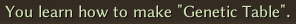 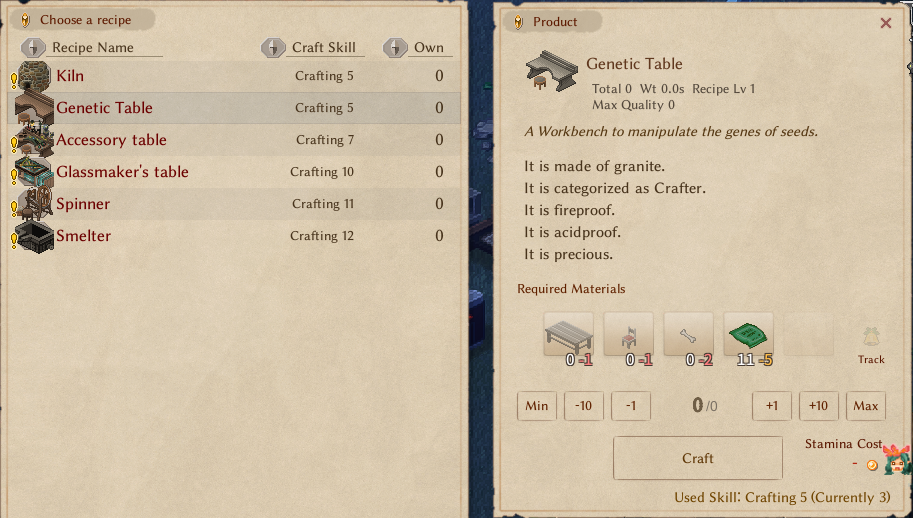

And there it is! Now, I've lied about the console, go back there, spawn our new table and place it down, you'll see we can already interact with it, and when we do so:

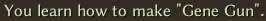
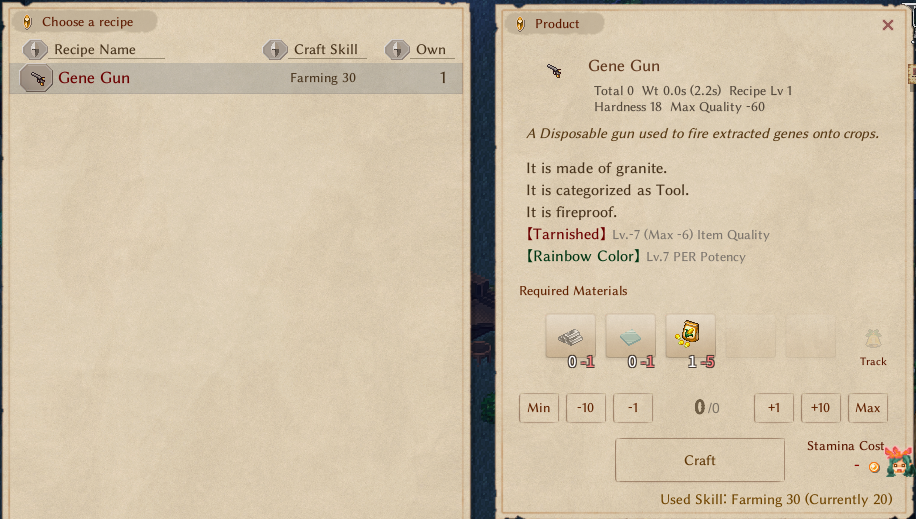

We are not done yet, but that's two steps done, on part 3 we're are going to transfer the Enchantments on our seed ingredient to the gun.
