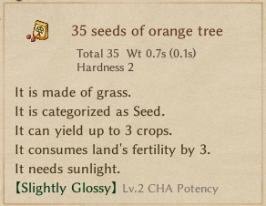
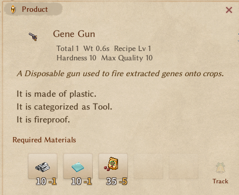
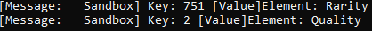
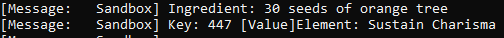
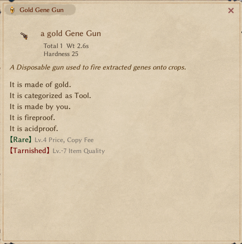
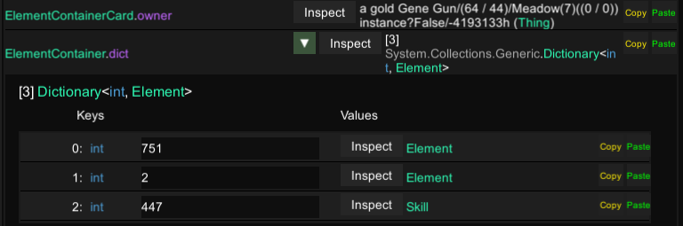

# Part 3 - Transplanting enchantments

Now that our Item and Crafting station are done, we might as well test them properly, we know that while crafting items, the enchantment of the ingredients are inherit by the resulting crafted item, but, maybe there are some restriction on what is inherited or not, so lets craft our gun using some seed with enchantments.

::: tip
For that I suggest relying on cheating to save time, in my case the two tools I use mostly are [YK Testing Tool](https://steamcommunity.com/sharedfiles/filedetails/?id=3365678112) and [Unity Explorer](https://steamcommunity.com/sharedfiles/filedetails/?id=3364902496&searchtext=unity), I'll leave how to use them for you to learn.
:::

Lets go ahead and cheat ourselves the materials for our gene gun, also making sure that our seed does have a enchantment, I'll be using these:


And by going over to our crafting table and imputing our desired ingredients we get...


Nothing? Oh well, unfortunately, my suspicion about restrictions was right, not every enchantment is inherited. For you, it might not make sense to suspect these kinds of things, even though this one might be within reason to suspect. The reason I decided to test that right away was previous knowledge of the `Element` class. Let me show you: head over to your decompiler of choice or [Elin Decompiled](https://elin-modding-resources.github.io/Elin-Decompiled/) (courtesy of yours truly) and search for the `Element` class.

In there, if we quickly go through its functions and properties, you'll find this:

[IsFoodTrait](https://elin-modding-resources.github.io/Elin-Decompiled/classElement.html#a4a285c3ae82445a9c479a5c77a7d2129).

Specific, isn't it? I won't make you do that, but if you read around things that reference it, it quickly becomes apparent that "foodTrait" elements only show up in foods (surprise, surprise).

In any case, we would've found this out pretty quickly, and this knowledge alone does nothing for us right now (but it will in the future). What we need to do is find where and how items are crafted and understand it so we can patch it.

## Finding our target method

We know exactly what possibly calls the crafting functions: the "Craft" button on the crafting window. To easily find UI element classes, you can just search for classes or files that have "Layer" in their name. Fortunately, searching for [`LayerCraft`]() lands us exactly where we wanted. Now it's a reading game—let's find out what our little button is calling.

After a bit of reading we can safely assume its [OnClickCraft](https://elin-modding-resources.github.io/Elin-Decompiled/classLayerCraft.html#a209d122805d09c7b140dccc89c9d047f), quickly reading through it doesn't seems it directly calls any methods related to crafting, for now, let's keep going. Our next stop will be [RefreshProduct](https://elin-modding-resources.github.io/Elin-Decompiled/classLayerCraft.html#a2c6414e8cab7664c6aef5a050e70fff1), while following simple logic it doesn't seem to make sense but this method actually calls `recipe.Craft()`

```cs
foreach (Recipe.Ingredient ingredient in recipe.ingredients)
{
    if (ingredient.thing != null)
    {
        list.Add(ingredient.thing);
    }
}
Thing thing = recipe.Craft(BlessedState.Normal, sound: false, list, null, model: true); // [!code focus]
thing.SetNum(inputNum.Num);
if (thing.sockets != null)
{
    thing.sockets.Clear();
}
```

Oh well, its what we have, let's follow it and investigate more, [`Recipe.Craft()`](https://elin-modding-resources.github.io/Elin-Decompiled/classRecipe.html#ac02871547f61b1b6ac605f8e32030463), couple of points to note here, this method is virtual and if we check what references this method you'll see `AI_UseCrafter.Run()`, remember that from `OnClickCraft` earlier? It seems we're on the right track. Time to test, a small postfix patch will give us our answers.

```cs
[HarmonyPatch]
public class ItemCrafting
{
    [HarmonyPostfix, HarmonyPatch(typeof(Recipe), "Craft")]
    public static void Craft()
    {
        Plugin.Log.LogMessage("We crafting boys!"); //This is BepInEx logger
    }
}
```

Build it, go in-game, craft our gun, check the console and you'll see... **nothing**. Well, not our expected outcome, but that's how things are, we have other options, one is them is very quick and easy, remember that `Craft()` is virtual? Let's take a look at it's overrides, it so happens that there is only one: [`RecipeCard.Craft`](https://elin-modding-resources.github.io/Elin-Decompiled/classRecipeCard.html#a90e5d744f49ca9e50e8912ef9fbd3f4c), we'll try with this one now:


Target acquired! There it is, this is the method we want, we can now move on by first making sure that our item is really not inheriting our food enchantment and if not, then making sure it receives it.

::: info
If you happen to be following along you might have noticed that `We crafting boys!` was triggered multiple times, for brevity I'll just spoil right away the reason: One of the logs is our actual item being crafted, the other logs are "ghost" items crafted to display on the crafting window, boring right? Took me a minute to figure out why that was happening.
:::

## Transplanting the enchantment

Time to grab our `__result` and do some iterating...

```cs{1,5}
public static void Craft(Thing __result)
{
    foreach (int k in __result.elements.dict.Keys)
        {
            Plugin.Log.LogMessage("Key: " + k + " [Value]Element: " + __result.elements.dict[k].FullName);
        }
}
```

And that gives us:


Now that we've confirmed it really isn't there, we just add it. We'll take `List<Thing> ings` and iterate over it, and just to make sure we're only getting our seeds enchantments let's find out what `Trait` seeds have so we can filter them. We can easily find that out on the original SourceCard spreadsheet... Obviously enough seeds have the TraitSeed trait, who would've guessed... Okay, then we shall ignore anything that doesn't have `TraitSeed`, don't forget to log your way out of goofing up and lastly we transplant our so desired enchantment:

```cs{1,3,5,13}
public static void Craft(Thing __result, List<Thing> ings)
{
    ings.ForEach(x =>
    {
        if (x.trait is not TraitSeed) return;
        Plugin.Log.LogMessage("Ingredient: " + x.InspectName);

        foreach (int k in x.elements.dict.Keys)
        {
            Plugin.Log.LogMessage("Key: " + k + " [Value]Element: " + x.elements.dict[k].FullName);
            if (!__result.elements.dict.ContainsKey(k))
            {
                __result.elements.dict.Add(k, x.elements.dict[k]);
            }
        }
        Plugin.Log.LogMessage("---------------------");
    });
}
```


Right, that's the right ingredient, the right element and no errors. But...


Our crafter gun still doesn't show its enchantment... But, inspecting our gun with Unity Explorer we can see that element 447 is there.


Well that's good news, we can call our transplant a success, but that comes with bad news, we'll have to patch UI so that the enchantment shows up. Onto a bit of UI next.
