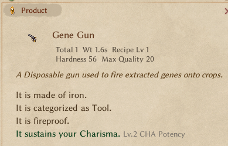
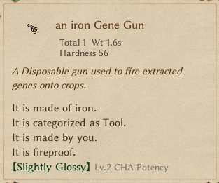

# Part 4 - Fixing the UI

Continuing on, as last time, our first order of business is to find our target methods, where we'll be focusing our attention. We once again are privy by past knowledge, remember from part 3 that little bool we briefly touched upon, [IsFoodTrait](https://elin-modding-resources.github.io/Elin-Decompiled/classElement.html#a4a285c3ae82445a9c479a5c77a7d2129), let's take a look at him again...

> Referenced by `ElementContainer.AddNote()`

That very much sounds like what we're looking for, while we're here, take a look just past IsFoodTrait, we have [IsFoodTraitMain](https://elin-modding-resources.github.io/Elin-Decompiled/classElement.html#a1abc0a4871bc31a84f38761f9a4d67fe), since they obviously seem "related", we shall check their references as well. And would look at that:

> Referenced by `ElementContainer.AddNote()` and `Thing.WriteNote()`.

Hey, looks like we're already almost there, considering both of these are used in "Note" related methods, they could very well be what is locking our Enchantment from showing up, for now let's move from the top. We need to patch the UI tooltip for our item, so considering `ElementContainer` are stored on `Card` and `Thing` is derived of `Card`, we'll start checking out [`Thing.WriteNote()`](https://elin-modding-resources.github.io/Elin-Decompiled/interfaceIInspect.html#a53694e39c0b8ee3f771896555166a20c)

Very much like before, we'll begin by deploying our "probe" to check if we are at the right place:

```cs
[HarmonyPostfix, HarmonyPatch(typeof(Thing), "WriteNote")]
public static void WriteNote()
{
    Plugin.Log.LogMessage("Really Commander? ... Probing Uranus");
}
```

::: danger Jank Incoming
From this point forward solutions are fueled by laziness.
:::

Before we run it, we of course will do a bit of reading... a fair bit of reading... Never mind, let's just ctrl+f and go where IsFoodTrait is used:
::: details Here.

```cs
elements.AddNote(n, (Element e) => list.Contains(e), null, ElementContainer.NoteMode.Trait, addRaceFeat: false, delegate(Element e, string s)
{
    //trimmed...
	if (!text8.IsEmpty())
	{
		//trimmed...
		if (infoMode && e.IsFoodTraitMain) // [!code focus]
		{
			text8 += "traitAdditive".lang();
		}
		text7 += (" <size=12>" + text8 + "</size>").TagColor(FontColor.Passive);
	}
	return text7;
}, delegate{});
```

:::
::: details And here.

```cs
if (mode == IInspect.NoteMode.Product && HasTag(CTAG.dish_bonus))
{
	source.model.elements.AddNote(n, (Element e) => e.IsFoodTraitMain, null, ElementContainer.NoteMode.Trait, addRaceFeat: false, delegate(Element e, string s)
	{
		//trimmed
		if (!text11.IsEmpty())
		{
			if (infoMode && e.IsFoodTraitMain)
			{
				text11 += "traitAdditive".lang();
			}
			text10 += (" <size=12>" + text11 + "</size>").TagColor(FontColor.Passive);
		}
		return text10;
	});
}
```

:::

Okay, both are the inside the same big if statement, and the second occurrence happens inside an if that checks for `HasTag(CTAG.dish_bonus)`. Going in game and testing we'll see our probe triggers when hovering any item in our inventory and when we open the crafting window, this seems a good enough place for us to patch. We do have other options, but this time we're going with the "brute force-ish" solution. ~~GoAwayFreshClothI'mNotDoingTranspilerPatches~~

::: details A Little context
Hey, I'm writing most of this guide out of memory, it has been several days since I've actually completed the code (Even though I haven't released it yet), so there might be some discrepancies between how I am presenting the steps here to what actually happened, as I'm noticing now, I don't really remember much of this part, but i feel it took longer than it should've...
:::

We shall just postfix a check to see if we're building the tooltip for our Gene Gun and then call `AddNote` again dodging our food check. And for that we can just yoink most of the existing code.

With the yoiking done this is what we've got: (Take note of line 7, we'll need to fix it)

```cs{4,7}
[HarmonyPostfix, HarmonyPatch(typeof(Thing), "WriteNote")]
    public static void WriteNote(Thing __instance, UINote n, IInspect.NoteMode mode, Recipe recipe)
    {
        if (__instance.id != "gene_gun") return;
        __instance.elements.AddNote(n, (Element e) => e.IsFoodTraitMain, null, ElementContainer.NoteMode.Trait, addRaceFeat: false, delegate (Element e, string s)
                {
                    string text10 = s;
                    string text11 = e.source.GetText("textExtra");
                    if (!text11.IsEmpty())
                    {
                        string text12 = "";
                        int num3 = e.Value / 10;
                        num3 = (e.Value < 0) ? (num3 - 1) : (num3 + 1);
                        text11 = "Lv." + num3 + text12 + " " + text11;
                        if (mode == IInspect.NoteMode.Info)
                        {

                            text11 += "traitAdditive".lang();
                        }
                        text10 += (" <size=12>" + text11 + "</size>").TagColor(FontColor.Passive);
                    }
                    return text10;
                });
    }
```

And in game...


Hum, well it works, but not as I was expecting... It seems `text10` is getting our `textPhase` instead of the `textAlt`, time to go into `AddNote` find out how the `textAlt` is used and yoink some more code...

::: tip More Context
Well, just dropped some random names on you didn't I, these are columns on the Element sheet of SourceGame.xlsx, the `textAlt` column contains the names that are used to represent the "levels" of elements, the seed I'm using has a level 2 `Sustain PER` so its named "\[Slightly Glossy\]" with the fancy brackets around and that's what we want to show on our gun too, Fancy Brackets!
:::

```cs
if (e.IsTrait || (flag4 && e.IsFoodTrait))
{
    string[] textArray = e.source.GetTextArray("textAlt");
    int num2 = Mathf.Clamp(e.Value / 10 + 1, (e.Value < 0 || textArray.Length <= 2) ? 1 : 2, textArray.Length - 1);
    text = "altEnc".lang(textArray[0].IsEmpty(e.Name), textArray[num2], EClass.debug.showExtra ? (e.Value + " " + e.Name) : "");
    //trimmed
}
```

Easy enough, let's transplant that into our patch and we should be good to go!

```cs
__instance.elements.AddNote(n, (Element e) => e.IsFoodTraitMain, null, ElementContainer.NoteMode.Trait, addRaceFeat: false, delegate (Element e, string s)
{
    string[] textArray = e.source.GetTextArray("textAlt");
    int num2 = Mathf.Clamp(e.Value / 10 + 1, (e.Value < 0 || textArray.Length <= 2) ? 1 : 2, textArray.Length - 1);
    string text = "altEnc".lang(textArray[0].IsEmpty(e.Name), textArray[num2], EClass.debug.showExtra ? (e.Value + " " + e.Name) : "");
    string text10 = text;
    string text11 = e.source.GetText("textExtra");
    if (!text11.IsEmpty())
    {
        string text12 = "";
        int num3 = e.Value / 10;
        num3 = (e.Value < 0) ? (num3 - 1) : (num3 + 1);
        text11 = "Lv." + num3 + text12 + " " + text11;
        if (mode == IInspect.NoteMode.Info)
        {

            text11 += "traitAdditive".lang();
        }
        text10 += (" <size=12>" + text11 + "</size>").TagColor(FontColor.Passive);
    }
    return text10;
});
```



Aaaaaaand another bit ~~~gracefully~~ solved. Next up, adding functionality to our gun, disposing of it after its used and a little bit of polish.
