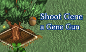
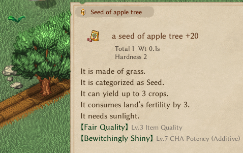
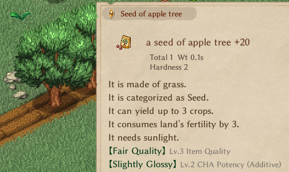

# Part 5 - Custom trait and Functionality

We are nearing the finish line for our new feature/mod, all that is left is giving our gun the ability to shoot, applying the existing Enchantment that our Gun carries to the target while ensuring the target contains a `GrowSystem` and finally we will embellish our work a bit by playing sound and visual effects during our actions.

## Creating a new Trait

We are going to start off by making ourselves a new Trait. Create a new .cs file with the name of our trait, in this case `TraitGeneGun.cs`, we'll make a class with the same name and we are going to be deriving it from `TraitTool`, because we are a tool, and tools can't be stacked.

```cs
class TraitGeneGun : TraitTool
{
}
```

That's it, we now have a new trait, we can go to our Thing sheet and add `GeneGun` to the trait column, yes, without the "Trait" part.

::: warning
I am recommending creating our trait in a new file not only for organization sake, but most importantly because you have to make sure that this class is on the `global namespace` otherwise the game will not recognize it and will not load it into the `classCache`. Thanks to @Ryozu on discord for the tip!
:::

## Adding functionality

Before we continue, I'd like to recommend that if you want to have a better understanding of a fair chunk of how the game works, that you take your time to read the base classes of most common things in the game that we've been interacting so far, such as the `Card` and `Thing` class and in this case, the `Trait` class. This is knowledge that we'll be making use right now as we override a very "obvious" function:

```cs
public override void TrySetHeldAct(ActPlan p)
```

This will allow us to execute specific actions while holding our item, the first one we need to do as mentioned earlier is make sure that our target has a `GrowSystem`, additionally let's also make it so that we can only our gun on our territory.

```cs
class TraitGeneGun : TraitTool
{
    public override void TrySetHeldAct(ActPlan p)
    {
        if (p.pos.cell.growth == null || !EClass._zone.IsPCFaction) return;
    }
}
```

Now, we'll add our actual action with [TrySetAct()](https://elin-modding-resources.github.io/Elin-Decompiled/classActPlan.html#ae4547e83c1eaea57c11c2991b0752987) and just so we can go in game to test our trait, we are going to add the disposability part of our item by destroying it on use.

```cs

p.TrySetAct("Shoot Gene", delegate
{
    if (owner.c_charges <= 0) // we've never have any charges to item, so it will be by default 0
    {
        EClass.pc.Say("spellbookCrumble", owner);
        owner.Destroy();
    }
    return false;
}, this.owner, CursorSystem.IconRange, 1);
```



Awesome, feels a bit bland right now as it doesn't have any visual or auditory feedback but we'll fix that in a bit. Let's move on to applying the new Enchantments to our target.

But first, a small fix is in order, instead of checking if the growth is null, we will use the `TryGetPlant` method for our check, since we can't really put our enchantment on a plant that wasn't planted by us, because the enchantments are actually on the seed. Then remove the existing `FoodTrait`'s from our target, and add the ones from our gun.

```cs
if (p.pos.cell.TryGetPlant() == null || !EClass._zone.IsPCFaction) return;
Thing targetPlant = p.pos.cell.TryGetPlant()?.seed;
Thing gun = owner.Thing;

p.TrySetAct("Shoot Gene", delegate
{

    foreach (int k in targetPlant.elements.dict.Keys)
    {
        if (targetPlant.elements.dict[k].IsFoodTraitMain || targetPlant.elements.dict[k].IsFoodTrait)
        {
            targetPlant.elements.dict.Remove(k);
        }
    }
    foreach (int k in gun.elements.dict.Keys)
    {
        if (gun.elements.dict[k].IsFoodTraitMain || gun.elements.dict[k].IsFoodTrait)
        {
            targetPlant.elements.dict.Add(k, gun.elements.dict[k]);
        }
    }

    if (owner.c_charges <= 0)
    {
        EClass.pc.Say("spellbookCrumble", owner);
        owner.Destroy();
    }
    return false;
}, this.owner, CursorSystem.IconRange, 1);
```

Alright, testing time, we are going to sacrifice this beautiful +20 apple tree to test our gun.

::: tip Shameless plug
I'm inspecting the seed of an already planted and grown tree, this is not possible in the base game. It is a feature of [FarmDoctor](https://steamcommunity.com/sharedfiles/filedetails/?id=3366547733). You should subscribe to it! _wink wink_
:::

<!-- put these to images in a markdown table -->

|             Before             |             After             |
| :----------------------------: | :---------------------------: |
|  |  |

Look at us, we successfully ruined a perfectly fine apple tree!

## Polish

It's our victory lap, let's add our finishing touches. Audio and animations, for that head over to your decompiler(or [Elin-Decompiled](https://elin-modding-resources.github.io/Elin-Decompiled/)) and search for "play", that should give us the answer on how to play sounds and animations. Knowledge is power, again I already have the answer. Because FarmDoctor patches the `TraitFertilizer` and it utilizes these guys:

```cs
PlaySound("mutation");
PlayEffect("mutation");
```

Perfect fit, sound and effect for the plant? Check. Now we need one for the gun.  
After a bit of searching, using "gun" as our search term, we also have our sound and effect for the gun. Add them in and head to testing.

```cs
gun.PlayEffect("bullet").Emit(1);
gun.PlaySound("attack_gun");
targetPlant.PlaySound("mutation");
targetPlant.PlayEffect("mutation");
```

Well, you'll excuse me now, but I'm not recording a video nor timing a screenshot with the effect in action, you'll just have to trust me, our sounds and effects work!

~~We are finally done!~~ Hold on, one more thing, remember how our gun shows its little action tool tip?

I'd like to make clear to the player what Enchantment the gun he is holding contains, before the shoots that innocent plant.

## The final touch

This little detail should be in the `Act` class, based on the fact that we were fiddling with `TrySetAct` on our Trait.  
A quick little search lands us on `GetTextSmall(Card c)`, quick and easy, awesome, let's postfix this and alter the `__result`, remember to add `ref` keyword to it so we can edit it, and replicate the null checks, while also adding ours. Again to make sure we don't affect other mods and the base game itself we'll also return if it's not our gene gun we're dealing with. Everything else you are already familiar with.

```cs
[HarmonyPostfix, HarmonyPatch(typeof(Act), "GetTextSmall")]
public static void GetTextSmall(Card c, ref string __result)
{
    if (c == null || c.trait == null || c.trait is not TraitGeneGun) return;

    foreach (int k in c.elements.dict.Keys)
    {
        Element e = c.elements.dict[k];
        if (e.IsFoodTrait)
        {
            int num3 = e.Value / 10;
            num3 = (e.Value < 0) ? (num3 - 1) : (num3 + 1);
            __result = "<size=28>" + c.Name + ": Lv." + num3 + " " + e.source.GetText("textExtra") + "</size>";
        }
    }
}
```


And there we have it, all steps complete and it only took a 5 part guide.

Jokes aside, if you have weathered though this whole guide I truly hope it has been of any educational value to you and that you are moving on with the knowledge you needed to either start, continue or finish your modding project.

Once again, this whole guide is based on [FarmDoctor](https://steamcommunity.com/sharedfiles/filedetails/?id=3366547733), and you can find the complete finished code for all that was done during this guide on github along with the rest of the code of FarmDoctor and all my other ~~messes~~ projects.

::: tip [Drakeny's github](https://github.com/Drakeny?tab=repositories&q=Elin)
[FarmDoctor repo](https://github.com/Drakeny/Elin.FarmDoctor)
:::
