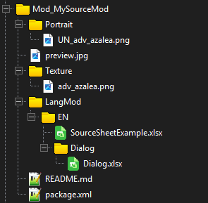
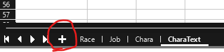

# Introduction

This tutorial is designed in the windows environment with a normal steam installation location (e.g. C:\\Program Files (x86)\\Steam\\steamapps\\common\\Elin)

Every entity in Elin can be boiled down to a Source entry. We can easily add new content by simple dropping a properly formatted xlsx sheet (Microsoft Excel) in the right place.
You can add practically anything from characters to items to even hobbies and jobs.

# Setting up
Step 1: Setting up your basic mod skeleton. This will follow a lot of the steps listed in [Basic Elin mod Package](../../../../2_Getting%20Started/basic_mod) and this: [Setting up script mods](../../../../2_Getting%20Started/Script%20Mods/script_mod)

Go to your elin install location.
Go to Package
Create a new folder, for this tutorial let's call it "Mod_MySourceMod". If you plan on publishing this into steam, you should come up with a more creative name.

## The package.xml file.

A `package.xml` describes the mod. Create a new text file in the mod folder and change its name **and extension** to `package.xml`:

Open it with an editor - not chrome/your browser, and fill in the following information:
```xml
<?xml version="1.0" encoding="utf-8"?>
<Meta>
  <title>My Custom Source Mod</title>
  <id>myname.myfirstsourcemod</id>
  <author>Me</author>
  <loadPriority>100</loadPriority>
  <version>0.23.275</version>
  <tags>Race, Class</tags>
  <description>
    My Custom CWL Class and-or Race!
  </description>
  <builtin>false</builtin>
</Meta>
```

## The LangMod folder + Source Sheet.

Elin looks for specific directories to load all the new data you have added.
In your new Package folder (Mod_MyMod from the section above), Create the "LangMod" folder in your package folder.
In there, create an "EN" folder.

Using either Libreoffice or Microsoft Excel, create a SourceSheet.xlsx file in that folder.

The overall structure should look like this:



## The Source Sheets

To see all the possible sheets we can add, go to Noa's public repository here:
https://drive.google.com/drive/folders/1czOUsixQyAIqMNCyjOpsDZmqVxo_FUFg

### Source Sheets Quick Summary

TODO: Do we even want this section?

#### Lang
The Language files. It's a bit hard to explain this, but these are the words that you the player will see, from in the logs, to UI elements, everything.
Modders who plan on adding extensive new content should get used to this file, but you likely do not need to do too much here if you are aren't planning to code.

#### SourceBlock
- GlobalTile - Tiles used on the world map, pointing to what zone they should spawn when you enter it. This does not include prefab locations (e.g. cities, dungeons, nefias)
- Block - Blocks, Walls, Roofs, Stairs. For building with.
- Floor - Floor data. Self explanatory.
- Obj - Object data.
- CellEffect - Extra effects applied to the tile.
- Material - What materials are made available in the game.

#### SourceCard
- Thing - Items.
- ThingV - Furniture Variations of items.
- Food - Food Items and their stats.
- Recipe - Crafting Recipes
- SpawnList - Spawn lists for either shop inventories or what monsters spawn in which areas.
- Category - Item Categories.
- Collectible - Junk items, mostly for decoration, or quests.
- KeyItem - Key Items.

#### SourceChara
- Chara - Character entries.
- CharaText - Text that the characters would say over their heads, or in the log based on the scenario.
- Tactics - Combat AI. Weights on what kind of action each tactic style would take in a given turn.
- Race - Character Races.
- Job - Character Jobs. Can be referred to as Classes as well.
- Hobby - Character Hobbies, the one each character has at least two of.

#### SourceGame
- Element - Basically all the Attributes/Skills/Feats/Spells/Abilities are housed here.
- Calc - Dice calculation for various spells or abilities.
- Stat - Conditions.
- Check - Uh... not sure. TODO: HELP MEEEEE
- Faction - Factions of the game.
- Religion - Religions of the game.
- Zone - Zone data.
- ZoneAffix - For random nefias, adds a prefix adjective.
- Quest - Quest Data like descriptions, who is the quest giver, what is the quest name.
- Area - Possible room designations.
- HomeResource - Various stats of a Zone.
- Research - Licenses and rewards.
- Person - Unique characters in game.

## Setting up your Source Sheet

A single Source file can contain multiple sheets to handle everything in your mod.



All Source Sheets should start on the 4th Row.  
The 1st Row is the Header, containing what each column represents. E.G. Id, Alias, Details.  
The 2nd Row is the Type, containing what type each column should be. E.G. String, int, string array.  
The 3rd Row is the Default Value for that column.  
The 4th Row is where you can start filling it out.

Add new sheets, rename them to which sheet you wanted to mod, then go and copy the first three rows from the original source sheets.

# Filling out the Source Sheet.

For this tutorial, we will add the following:  
A new playable race - Alraune.  
A new playable class - Herbalist  
A new character - Azalea, an wandering Alraune Herbalist for the player to recruit.

In the new SourceSheet, rename the first sheet to Race, then create 3 additional sheets, Job, Chara, and CharaText. Then go to the original Source Sheets and copy the first 3 rows from each sheet.

## Alraune Race.
It's recommended to start by using one of the vanilla races as a baseline for balance reasons.  
Alraunes have higher charisma so they attract things easily, and are proficient with magic magical powers.
However, they are plants, and plants don't really move, so they will have reduced speed.  
Set the playable to 5 so that it can be selected through "Advanced Classes and Races"  
For elements, reference the Element sheet from SourceGame. featElea seems to work, as they could from the same forests as the Elea. They have to eat a lot, so featHeavyEater.  
Fill out the rest of the details, and that's the Alraune Race.

## Herbalist Job. 
The herbalist is a mixture of Farmer and Witch. Copy the Farmer row, then start mixing it with the Witch 
For Domains, elePoison and eleImpact are fitting for nature forces and earth forces.  
Add a description, and that's the Herbalist.

## Custom Adventurer
For the custom adventurer, let's make Azalea! She's going to be an Alraune herbalist who travels around the world using her medicines to help people, a kind traveling doctor! Adding recruitable wandering adventurers is actually easier than you'd think!  
Start by copying adv_kiria's entire row into your sheet.
Rename the id from adv_kiria to adv_azalea.  
Change _id to something really large. With sheets, the _id number should be unique per row. This means if another mod happens to use the same _id as you have for a character, there will be a collision and someone's mod will be overwritten, so pick something unique. Let's use 80835 for Azalea in this example.  
Set renderData to @chara, which will tell Elin to simply look for a png of the same file name.  
Leave her trait as AdventurerBacker, which will tell the game to add her as a wandering adventurer like the others.  
Update the race and job to our new ones.  
For tactics the priest tactic will focus on healing.  
Update ActCombat with her skillset. She's a doctor, so let's give her some healing magic. SpHealLight/100, SpRestoreBody/50, and SpRestoreMind/50, so she can address all kinds of ailments and wounds. As an Alraune, let's also give her ActEntangle/50, which allows her to bind enemies with her vines.  
For elements let's add featHealer/1 to boost her healing powers because she's a doctor.  
As a plant, she likely would worship Kumiromi, so set her faith to harvest.  

Next let's breathe a little more life into her.

Like Kiria, let's give her some unique dialog options.
This will require a different file though. From the picture where we were setting up our mod package layout, we had a "dialog.xlsx" file.
Add this file with the headers, then go ahead and add some lines for your character to say.

Final steps for our custom adventurer, let's add a custom portrait and sprite for her.
Go back to your Mod Package folders, and in the topmost level (where LangMod folder and package.xml sit) add two more folders. Texture and Portrait.
In texture, drop a png of the sprite you want for your character, labeled to match her id. So for Azalea it would be a sprite called called "adv_azalea.png"
In portrait, drop a png of the portrait you want for your chracter, in the format "UN_id.png", so for Azalea, it would be "UN_adv_azalea.png".

So all in all, our folder should look like this...  
  

Save everything, and let's boot up your game and take a look at our new content!  


And if we get to find her...  


## Finishing touches

You might have noticed in the picture there were a few extra files.  
The README.md is a file a lot of modders like to include in their mod. It can include helpful things for the users, usually information or instructions for that might help when using your mod.  
The preview.jpg is a 512x512 jpg file that will be used in the Steam Workshop as the preview thumbnail when the mod is uploaded.  
Add what you want, then in game, go to the Mod Viewer, and you can publish your mod by finding your mod by left-clicking it and clicking Publish.  
Go to your Steam Workshop and update your description as you want!

<script setup>
import { withBase } from 'vitepress'
</script>
