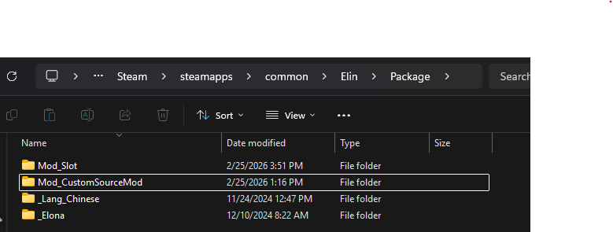
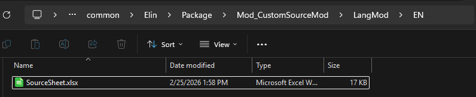
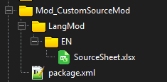
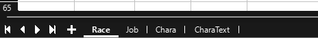
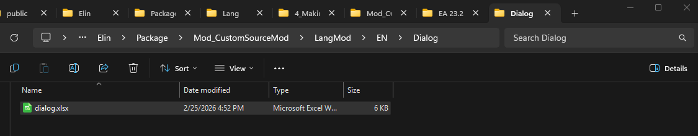
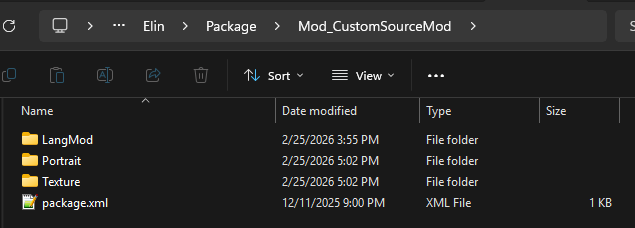
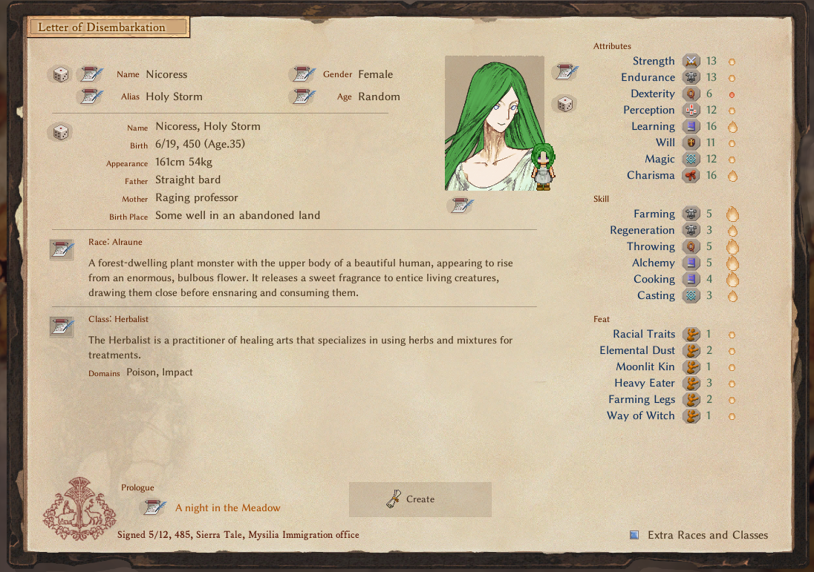
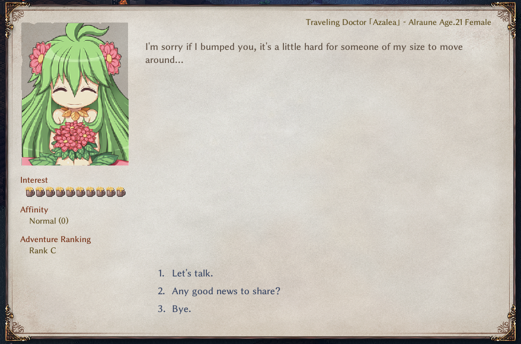
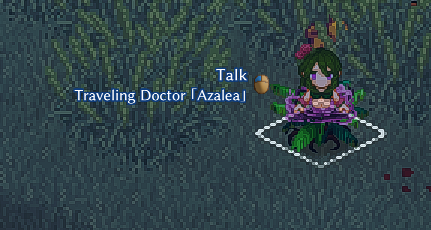
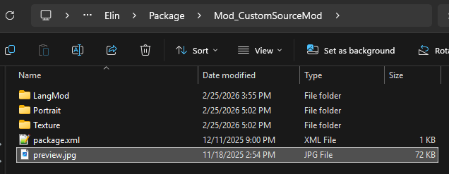

# Introduction

Elin can be easily modded by adding Source entries. By creating a Mod Package and simply adding a properly formatted xlsx file in the right location, you can add all kind of things into Elin.
This tutorial is meant to help anyone set up their own Source Sheet based mod, no coding necessary!

# The Source Sheets

First, check out this google drive: https://drive.google.com/drive/folders/1czOUsixQyAIqMNCyjOpsDZmqVxo_FUFg
Here you will find all of the Source Sheets uploaded by the developer for modders to view.

Secondly, ensure you have a method to read and write xlsx files. xlsx files are standard XML based spreadsheets.
The most common methods to work with this kind of file is Microsoft Excel. Other options would include LibreOffice Calc or Google Sheets.

The Drive has multiple Source Files broken down into categories. Each category contains multiple sheets. When you open one of the files, at the bottom you can see the Source Sheets included.
Make sure the name of these sheets line up with one of the original sheet names (e.g. Chara, Race, Job.)

When making your own Source Sheet file, you need to make sure the format is correct.
You can have a single Source.xlsx file for your entire mod that has a variety of sheets inside it.

Add new sheets as needed (Click the + button) and rename them (Right click) at the bottom to match the original Source Sheets.

Example of how to do it in Excel Online  


Example how to do it in LibreOffice  


All Source Sheets should start on the 4th Row. (Exception of dialog.xlsx, but we'll go over that later)  
The 1st Row is the Header, containing what each column represents.  
The 2nd Row is the Type, containing what type each column should be.  
The 3rd Row is the Default Value for that column.  
The 4th Row is where you can start filling it out with what you want to mod into the game.

When you set up your sheets, you should go to the original sheets and copy the first few 3 rows into your own Sheet. Make sure you get the whole row.


### Source Sheets Quick Summary

#### Lang
- The Language files. It's a bit hard to explain this, but these are the words that you the player will see, from in the logs, to UI elements, everything.
Modders who plan on adding extensive new content should get used to this file, but you likely do not need to do too much here if you are aren't planning to code.

#### SourceBlock
- GlobalTile - Tiles used on the world map, pointing to what zone they should spawn when you enter it. This does not include prefab locations (e.g. cities, dungeons, nefias)
- Block - Blocks, Walls, Roofs, Stairs. For building with.
- Floor - Floor data. Self explanatory.
- Obj - Object data.
- CellEffect - Extra effects applied to the tile.
- Material - What materials are made available in the game.

#### SourceCard
- Thing - Items.
- ThingV - Furniture Variations of items.
- Food - Food Items and their stats.
- Recipe - Crafting Recipes
- SpawnList - Spawn lists for either shop inventories or what monsters spawn in which areas.
- Category - Item Categories.
- Collectible - Junk items, mostly for decoration, or quests.
- KeyItem - Key Items.

#### SourceChara
- Chara - Character entries.
- CharaText - Text that the characters would say over their heads, or in the log based on the scenario.
- Tactics - Combat AI. Weights on what kind of action each tactic style would take in a given turn.
- Race - Character Races.
- Job - Character Jobs. Can be referred to as Classes as well.
- Hobby - Character Hobbies, the one each character has at least two of.

#### SourceGame
- Element - Basically all the Attributes/Skills/Feats/Spells/Abilities are housed here.
- Calc - Dice calculation for various spells or abilities.
- Stat - Conditions.
- Check - Uh... not sure. TODO: HELP MEEEEE
- Faction - Factions of the game.
- Religion - Religions of the game.
- Zone - Zone data.
- ZoneAffix - For random nefias, adds a prefix adjective.
- Quest - Quest Data like descriptions, who is the quest giver, what is the quest name.
- Area - Possible room designations.
- HomeResource - Various stats of a Zone.
- Research - Licenses and rewards.
- Person - Unique characters in game.

# Setting Up your first Source Sheet Mod

Before you get started, ensure you have the following:
- A text editor. The basic Notepad included in windows would work.
- An xlsx editor. Microsoft Excel or LibreOffice are two options, the latter being free.

This tutorial is designed in the windows environment with a normal steam installation location (e.g. C:\\Program Files (x86)\\Steam\\steamapps\\common\\Elin)

Your first step is to set up your basic mod skeleton. This will follow a lot of the steps listed in [Basic Elin mod Package](../2_Getting%20Started/basic_mod) and this: [Setting up script mods](../2_Getting%20Started/Script%20Mods/script_mod)

Go to the Elin Install Location and go to the "Package" folder.
Create a new folder for your Mod. Use the name format "Mod_MyModName", something that makes sense for what you're adding.
For the sake of this tutorial, it will be "Mod_CustomSourceMod"


Enter the new folder, then open your text editor of choice. Add the following xml block into the new file:

```
<?xml version="1.0" encoding="utf-8"?>
<Meta>
  <title>Custom Source Mod</title>
  <id>myname.myfirstsourcemod</id>
  <author>myname</author>
  <loadPriority>100</loadPriority>
  <version>0.23.275</version>
  <tags>Race,Class,Chara</tags>
  <description>
    My First Source Mod!
  </description>
  <builtin>false</builtin>
</Meta>
```

A quick explanation of each of the fields:  
- title : The title of your mod that shows up in the Workshop, as well as in the in game Mod Viewer. Will be used as the Title in the workshop when you first upload it.  
- id: A unique identifier for your mod. You cannot upload a mod with the same id as an existing mod. This should not change once uploaded!  
- author: The author of the mod. In this case, you.  
- loadPriority: The load priority of the mod. Mods with lower numbers are loaded first, allowing dependencies, or overwrites.  
- version: The latest version of Elin that your mod will work on.  
- tags: Which tags do you want your mod to be tagged with in the workshop. These should be comma separated.  
- description: The description of your mod. Will be used as the description in the workshop when you first upload it.  
- Ignore builtin, leave it as false.  

Once the package.xml is filled out, save this as package.xml (ensure you have the right file extension!) into the newly created Mod Package folder.  


Next, in the same Mod Package folder, create a new folder called LangMod.  


In the new LangMod folder create another folder called EN.  


Create a new xlsx file called "SourceSheet" and drop it into your EN folder.  


So after all of that, you should have a file structure that looks like this:  


Now you are finally ready to start adding things into the Source Sheet to mod them into your game.

# Editing your First Source Sheet Mod.

For this tutorial, we will be adding a custom race, job, and character. In your new xlsx file, set up the following four sheets:  
- Race
- Job 
- Chara
- CharaText

In the new SourceSheet, rename the first sheet to Race, then create three additional sheets, Job, Chara, and CharaText. Then go to the original Source Sheets and copy the first three rows from each sheet.


## Alraune Race.
Let's start by creating the modded race. We will be creating the "Alraune" race, a plant monster that lures prey to their doom with sweet scents and their enchanting beauty.  
Alraunes are very much like the vanilla "Ent" race, so let's just copy that entire row from the Race sheet to start. Once we rename a few things, we can update the existing statlines to better fit our modded race, like increasing their base CHA and MAG.  
We set the playable to 5 so that it can be selected through "Advanced Classes and Races."  
For the elements, we can reference the Element sheet from SourceGame. As they are often found in the old magical forests, let's add "featElea/1" to the elements. They have to eat a lot to sustain their size, so "featHeavyEater/3" is next, and that should be it.  
Add some flavor text for details, add translations, and we now have the Alraune race!  


## Herbalist Job. 
For the custom Job, we'll be creating the "Herbalist", which is a mix between the Farmer and the Witch.  
This will largely be simillar to the previous step, where we will copy the vanilla "Farmer" job then update it for our mod. Rename it to herbalist, make sure playable is set, and start updating the elements.  
We don't want it to completely be a better Farmer, so we reduced it's featFarmer from 2 to 1, then added featWitch/1 so it can do some potion brewing.  
Fill out some of the remianing fields, add some flavor text, translate, and that's it!


## Custom Adventurer
Finally, we get to the the Character adding.  
Like the previous, we'll largely just be copying an existing entry and editing it for our mods.  
We will be creating the custom Adventurer, Azalea, who is an traveling Alraune Herbalist.  
For this custom adventurer, like the previous two sheets, we're going to make our lives easier by copying an existing entry and editing it. More specifically, we're going to borrow adv_kiria. You should know the drill by now!  
Change the id from adv_kiria to adv_azalea.  
Change _id to something really large. With sheets, the _id number should be unique per row. This means if another mod happens to use the same _id as you have for a character, there will be a collision one of the mod will be overwritten, so pick something unique. Let's use 80835 for Azalea in this example.  
Set renderData to @chara, which will tell Elin to simply look for a png of the same file name.  
Leave her trait as AdventurerBacker, which will tell the game to add her as a wandering adventurer like the others.  
Update the race and job to our new ones, alraune and herbalist.  
For tactics the priest tactic will focus on healing.  
Update ActCombat with her skillset. She's a doctor, so let's give her some healing magic. SpHealLight/100, SpRestoreBody/50, and SpRestoreMind/50, so she can address all kinds of ailments and wounds. As an Alraune, let's also give her ActEntangle/50, which allows her to bind enemies with her vines.  
For elements let's add featHealer/1 to boost her healing powers because she's a doctor.  
As a plant, she likely would worship Kumiromi, so set her faith to harvest.


Next, let's breathe some life into her. Go to the CharaText sheet.  
Here we can add either environmental messages (no quotes) that will be played in the log, or ambient chatter (quotes) that will show up as a speech bubble over our characters.  
Make sure your id is the same id string as the one you have defined in the Chara sheet. So for this tutorial, we want adv_azalea.  
Add some text for what you want to give your character more personality!  


In addition to this, let's make it so she has her own dialogue when you talk to her.  
This will require a different file though. Let's add our "dialog.xlsx" file.  
Go to the same folder where your SourceSheet.xlsx file lives (LangMod\EN) and add a new folder, Dialog.  
Go in there, create a new dialog.xlsx.  


Now, the dialog.xlsx file doesn't have an existing Source to work off of in the online repository. You can however find the existing ones in the _Elona package included in the Elin installs. (e.g. C:\\Program Files (x86)\\Steam\\steamapps\\common\\Elin\\Package\\_Elona\\Lang\\_Dialog)

<b>If you open this, you will see immediately that unlike the other Source Sheets, this one starts at row 5.</b>  
We are interested in the Unique tab, which contains unique talk options for their respective character.  

Rename the first sheet in our mod's dialog.xlsx file to Unique, copy the first 4 rows, and let's add some flavor text for Azalea.  


Almost there, we've got to add a custom portrait and sprite for Azalea.
Go back to your Mod Package folders, and in the topmost level (where LangMod folder and package.xml sit) add two more folders. Texture and Portrait.
In texture, drop a png of the sprite you want for your character, labeled to match her id. So for Azalea it would be a sprite called called "adv_azalea.png"
In portrait, drop a png of the portrait you want for your chracter, in the format "UN_id.png", so for Azalea, it would be "UN_adv_azalea.png".

So all in all, our folder should look like this...  
  

So, if you've done everything correctly, your final file structure should resemble this


Picture > 18_FinalFileStructure.png

Time to test it out. Boot up Elin to view the fruit of your labors!


Picture > 19_AlrauneInGame.png

And if you find her...
  


## Finishing touches

Before you upload your mod, we should a preview at least to be used by the Steam Workshop.  
The preview.jpg is a 512x512 jpg file that will be used in the Steam Workshop as the preview thumbnail when the mod is uploaded. It goes into the top level of the Mod Package folder alongside package.xml  

Once you got a nice preview picture, boot up Elin. Go to the Mod Viewer and publish your mod by finding your mod by left-clicking it and clicking Publish!  
Congratulations, you can now view your mod on the Steam Workshop!

<script setup>
import { withBase } from 'vitepress'
</script>
