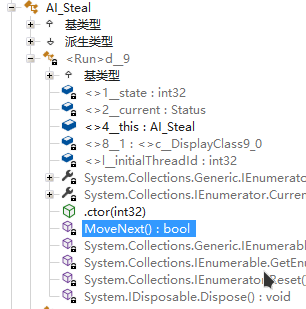
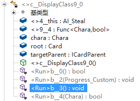

# Harmony Patch

... is very well documented here:

<LinkCard t="Harmony Patching" u="https://harmony.pardeike.net/articles/patching.html"/>

But sometimes we encounter edge cases, let's break them down today.

## Enumerator

An enumerator is a method that returns `IEnumerable<T>` or `IEnumerator` and contains yield statement. They are also used as coroutines in Unity.
```cs
public override IEnumerable<Status> Run()
{
    yield return Cancel();
}
```

Even though they look like normal methods in decompiler, they are actually wrapped up as a compiler generated nested class within `MoveNext()` method. When we iterate the enumerator, it's in fact invoking the `MoveNext()` method for us, until the yield state exhausts. 

### Patch

To patch these methods, supply `MethodType.Enumerator` argument to the `[HarmonyPatch]` attribute, as follows:
```cs
// in a patch class
[HarmonyPostfix]
[HarmonyPatch(typeof(AI_Fuck), nameof(AI_Fuck.Run), MethodType.Enumerator)]
internal static void OnRunMoveNext();
```

However, here's the catch: `MoveNext()` is invoked repeatly until the yield state exhausts, so within the original method, each time it yields, the patch will get called once. 

## Delegate

A delegate can be an `Action`, a `Func<T>`, an anonymous method, a lambda, a local method...you name it. Delegates are very convenient and you probably have written countless of them too:
```cs
myArray.ForEach(item => item.DoSomething());
myList.Where(item => {
    // do something else
    return item.IsSomething();
});
var validated = myFiles.All(File.Exists);
```

It's just a chunk of code snippet that can be used as an object and pass around. Now you want to patch such code snippet, how?

### Snippet from Elin 

This is a snippet from `AI_Steal.Run`, that assigns a delegate to field `onProgressComplete` which will get invoked when `AI_Steal.Run` completes.
```cs
onProgressComplete = delegate {
    if (target.isThing && target.IsInstalled) {
        target.SetPlaceState(PlaceState.roaming);
    }
    owner.Say("steal_end", owner, target);
    if (chara != null && (chara.IsPCFaction || chara.OriginalHostility >= Hostility.Friend)) {
        EClass.player.ModKarma(-1);
    }
    else if (chara == null || chara.hostility > Hostility.Enemy) {
        EClass.player.ModKarma(-1);
    }
    target.isNPCProperty = false;
    if (!target.category.IsChildOf("currency")) {
        target.isStolen = true;
    }
    owner.Pick(target.Thing);
    owner.elements.ModExp(281, 50);
    if (EClass.rnd(2) == 0) {
        EClass.pc.stamina.Mod(-1);
    }
}
```

### DisplayClass

In C#, all delegates are compiled separately into compiler generated hidden nested class `DisplayClass`, and wrapped in their own methods.

First we check the IL instruction for this method `IEnumerable<Status> AI_Steal.Run`, since it's an enumerator, we actually check the `MoveNext()` in the nested class:


Search for `onProgressComplete` and we find these:
```cs:no-line-numbers
ldftn inst void AI_Steal/'<>c__DisplayClass9_0'::'<Run>b__3'()
newobj inst void System.Action::.ctor(object, native int)
stfld class System.Action Progress_Custom::onProgressComplete
```

This simply loads the function pointer (aka the delegate object) `<Run>b__3` from nested class `<>c__DisplayClass9_0`, and constructs a `System.Action` then assigns it to field `onProgressComplete`. If you are interested, you can also checkout the actual function there and will find it's the same as the delegate snippet shown above:


### Patch

We found this specific method, to patch it, we need to use `[HarmonyTargetMethod]` attribute or `TargetMethod()` special method to designate the delegate.
```cs
// in a patch class
internal static MethodInfo TargetMethod()
{
    var closures = AccessTools.FirstInner(
        typeof(AI_Steal), 
        t => t.Name.Contains("DisplayClass9_0"));
    return AccessTools.Method(closures, "<Run>b__3");
}

[HarmonyPostfix]
internal static void OnProgressComplete()
{
    // do something
}
```

As you can see, we didn't use `[HarmonyPatch]` attribute - that's because the method info for the delegate is found at runtime, and we can only supply constants to the attribute.

## Generics

Patching generic methods require you to specialize the template type, otherwise it overwrites all of them or none of them:
```cs
// in a patch class
internal static MethodInfo TargetMethod()
{
    return AccessTools.Method(
        typeof(SomeClass), 
        nameof(SomeClass.GenericMethod))
        .MakeGenericMethod(typeof(int));
}
```