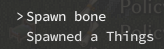
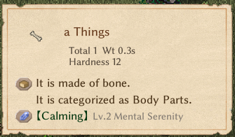

# Editing Sources at Runtime


Sometimes you want your Thing (or other source) to only be added when a certain mod option is enabled, or if you want to patch an existing Thing so that it integrates into your mod. You can override the entry with an XLSX edit, but this can conflict with mods that also override the source with their own edits, as well the possibility of the Thing or other element breaking when Noa changes things.

A patch that changes the Thing's sources at runtime is hence preferred.

# Patching

You can patch `SourceManager.Init` with a prefix that can edit the Thing you want to edit. `SourceManager` inits its sources after `OnStartCore`, and before `Start`, so the patch has to be injected on Awake.

> [!Note]
> The base game now also publishes the `EVENT.SourceImporting` / `EVENT.SourceImported` events (see [ModUtil & Events](../5_Elin%20API/modutil)). Subscribing to `EVENT.SourceImported` needs no Harmony at all, runs after **all** sheets (including other mods') are imported and initialized, and re-runs whenever sources are reloaded — prefer it for new code. A prefix on `SourceManager.Init` only sees base-game rows, because mod sheets are imported inside `Init` itself.

You can make a method that uses attributes and has a Prepare method, which only inits the patch if it returns true.
```cs
[HarmonyPatch]
internal class PatchSomeRows
{
    internal static bool Prepare()
    {
        //Only run if HasModConfigOptionEnabled is true.
        return HasModConfigOptionEnabled;
    }

    //These attributes indicate that it is a prefix for SourceManager.Init.
    [HarmonyPrefix]
    [HarmonyPatch(typeof(SourceManager), nameof(SourceManager.Init))]
    internal static void Thingy()
    {
        SourceManager sources = EMono.sources; //defines our sources variable, which is usually in EMono. There's also Core.Instance.
        SourceThing.Row row = sources.things.rows.Find((SourceThing.Row x) => x.id == "bone"); // Gets our row and tries to find an item with the id "bone"
        //Your changes here
        row.name = "Things"; //Example change, renames the bone item to "Things"
        return;
    }
}
```

## Alternatives

An alternative way is to put the patch on the plugin's `Awake()` method, usually when `PatchAll()` is on `Start` or `OnStartCore` instead of `Awake`. There are two ways to do this

### Alternative 1
Use Reflection to get the method to patch and the patching method. This defines a prefix with a low priority and is ran after CWL. 
```cs
private void Awake()
{
    var harmonyPrefix = new HarmonyMethod(SymbolExtensions.GetMethodInfo(() => SourceManagerPrefix.ExampleMethod()))
    {
        priority = Priority.Low,
    };
    harmony.Patch(AccessTools.Method(typeof(SourceManager), "Init"), prefix: harmonyPrefix);
}
```
We can now make our patching method

```cs
class SourceManagerPrefix
{
    public static void ExampleMethod()
    {
        SourceManager sources = EMono.sources; //defines our sources variable, which is usually in EMono. There's also Core.Instance.
        SourceThing.Row row = sources.things.rows.Find((SourceThing.Row x) => x.id == "bone"); // Gets our row and tries to find an item with the id "bone"

        //Your changes here
        row.name = "Things"; //Example change, renames the bone item to "Things"
        return;
    }
}
```

### Alternative 2
Use CreateAndPatchAll. This uses the same method from before.
```cs
private void Awake()
{
    Harmony.CreateAndPatchAll(typeof(PatchSomeRows));
}
```

## Testing
We can test the patch by opening the game in debug mode and using the ingame console to spawn the patched object (`spawn bone` in this case).




As you can see, the name of the Thing was changed to "Things".

Note that some Things, such as `poop` may not be editable. Food (`SourceFood`) is also not editable this way

# Race Editing
Races can be edited also like Things — instead of SourceThing rows, you use SourceRace rows.

One caveat: **derived data such as `elementMap` cannot be edited from a prefix.** `elementMap` is rebuilt from the `elements` column by `SourceRace.OnInit` during `Init` — before the first `Init` it is still `null`, and after it your prefix edit would be overwritten. Subscribe to `EVENT.SourceImported` instead, which fires after all sources are initialized and re-fires on every source reload:

```cs
private void Awake()
{
    BaseModManager.SubscribeEvent(EVENT.SourceImported, () =>
    {
        SourceManager sources = EMono.sources;
        SourceRace.Row c = sources.races.rows.Find((SourceRace.Row x) => x.id == "mifu"); // Gets our row and tries to find a race with the id "mifu"
        //Your changes here
        c.elementMap.Add(1512, 3);// Add Sharp Eye mutation level 3
        c.name = "test race";// Rename race to "test race"
        c.playable = 1;// Set race so that its shown without extra races enabled.
    });
}
```

Plain serialized fields (`name`, `playable`, …) can still be edited from a `SourceManager.Init` prefix like Things above; only the runtime-derived fields need the event.

You can go and make a new game to display the race overview during character creation. As you can see, the rename, Element addition, and playable flag changes were applied.

